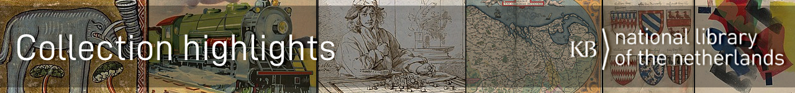

# KB Collection Highlights

Code, data and stories about Wikifying(*) the [collection highlights](https://www.kb.nl/zoeken/content/categorie/topstuk) of the KB, the national library of the Netherlands. 

Most **data** on the KB collection highlights can be found on our project pages on 
* [Wikidata](https://www.wikidata.org/wiki/Wikidata:WikiProject_Collection_highlights_National_Library_of_the_Netherlands) and on 
* [Dutch Wikipedia](https://nl.wikipedia.org/wiki/Wikipedia:GLAM/Koninklijke_Bibliotheek_en_Nationaal_Archief/Topstukken)

**Images** of our public domain collection highlights are in [Category:Collection highlights of Koninklijke Bibliotheek](https://commons.wikimedia.org/wiki/Category:Collection_highlights_of_Koninklijke_Bibliotheek) on Wikimedia Commons.

**Publications & stories** about Wikifying KB's collection highlights can be found on https://kbnlwikimedia.github.io/KBCollectionHighlights/stories 

------------
*Wikifying*: putting data, images and texts on Wikidata, Wikimedia Commons and Wikipedia (and other Wikimedia projects) to make them more visible and reusable for humans and machines.
