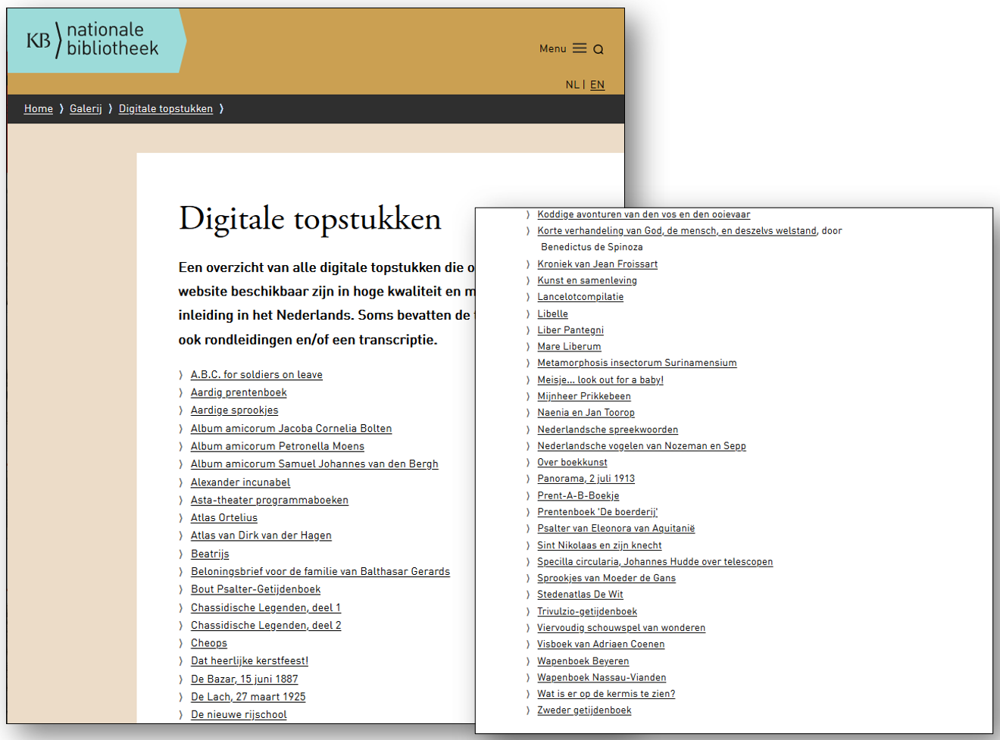
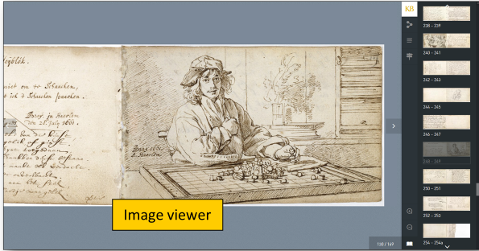
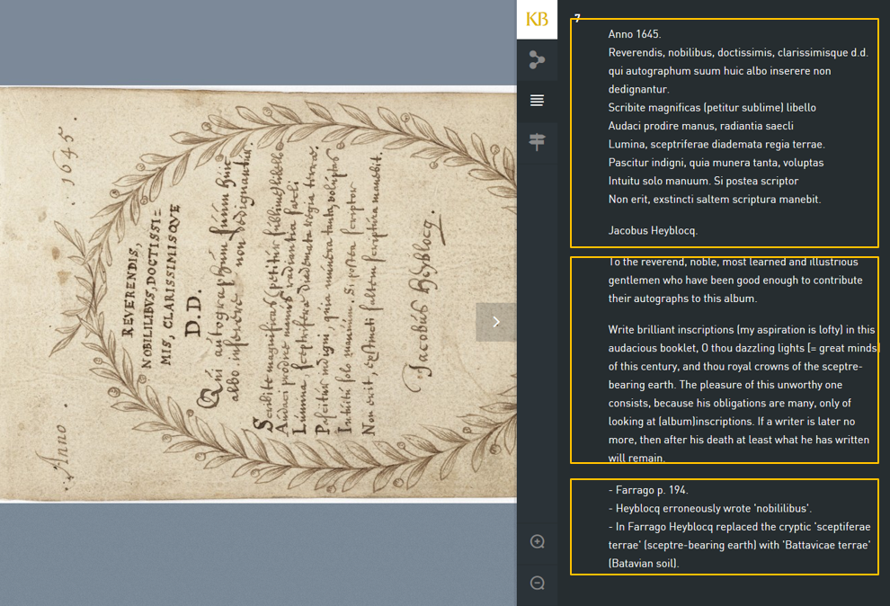
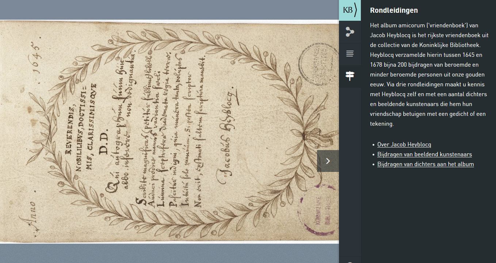
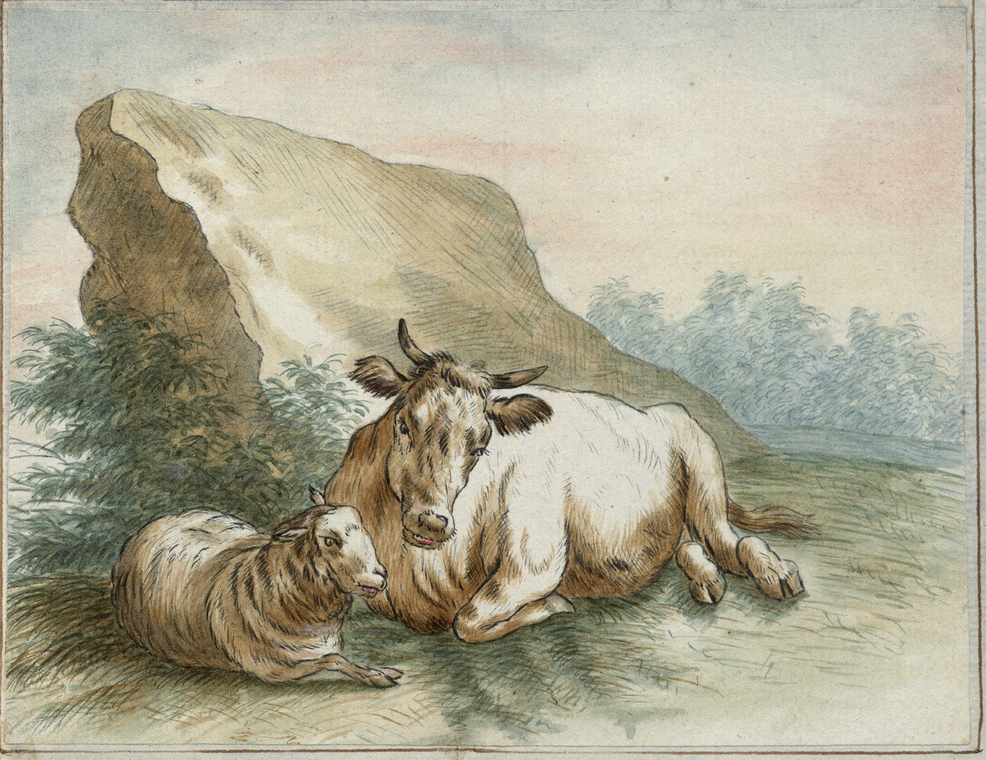
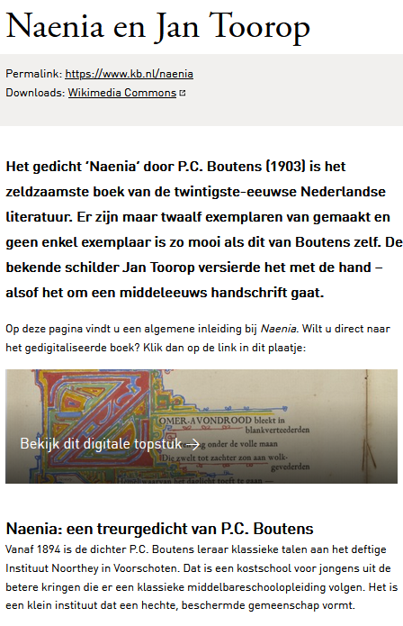
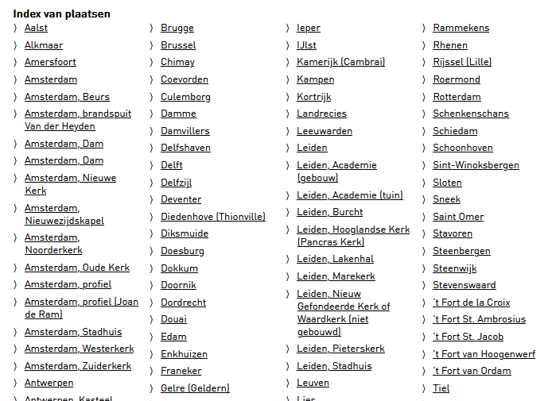
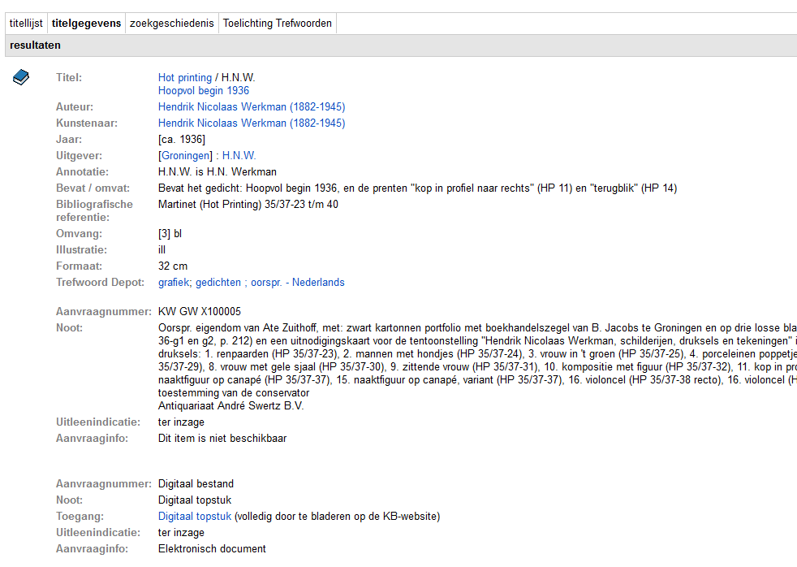

# 50 cool new things you can now do with KB's collection highlights - Part 1, Introduction

*In this [series of 5 articles](index.md) I show the added value of putting images and metadata of [digitised collection highlights](https://www.kb.nl/galerij/digitale-topstukken) of the KB, national library of the Netherlands, into the Wikimedia infrastructure. By putting our collection highlights into Wikidata, Wikimedia Commons and Wikipedia, dozens of new functionalities have been added: now you can do things with these digital objects that were not possible before.*

## Collection highlights of the KB
Before I dive into the details, I need to explain a bit about the the collection highlights of the KB, and which things you can do with them on the 'native' websites of the KB.   

The more than 70 highlights of the KB are collection items that are of particular cultural or historical value. Ranging from the early Middle Ages to the 20th century, they comprise manuscripts, books, magazines, armorials, atlases, alba amicorum, childrens's books and even photo albums. All objects have been digitised in high resolution and are presented as [browse books on the KB website](https://www.kb.nl/galerij/digitale-topstukken).  

<a href="https://www.kb.nl/dernaturenbloeme"><kbd></kbd></a><a href="https://www.kb.nl/heyblocq"><kbd></kbd></a><a href="https://www.kb.nl/ortelius"><kbd></kbd></a><a href="https://www.kb.nl/vogelen"><kbd></kbd></a><a href="https://www.kb.nl/bazar"><kbd></kbd></a><a href="https://www.kb.nl/fabrieksprentenboeken"><kbd></kbd></a><a href="https://www.kb.nl/hotprinting"><kbd></kbd></a>

*Sample gallery of KB's collection highlights*

## Functionalities on kb.nl
- Wat kan er wel met deze topstukken

Voordat ik in de volgende vier Plein-posts het rechter mes stukje voor stukje helemaal ga uitklappen, wil ik in deze inleiding eerst nog even het linker mes bespreken, dus nog even op een rijtje te zetten wat je voor het project al met de topstukken op kb.nl kon doen:
Before I fully unfold the right knife piece by piece in the next four Square posts, I would first like to discuss the left knife in this introduction, so I would like to list what you already have with the masterpieces for the project. kb.nl could do: 

1) een alfabetische lijst van de topstukken opvragen, in HTML-formaat
1) request an alphabetical list of the highlights, in HTML format

2) Bladerboeken bekijken in hoge resolutie – zie bv het Zweder getijdenboek of het vriendenboek van Jacob Heyblocq.
2) View scrolling books in high resolution - see, for example, the Zweder Book of Hours or the friend book of Jacob Heyblocq.

3) Bij sommige topstukken zijn er in dit bladerboek transcripties, vertalingen, annotaties en/of rondleidingen beschikbaar, zoals bij bovengenoemd vriendenboek.
3) For some masterpieces, transcriptions, translations, annotations and / or guided tours are available in this leaflet, such as with the aforementioned friends book.

4) Voor een klein aantal topstukken - de alba amicorum - kun je de losse afbeeldingen opvragen als downloadbare jpg, bv deze pagina uit het vriendenboek van Petronella Moens of dit gedicht uit het vriendenboek van Samuel Johannes van den Bergh. Maar dit zijn uitzonderingen, bij veruit de meeste topstukken zijn de beelden uit het bladerboek niet los te downloaden.
4) For a small number of masterpieces - the alba amicorum - you can request the separate images as downloadable jpg, eg this page from the friend book of Petronella Moens or this poem from the friend book of Samuel Johannes van den Bergh. But these are exceptions, with the vast majority of masterpieces the images from the browse book cannot be downloaded separately.

5) Contextuele informatie over het topstuk lezen – zie bv de toelichtingen bij Atlas Ortelius of bij Naenia en Jan Toorop
5) Read contextual information about the masterpiece - see, for example, the notes to Atlas Ortelius or to Naenia and Jan Toorop

6) Bij een aantal topstukken zijn bladerindexen beschikbaar, zoals bij Nederlandsche Vogelen, een filmtitelregister van het ASTA-theater of een plaatsnamenindex bij Stedenboek De Wit. Niet doorzoekbaar en alleen in HTML-formaat (als webpagina dus).
6) Leaf indices are available for a number of masterpieces, such as at Nederlandsche Vogelen, a film title register of the ASTA theater or a place name index at Cities Book De Wit. Not searchable and only in HTML format (as a web page).

7) Als je geïnteresseerd bent in de metadata van de topstukken, kun je die in KB-catalogus vinden, bv Buiten! Waar de vogels fluiten, Evangeliarium van Egmond of Hot printing van H.N. Werkman.
7) If you are interested in the metadata of the masterpieces, you can find them in the KB catalog, eg Outside! Where the birds are singing, Evangeliarium of Egmond or Hot printing by H.N. Workman.

8) Tot slot: als je liever die metadata in gestructureerd formaat wilt hebben, dan kun je die via onze jSRU- en OAI-diensten opvragen, bv. Wat is er op de kermis te zien? (via jSRU) of deze albumbijdrage (via OAI) uit het vriendenboek van Samuel Johannes van den Bergh. Wel alleen hele records, uitsluitend in XML, en voor de OAI-services moet je VPN aan hebben staan, of in het KB-gebouw zijn.
8) Finally: if you prefer to have that metadata in a structured format, you can request it via our jSRU and OAI services, eg What can be seen at the fair? (via jSRU) or this album contribution (via OAI) from the friends book of Samuel Johannes van den Bergh. Only whole records, only in XML, and for the OAI services you must have VPN on, or be in the KB building.

## Limitations

Wat kan er nu niet, bijvoorbeeld?
What is not possible now, for example? 

Deze mogelijkheden zijn al aardig tof natuurlijk, maar als je bv.

    in een oogopslag een snelle visuele indruk van alle topstukken samen wilt krijgen
    alle pm. 10.000 afbeeldingen uit de (59) rechtenvrije topstukken in diverse resoluties wilt downloaden
    de topstukken in PDF-formaat wilt hebben
    de afbeeldingen van de topstukken op inhoud wilt doorzoeken (wat is er op te zien?)
    een lijst van alle topstukken en/of bovengenoemde bladerindexen als CSV, XMl of JSON wilt opvragen
    een overkoepelend overzicht wilt krijgen welke auteurs, vervaardigers, uitgevers, drukkers, illustratoren, vertalers, eigenaren, verzamelaars, locaties etc. bij de topstukken betrokken zijn
    datavisualisaties van onze topstukken wilt maken (tijdlijn, kaartjes etc.)
    kant-en-klare Python/PHP/Ruby scripts wilt hebben om onze topstukken in andere producten & diensten te kunnen verwerken
    de metadata van de topstukken als Linked Open Data wilt publiceren

These options are already quite cool of course, but if you eg.

- want to get a quick visual impression of all the masterpieces together at a glance
- all pm. Download 10,000 images from the (59) royalty-free masterpieces in various resolutions
- want to have the masterpieces in PDF format
- want to search the images of the masterpieces for content (what can be seen on it?)
- want to request a list of all highlights and / or the above-mentioned browse indexes as CSV, XMl or JSON
- want to get an overarching overview of which authors, makers, publishers, printers, illustrators, translators, owners, collectors, locations, etc. are involved in the masterpieces
- want to make data visualisations of our masterpieces (timeline, cards, etc.)
- want ready-to-use Python / PHP / Ruby scripts to be able to process our masterpieces in other products & services
- want to publish the metadata of the masterpieces as Linked Open Data

… dan kwam je in de meeste gevallen van een koude kermis thuis. Maar dankzij het Toptukkenproject kunnen dat soort dingen – en veel, veel meer - nu opeens wél heel makkelijk.
… Then in most cases you came home from a rude awakening. But thanks to the Toptukken project, things like that - and much, much more - can now suddenly become very easy.

## Wikifying the collection highlights
- Topstukkenproject 2020 --> Wikifiocering --> gebruik slides uit presentatie
- Rationale achter project = meer zichtbaarhei en meer herbruikbaarheid

https://commons.wikimedia.org/wiki/File:Zichtbaarheid_%26_hergebruik_KB-Topstukken-_HNI_-_14_januari_2021.pdf 
https://www.wikidata.org/wiki/Wikidata:WikiProject_Collection_highlights_National_Library_of_the_Netherlands

## The next 4 articles

In de volgende vier Plein-berichten wil ik de komende tijd al deze nieuwe mogelijkheden met jullie delen, steeds ongeveer 10 per bericht, om het enigszins behapbaar te houden. Hier meteen Deel 2, waarin ik allerlei handige overzichten voor alle 70 topstukken samen bespreek.
In the next four Plein messages I want to share all these new possibilities with you in the coming period, each time about 10 per message, to keep it somewhat manageable. Right here Part 2, in which I discuss all kinds of useful overviews for all 70 masterpieces together. 

Part 1, Introduction // [Part 2, Overviews of all highlights](Part%202%2C%20Overviews%20of%20all%20highlights.html) // [Part 3, Overviews per highlight](Part%203%2C%20Overviews%20per%20highlight.html) // [Part 4, Images](Part%204%2C%20Images.html) // [Part 5, Reuse](Part%205%2C%20Reuse.html)

## About the author

Olaf Janssen is the Wikimedia coordinator of the KB, the national library of the Netherlands. He contributes to
[Wikipedia](https://nl.wikipedia.org/wiki/Wikipedia:GLAM/Koninklijke_Bibliotheek_en_Nationaal_Archief), [Wikimedia Commons](https://commons.wikimedia.org/wiki/Category:Koninklijke_Bibliotheek) and [Wikidata](https://www.wikidata.org/wiki/Wikidata:GLAM/Koninklijke_Bibliotheek_Nederland) as [User:OlafJanssen](https://nl.wikipedia.org/wiki/Gebruiker:OlafJanssen) 

## Reusing this article
This text of this article is available under the [CC-BY 4.0](https://creativecommons.org/licenses/by/4.0/) license. 
<kbd></kbd>

<b>Image credits</b> 
[Swiss_army_knife_open,_2012-(01)](https://commons.wikimedia.org/wiki/File:Swiss_army_knife_open,_2012-(01).jpg) -- Joe Loong, [CC BY-SA 2.0](https://creativecommons.org/licenses/by-sa/2.0), via Wikimedia Commons 
[Victorinox_Swiss_Army_SwissChamp_XAVT](https://commons.wikimedia.org/wiki/File:Victorinox_Swiss_Army_SwissChamp_XAVT.jpg) -- Dave Taylor from Boulder, CO, [CC BY 2.0](https://creativecommons.org/licenses/by/2.0>), via Wikimedia Commons
