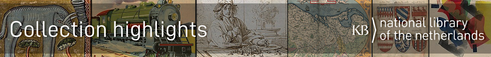

# 50 cool new things you can now do with KB's collection highlights - Part 1, Introduction

*In this [series of 5 articles](index.md) I show the added value of putting images and metadata of [digitised collection highlights](https://www.kb.nl/galerij/digitale-topstukken) of the KB, national library of the Netherlands, into the Wikimedia infrastructure. By putting our collection highlights into Wikidata, Wikimedia Commons and Wikipedia, dozens of new functionalities have been added. As a result of Wikifying this collection, you can now do things with these highlights that were not possible before.*

## Collection highlights of the KB
Before I begin to unfold the parts in the right hand knife one by one in the next four articles, let me tell a bit more about the collection highlights of the KB, and which things you can do with them on the native websites of the KB.   

The more than 70 highlights of the KB are collection items that are of particular cultural or historical value. Ranging from the early Middle Ages to the 20th century, they comprise manuscripts, books, magazines, armorials, atlases, alba amicorum, childrens's books and even photo albums. All objects have been digitised in high resolution and are presented as [browse books on the KB website](https://www.kb.nl/galerij/digitale-topstukken).  

<a href="https://www.kb.nl/dernaturenbloeme"><kbd></kbd></a><a href="https://www.kb.nl/heyblocq"><kbd></kbd></a><a href="https://www.kb.nl/ortelius"><kbd></kbd></a><a href="https://www.kb.nl/vogelen"><kbd></kbd></a><a href="https://www.kb.nl/bazar"><kbd></kbd></a><a href="https://www.kb.nl/fabrieksprentenboeken"><kbd></kbd></a><a href="https://www.kb.nl/hotprinting"><kbd></kbd></a> *Sample gallery of KB's collection highlights*

## Functionalities on kb.nl
Peeking at the left hand knife, I would like to look at our own KB webservices and the things you could already do with the highlights, before we decided to Wikify them. So let's make a list. Some screenshots below show Dutch language web interfaces, due to the KB not fully offering all interfaces in English.    

1) Request an alphabetical **list of the highlights**, in HTML format. This overview is not available in CSV, XML, JSON or any other standard stuctured format
<kbd></kbd>
*Overview of [KB collection highlights](https://www.kb.nl/galerij/digitale-topstukken). Screenshot KB website d.d. 30-03-2021*

2) **View the works as browsable books**, in high resolution, using an image viewer. See for example the [Zweder Book of Hours](https://galerij.kb.nl/kb.html#/nl/zweder/page/14/zoom/2/lat/-42.03297433244139/lng/-10.546875) or the [Album amicorum of Jacob Heyblocq](https://galerij.kb.nl/kb.html#/nl/heyblocq/page/129/zoom/3/lat/-77.50411917973987/lng/75.41015624999999).
<kbd></kbd>
*Album amicorum of Jacob Heyblocq [presented as a browse book](https://galerij.kb.nl/kb.html#/nl/heyblocq/page/129/zoom/3/lat/-78.6991059255054/lng/79.453125) in a high resolution image viewer. Screenshot KB website d.d. 30-03-2021*

3) For some highlights, **transcriptions, translations, annotations and / or guided tours** are available as part of the presentation, such as with the aforementioned album amicorum.
    <kbd></kbd>
    *Transcription (top), translation (middle) and annotations (bottom) for [page 7](https://galerij.kb.nl/kb.html#/nl/heyblocq/page/6/zoom/3/lat/-76.88077457250164/lng/70.13671875) of the Album amicorum of Jacob Heyblocq . Screenshot KB website d.d. 30-03-2021*
    <kbd></kbd>
    *Guided tours in the Album amicorum of Jacob Heyblocq. Screenshot KB website d.d. 30-03-2021*

4) For specific highlights - the alba amicorum - you can request the **separate images as downloadable jpgs**, such as [this page](https://resolver.kb.nl/resolve?urn=EuropeanaTravel:79L5:003r) from the [album amicorum book of Petronella Moens](https://galerij.kb.nl/kb.html#/nl/moens/page/4/zoom/3/lat/-79.71860546904043/lng/-28.828124999999996) or [this poem](https://resolver.kb.nl/resolve?urn=EuropeanaTravel:133M117:016v) from the [album of Samuel Johannes van den Bergh](https://galerij.kb.nl/kb.html#/nl/vandenbergh/page/22/zoom/2/lat/-68.78414378041504/lng/-50.625). But these are exceptions, for the vast majority of highlights the individual from the browse book cannot be downloaded.
    <kbd></kbd>
    *Downloadable jpg : [folio 3r](https://resolver.kb.nl/resolve?urn=EuropeanaTravel:79L5:003r)* from the [album amicorum book of Petronella Moens](https://galerij.kb.nl/kb.html#/nl/moens/page/4/zoom/3/lat/-79.71860546904043/lng/-28.828124999999996)

5) Read **contextual information** about the masterpiece - see, for example, the notes to [Atlas Ortelius](https://www.kb.nl/themas/atlassen/atlas-ortelius) or to [Naenia and Jan Toorop](https://www.kb.nl/themas/boekkunst-en-geillustreerde-boeken/naenia-en-jan-toorop)
    <kbd>
    **

6) For a number of highlights **browse indices** are available , such as for [Nederlandsche Vogelen](https://www.kb.nl/themas/boekkunst-en-geillustreerde-boeken/nederlandsche-vogelen-van-nozeman-en-sepp/nederlandsche-vogelen-index), a [film title register](https://www.kb.nl/themas/boekgeschiedenis/populair-drukwerk/asta-theater-programmaboeken) of the [ASTA theater](https://nl.wikipedia.org/wiki/ASTA) or a [place name index](https://www.kb.nl/themas/atlassen/stedenatlas-de-wit) for Atlas de Wit. However, these indices are not searchable and only available in a HTML format (as a web page).
    </kbd>
    **
    
7) If you are interested in the **metadata of the highlights**, you can find them in the [KB catalog](https://opc-kb.oclc.org/DB=1/SET=1/TTL=1/LNG=EN/), eg [Buiten! Waar de vogels fluiten](https://resolver.kb.nl/resolve?urn=PPN:238308081) (Outside! Where the birds are singing), the [Egmond Gospels](https://resolver.kb.nl/resolve?urn=PPN:311779433) or [Hot printing by H.N. Werkman](https://resolver.kb.nl/resolve?urn=PPN:369506812).
    <kbd></kbd>
    **
    
8) Tot slot: als je liever die metadata in gestructureerd formaat wilt hebben, dan kun je die via onze jSRU- en OAI-diensten opvragen, bv. Wat is er op de kermis te zien? (via jSRU) of deze albumbijdrage (via OAI) uit het vriendenboek van Samuel Johannes van den Bergh. Wel alleen hele records, uitsluitend in XML, en voor de OAI-services moet je VPN aan hebben staan, of in het KB-gebouw zijn.
8) Finally: if you prefer to have that **metadata in a structured format**, you can request it via our jSRU and OAI-PMH services, eg [Wat is er op de kermis te zien?](http://jsru.kb.nl/sru/sru?x-collection=GGC&recordSchema=dcx&operation=searchRetrieve&query=%22KW%20XKZ%20160%22) (What can be seen at the fair?) (via jSRU) or [this album contribution](http://services.kb.nl/mdo/oai?verb=GetRecord&identifier=PPN:310920310) (via OAI-PMH) from the Album amicorum of Samuel Johannes van den Bergh. This metadata is only available as whole records, only in XML.
    <kbd></kbd>
    **

## Limitations

Wat kan er nu niet, bijvoorbeeld?
What is not possible now, for example? 

Deze mogelijkheden zijn al aardig tof natuurlijk, maar als je bv.

    in een oogopslag een snelle visuele indruk van alle topstukken samen wilt krijgen
    alle pm. 10.000 afbeeldingen uit de (59) rechtenvrije topstukken in diverse resoluties wilt downloaden
    de topstukken in PDF-formaat wilt hebben
    de afbeeldingen van de topstukken op inhoud wilt doorzoeken (wat is er op te zien?)
    een lijst van alle topstukken en/of bovengenoemde bladerindexen als CSV, XMl of JSON wilt opvragen
    een overkoepelend overzicht wilt krijgen welke auteurs, vervaardigers, uitgevers, drukkers, illustratoren, vertalers, eigenaren, verzamelaars, locaties etc. bij de topstukken betrokken zijn
    datavisualisaties van onze topstukken wilt maken (tijdlijn, kaartjes etc.)
    kant-en-klare Python/PHP/Ruby scripts wilt hebben om onze topstukken in andere producten & diensten te kunnen verwerken
    de metadata van de topstukken als Linked Open Data wilt publiceren

These options are already quite cool of course, but if you eg.

- want to get a quick visual impression of all the masterpieces together at a glance
- all pm. Download 10,000 images from the (59) royalty-free masterpieces in various resolutions
- want to have the masterpieces in PDF format
- want to search the images of the masterpieces for content (what can be seen on it?)
- want to request a list of all highlights and / or the above-mentioned browse indexes as CSV, XMl or JSON
- want to get an overarching overview of which authors, makers, publishers, printers, illustrators, translators, owners, collectors, locations, etc. are involved in the masterpieces
- want to make data visualisations of our masterpieces (timeline, cards, etc.)
- want ready-to-use Python / PHP / Ruby scripts to be able to process our masterpieces in other products & services
- want to publish the metadata of the masterpieces as Linked Open Data

… dan kwam je in de meeste gevallen van een koude kermis thuis. Maar dankzij het Toptukkenproject kunnen dat soort dingen – en veel, veel meer - nu opeens wél heel makkelijk.
… Then in most cases you came home from a rude awakening. But thanks to the Toptukken project, things like that - and much, much more - can now suddenly become very easy.

## Wikifying the collection highlights
- Topstukkenproject 2020 --> Wikifiocering --> gebruik slides uit presentatie
- Rationale achter project = meer zichtbaarhei en meer herbruikbaarheid
    <kbd></kbd>
    **
https://commons.wikimedia.org/wiki/File:Zichtbaarheid_%26_hergebruik_KB-Topstukken-_HNI_-_14_januari_2021.pdf 
https://www.wikidata.org/wiki/Wikidata:WikiProject_Collection_highlights_National_Library_of_the_Netherlands

## The next 4 articles

In de volgende vier Plein-berichten wil ik de komende tijd al deze nieuwe mogelijkheden met jullie delen, steeds ongeveer 10 per bericht, om het enigszins behapbaar te houden. Hier meteen Deel 2, waarin ik allerlei handige overzichten voor alle 70 topstukken samen bespreek.
In the next four Plein messages I want to share all these new possibilities with you in the coming period, each time about 10 per message, to keep it somewhat manageable. Right here Part 2, in which I discuss all kinds of useful overviews for all 70 masterpieces together. 

Part 1, Introduction // [Part 2, Overviews of all highlights](Part%202%2C%20Overviews%20of%20all%20highlights.html) // [Part 3, Overviews per highlight](Part%203%2C%20Overviews%20per%20highlight.html) // [Part 4, Images](Part%204%2C%20Images.html) // [Part 5, Reuse](Part%205%2C%20Reuse.html)

## About the author

Olaf Janssen is the Wikimedia coordinator of the KB, the national library of the Netherlands. He contributes to
[Wikipedia](https://nl.wikipedia.org/wiki/Wikipedia:GLAM/Koninklijke_Bibliotheek_en_Nationaal_Archief), [Wikimedia Commons](https://commons.wikimedia.org/wiki/Category:Koninklijke_Bibliotheek) and [Wikidata](https://www.wikidata.org/wiki/Wikidata:GLAM/Koninklijke_Bibliotheek_Nederland) as [User:OlafJanssen](https://nl.wikipedia.org/wiki/Gebruiker:OlafJanssen) 

## Reusing this article
This text of this article is available under the [CC-BY 4.0](https://creativecommons.org/licenses/by/4.0/) license. 
<kbd></kbd>

<b>Image credits</b> 
[Swiss_army_knife_open,_2012-(01)](https://commons.wikimedia.org/wiki/File:Swiss_army_knife_open,_2012-(01).jpg) -- Joe Loong, [CC BY-SA 2.0](https://creativecommons.org/licenses/by-sa/2.0), via Wikimedia Commons 
[Victorinox_Swiss_Army_SwissChamp_XAVT](https://commons.wikimedia.org/wiki/File:Victorinox_Swiss_Army_SwissChamp_XAVT.jpg) -- Dave Taylor from Boulder, CO, [CC BY 2.0](https://creativecommons.org/licenses/by/2.0>), via Wikimedia Commons
