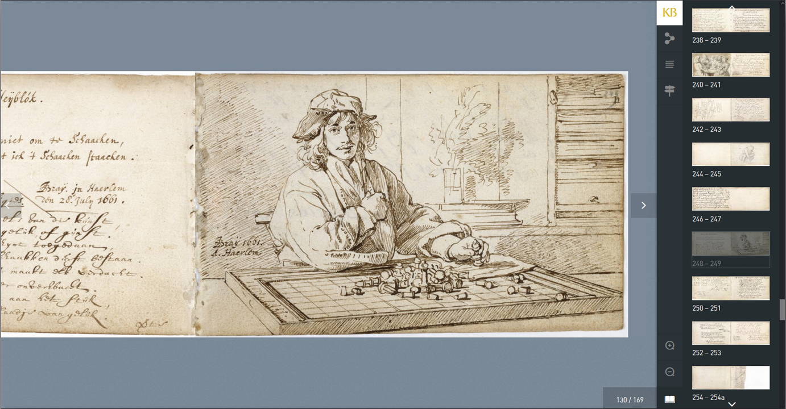
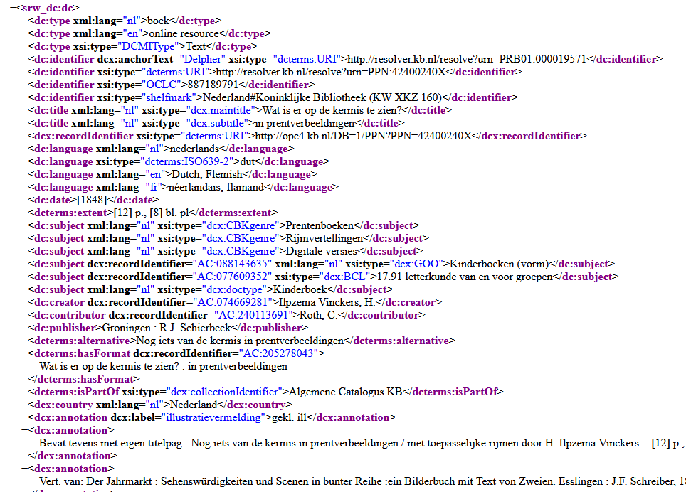

# 50 cool new things you can now do with KB's collection highlights - Part 1, Introduction

*In this [series of 5 articles](index.md) I show the added value of putting images and metadata of [digitised collection highlights](https://www.kb.nl/galerij/digitale-topstukken) of the KB, national library of the Netherlands, into the Wikimedia infrastructure. By putting our collection highlights into Wikidata, Wikimedia Commons and Wikipedia, dozens of new functionalities have been added. As a result of Wikifying this collection, you can now do things with these highlights that were not possible before.*

## Collection highlights of the KB
Before I begin to unfold the bits & tools in the right hand knife one by one in the next four articles, let me tell a bit more about the collection highlights of the KB, and which things you can do with them on the native websites of the KB.   

The more than 70 highlights of the KB are collection items that are of particular cultural or historical value. Ranging from the early Middle Ages to the 20th century, they comprise manuscripts, books, magazines, armorials, atlases, alba amicorum, childrens's books and even photo albums. All objects have been digitised in high resolution and are presented as [browse books on the KB website](https://www.kb.nl/galerij/digitale-topstukken).  

<a href="https://www.kb.nl/dernaturenbloeme"><kbd></kbd></a><a href="https://www.kb.nl/heyblocq"><kbd></kbd></a><a href="https://www.kb.nl/ortelius"><kbd></kbd></a><a href="https://www.kb.nl/vogelen"><kbd></kbd></a><a href="https://www.kb.nl/bazar"><kbd></kbd></a><a href="https://www.kb.nl/fabrieksprentenboeken"><kbd></kbd></a><a href="https://www.kb.nl/hotprinting"><kbd></kbd></a> *Sample gallery of KB's collection highlights*

## Functionalities on kb.nl
Peeking at the left hand knife, I would like to look at the native KB webservices and the functionalities these offer for our highlights, before we decided to Wikify them. So let's make a list. Some screenshots below show Dutch language web interfaces, due to the KB not fully offering all interfaces in English.    

1) Request an alphabetical **list of the highlights**, in HTML format. This overview is not available in CSV, XML, JSON or any other standard stuctured format. 
    <kbd></kbd> *Overview of [KB collection highlights](https://www.kb.nl/galerij/digitale-topstukken). Screenshot KB website d.d. 30-03-2021*

2) **View the works as browsable books**, in high resolution, using an image viewer. See for example the [Zweder Book of Hours](https://galerij.kb.nl/kb.html#/nl/zweder/page/14/zoom/2/lat/-42.03297433244139/lng/-10.546875) or the [Album amicorum of Jacob Heyblocq](https://galerij.kb.nl/kb.html#/nl/heyblocq/page/129/zoom/3/lat/-77.50411917973987/lng/75.41015624999999). 
    <kbd></kbd> *Album amicorum of Jacob Heyblocq [presented as a browse book](https://galerij.kb.nl/kb.html#/nl/heyblocq/page/129/zoom/3/lat/-78.6991059255054/lng/79.453125) in a high resolution image viewer. Screenshot KB website d.d. 30-03-2021*

3) For some highlights, **transcriptions, translations, annotations and/or guided tours** are available as part of the presentation, such as with the Heyblocq album.  
    <kbd></kbd> *Transcription (top yellow box), translation into English (middle) and annotations in English (bottom) for [page 7](https://galerij.kb.nl/kb.html#/nl/heyblocq/page/6/zoom/3/lat/-76.88077457250164/lng/70.13671875) of the Album amicorum of Jacob Heyblocq . Screenshot KB website d.d. 30-03-2021*
    
    <kbd></kbd> *Guided tours in Dutch in the Album amicorum of Jacob Heyblocq. Screenshot KB website d.d. 30-03-2021*

4) For specific highlights - the alba amicorum - you can request the **separate images as downloadable jpgs**, such as [this page](https://resolver.kb.nl/resolve?urn=EuropeanaTravel:79L5:003r) from the [album amicorum of Petronella Moens](https://galerij.kb.nl/kb.html#/nl/moens/page/4/zoom/3/lat/-79.71860546904043/lng/-28.828124999999996) or [this poem](https://resolver.kb.nl/resolve?urn=EuropeanaTravel:133M117:016v) from the [album of Samuel Johannes van den Bergh](https://galerij.kb.nl/kb.html#/nl/vandenbergh/page/22/zoom/2/lat/-68.78414378041504/lng/-50.625). But these are exceptions, for the majority of highlights the individual images cannot be downloaded from the browse books.
    <kbd></kbd> *Downloadable jpg : [folio 3r](https://resolver.kb.nl/resolve?urn=EuropeanaTravel:79L5:003r)* from the [album amicorum book of Petronella Moens](https://galerij.kb.nl/kb.html#/nl/moens/page/4/zoom/3/lat/-79.71860546904043/lng/-28.828124999999996)

5) Read **contextual information** about the highlights. See for example the introductions to [Atlas Ortelius](https://www.kb.nl/themas/atlassen/atlas-ortelius) or to [Naenia en Jan Toorop](https://www.kb.nl/themas/boekkunst-en-geillustreerde-boeken/naenia-en-jan-toorop) 
    <kbd></kbd> *Contextual information: introduction to [Naenia en Jan Toorop](https://www.kb.nl/themas/boekkunst-en-geillustreerde-boeken/naenia-en-jan-toorop) on kb.nl. Screenshot KB website d.d. 30-03-2021*

6) For a number of highlights **browse indexes** are available, such as for [Nederlandsche Vogelen](https://www.kb.nl/themas/boekkunst-en-geillustreerde-boeken/nederlandsche-vogelen-van-nozeman-en-sepp/nederlandsche-vogelen-index) (*Birds of the Netherlands*), a [film title register](https://www.kb.nl/themas/boekgeschiedenis/populair-drukwerk/asta-theater-programmaboeken) of the [ASTA theatre](https://nl.wikipedia.org/wiki/ASTA) or a [place name index](https://www.kb.nl/themas/atlassen/stedenatlas-de-wit) for Atlas de Wit. However, these indexes are not searchable and only available in HTML format (ie. as web pages). 
    <kbd></kbd> *[Place name index](https://www.kb.nl/themas/atlassen/stedenatlas-de-wit) for Atlas de Wit. Screenshot KB website d.d. 30-03-2021*
    
7) If you are interested in the **metadata of the highlights**, you can find them in the [KB catalog](https://opc-kb.oclc.org/DB=1/SET=1/TTL=1/LNG=EN/). For instance,  [Buiten! Waar de vogels fluiten](https://resolver.kb.nl/resolve?urn=PPN:238308081) (*Outside! Where the birds are singing*), the [Egmond Gospels](https://resolver.kb.nl/resolve?urn=PPN:311779433) or [Hot printing by H.N. Werkman](https://resolver.kb.nl/resolve?urn=PPN:369506812). 
    <kbd></kbd> *[KB catalog record](https://resolver.kb.nl/resolve?urn=PPN:369506812) for [Hot printing van H.N. Werkman](http://www.kb.nl/hotprinting). Screenshot KB catalog d.d. 30-03-2021*
    
8) Finally: if you prefer to have that **metadata in a structured format**, you can request it via our jSRU service, eg. for [Wat is er op de kermis te zien?](http://jsru.kb.nl/sru/sru?x-collection=GGC&recordSchema=dcx&operation=searchRetrieve&query=%22KW%20XKZ%20160%22) (*What can be seen at the fair?*). Please note: this metadata is only available as whole records (eg. you can't request only the *dc:title* field), and only in XML (you can't request it in JSON). 
    <kbd></kbd> *[XML response](http://jsru.kb.nl/sru/sru?x-collection=GGC&recordSchema=dcx&operation=searchRetrieve&query=%22KW%20XKZ%20160%22) for [Wat is er op de kermis te zien?](https://resolver.kb.nl/resolve?urn=PPN:205278043) from the KB SRU service. Screenshot d.d. 30-03-2021*

## Limitations
These functionalities offer decent ways to interact with the objects, but they have their limitations. For instance, if you  
* want to get a quick visual impression/overview of all highlights combined
* want to download all pm. 11.0000 images from the out-of-copyright (public domain) highlights in various resolutions
* want to have the highlights as PDFs
* want to search for things and objects depicted in the highlights
* want to request a list of all highlights and/or the above-mentioned browse indexes in CSV, XML or JSON formats
* want to get overviews of which people (authors, makers, publishers, printers, illustrators, translators, owners, collectors) and locations (including lat-longs) are related to which highlights
* want to make data visualisations of the highlights (timelines, maps, bubble charts etc.)
* want ready-to-use Python/PHP/Java scripts to be able to process the KB highlights in other (external) products & services
* want to publish the metadata of the highlights as 5* Linked Open Data

... then the KB websites can't help you. But thanks to a recent project to Wikify our highlights, these kinds of functionalities - and many more - have now become available.

## New audiences for our highlights
If you are a *regular consumer* and want to simply *discover, view or read* KB's collection highlights, the 'read/view-only' functionalities offered on KB's native websites are probably good enough for you. In many cases you won't be bothered by the types of limitations mentioned above. 

However, if you are a *creator/developer* and want to actually *reuse or build upon* our highlights you are probably looking for ways to interact with these objects in more flexible, targeted, automated or programmatic ways. Ideally, you would like the highlights to be 'decomposable' into individual building blocks (like LEGO® bricks) which you can then rearrange into new custom apps, services, products or data streams.

<kbd></kbd><kbd></kbd><kbd></kbd>

This reuse-centric approach was at the core of the [WikiProject Collection highlights](https://www.wikidata.org/wiki/Wikidata:WikiProject_Collection_highlights_National_Library_of_the_Netherlands) the KB ran in the second half of 2020. This project represents a new way of thinking about our collection highlights: in addition to the regular *view/read-only* functionalities for classical audiences (*consumers*), we are now also focusing on *reusability* of our highlights, providing building blocks and added value for *creators*: developers, app builders, digital humanities, data scientists, hackathons, LOD communities, GLAMs, Europeana, AIs, Big Tech etc.

In other words, we are increasingly thinking about our set of collection highlights as a richly filled LEGO Technic® box, with many sorts of building blocks, components and connectors that creators/reusers can pick and combine for their own purposes. 

<kbd></kbd><kbd></kbd>

## Wikifying KB's collection highlights
If you look closely at our LEGO® box, you'll notice that its 'powered by' Wikidata, Wikimedia Commons and Wikipedia. This is no coincidence, as many of the building blocks we were looking for were readily available in the Wikimedia infrastructure. Think for instance: 
* an open platform for uploading, describing, curating and sharing 1000s of public domain images of KB's highlights (*Wikimedia Commons*) 
* an open platform for creating, managing, linking and sharing multilingual 5* Linked Open Data under CC0-licensing (*Wikidata*) 
* an open and extremely well-visited platform for providing context for our highlights (*Wikipedia*) 
* with SPARQL endpoints (*Wikidata and Wikimedia Commons*)
* and REST APIs delivering machine readable outputs in CSV, JSON or RDF (*all three*) 
* and data visualisation tools (*Wikidata and Wikimedia Commons*)
* with good integrations for Python, PHP and many other popular languages. 

<kbd></kbd><kbd></kbd>

Furthermore, the contents of this box are
* *Free* - the Wikimedia infrastructure is a [public utility](https://en.wikipedia.org/wiki/Public_utility) that is just out there for anyone to use and benefit from, for free, without any membership, license and/or management fees. This meant the KB could budget and run the project with personnel costs *only*, as no material costs for IT hosting, licensing, tooling etc. were needed.
* *No burden* for KB's internal IT operations. Running all infrastructure outside the KB is putting no extra burden on our already overstressed IT department.
* *Unlimited* - we never noticed any limits to the amount of images or data we could upload to or download from Wikimedia Commons or Wikidata. OK, we noticed some throttling when making too many simultaneous Wikidata API calls, but that was never a major issue.   
* *Sustainable* - Wikipedia has been alive and kicking for over 20 years, Wikidata for nearly 10 and their futures look bright. In the meantime, quite a few websites of the KB (and other GLAMs) have disappeared from the public web, at best these are now only accessible in non-public web archives.       
* *Publicly accessible* - anyone can use the Wikimedia platforms, contents and tools, without geografic or economic boundaries. All you need is a (free) account and some commitment to get familiar with the Wikimedia ecosystem and community.   
* *Participative* - anyone can contribute to improving KB's collection highlights using the platforms and tools available in the Wikimedia infrastructure. 

All considerations combined, Wikimedia offers a pretty complete and reliable infrastructue that enables us to greatly improve the reusability of our collection highlights at very limited costs & resources. This improved reusability will eventually lead to improved uptake into apps, sites, services and channels of 3rd parties, which will result into improved visibility & findability for general audiences (consumers). 

<kbd></kbd>

## In the next 4 articles
So far for this introduction. In the next four articles I want to share no fewer than 50 new possibilities that have become available as a result of the WikiProject Collection highlights. To make it somewhat digestable, I'll split them up into pm. 10-13 functionalities per article. 

In [Part 2, Overviews of all highlights](Part%202%2C%20Overviews%20of%20all%20highlights.html) I'll talk about all sorts of useful overviews & listings that can created from the LEGO® box for all highlights combined. 

## About the author

Olaf Janssen is the Wikimedia coordinator of the KB, the national library of the Netherlands. He contributes to
[Wikipedia](https://nl.wikipedia.org/wiki/Wikipedia:GLAM/Koninklijke_Bibliotheek_en_Nationaal_Archief), [Wikimedia Commons](https://commons.wikimedia.org/wiki/Category:Koninklijke_Bibliotheek) and [Wikidata](https://www.wikidata.org/wiki/Wikidata:GLAM/Koninklijke_Bibliotheek_Nederland) as [User:OlafJanssen](https://nl.wikipedia.org/wiki/Gebruiker:OlafJanssen) 

## Reusing this article
This text of this article is available under the [CC-BY 4.0](https://creativecommons.org/licenses/by/4.0/) license. 
<kbd></kbd>

<b>Image sources & credits</b> 
[Swiss_army_knife_open,_2012-(01)](https://commons.wikimedia.org/wiki/File:Swiss_army_knife_open,_2012-(01).jpg) -- Joe Loong, [CC BY-SA 2.0](https://creativecommons.org/licenses/by-sa/2.0), via Wikimedia Commons 
[Victorinox_Swiss_Army_SwissChamp_XAVT](https://commons.wikimedia.org/wiki/File:Victorinox_Swiss_Army_SwissChamp_XAVT.jpg) -- Dave Taylor from Boulder, CO, [CC BY 2.0](https://creativecommons.org/licenses/by/2.0), via Wikimedia Commons 
Old paradigm, [Taxidermied Monarch Butterfly in a bell jar](https://commons.wikimedia.org/wiki/File:Monarch_Butterfly_Taxidermy_03.jpg) -- Jeremy Johnson, [CC BY-SA 4.0](https://creativecommons.org/licenses/by-sa/4.0), via Wikimedia Commons 
New paradigm, [Bricks by the Bay 2011](https://www.flickr.com/photos/roninsfx/5568986878) -- Roninsfx, [CC-BY 2.0](https://creativecommons.org/licenses/by/2.0/), via Flickr 
Building blocks for the tech communities, [Wikimedia hackathon San Francisco 2012](https://commons.wikimedia.org/wiki/File:Wikimedia_Hackathon_San_Francisco_107.jpg) -- Matthew (WMF), [CC BY-SA 3.0](https://creativecommons.org/licenses/by-sa/3.0), via Wikimedia Commons 
KB collection highlights LEGO® box - based upon the [Villa Savoye box from the LEGO® Architecture series](https://i.ebayimg.com/images/g/n4AAAOSwjIpgTPWQ/s-l1600.jpg) 
Improved reusability for tech communities, [butterflies in the sky](https://i.pinimg.com/originals/52/5d/30/525d30d3d8050e3b11edd23a219de37f.jpg) 
