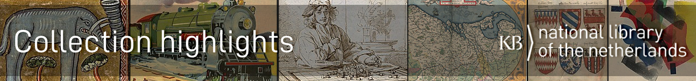
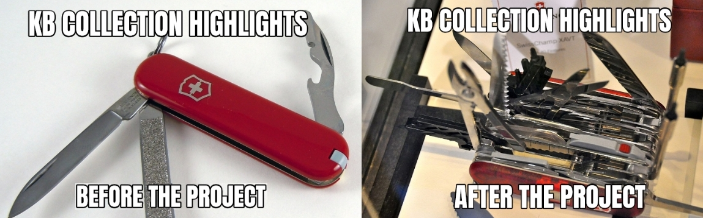
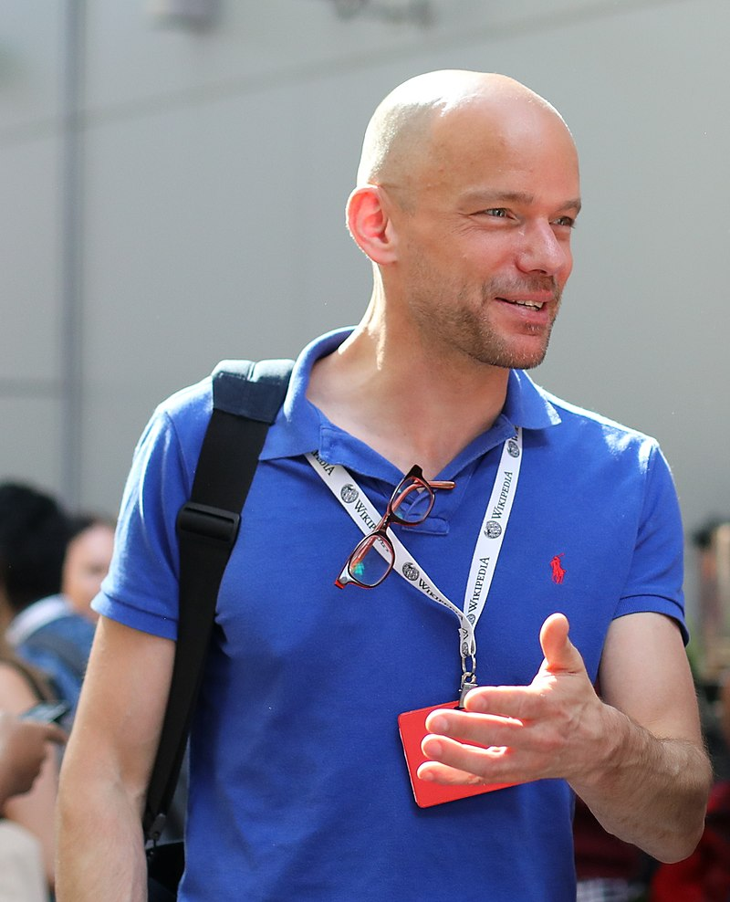

# 50 cool new things you can now do with the KB's collection highlights - Part 2, Overviews of all highlights

In het eerste deel van deze reeks Plein-berichten heb ik de tools van het linker mes besproken, dingen die je voor het Topstukkenproject al met onze topstukken kon doen In dit tweede deel ga ik de eerste paar hulpstukken van het rechter mes uitklappen, dus kijken welke handige & nuttige overzichten van alle 70 topstukken samen er als resultaat van het project beschikbaar zijn gekomen.

Und los gehts:

1) Een thumbnailgallery van alle topstukken: een centrale visuele ingang naar de beelden van alle topstukken. Door te klikken op een thumb ga je voor rechtenvrije werken naar een galerijpagina met alle losse afbeeldingen van het topstuk. Is het werk auteursrechtelijk beschermd, dan ga je naar het bladerboek op kb.nl.

2) Wil je een uitgebreidere visuele indruk krijgen van bv. de overeenkomsten en diversiteit van alle topstukken, zonder daarbij te hoeven bladeren door alle aparte bladerboeken op kb.nl, dan kun je op deze galerijpagina terecht, met steeds maximaal zes previews per werk. Door op de titelkop te klikken ga je naar een galerij met losse afbeeldingen van het desbetreffende topstuk. Wegens auteursrechten wel alleen voor de werken in het publieke domein.

3) Het kan handig zijn om de topstukken gegroepeerd naar type/soort te zien, dus de middeleeuwse handschriften bij elkaar, de atlassen bij elkaar, de kinderprentenboeken bij elkaar, idem voor de vriendenboeken en tijdschriften. Dat kan heel makkelijk op deze pagina, met wederom maximaal zes previews per werk, en steeds de mogelijkheid door te klikken naar een galerijpagina met losse afbeeldingen (bij rechtenvrije werken), dan wel het bladerboek op kb.nl bij auteursrechtelijk beschermde topstukken.

4) Maar heb je liever een alfabetisch overzicht van alle 70 topstukken, dat kan ook. Naast de metadata zie je bij rechtenvrije werken steeds een grote thumbnail, bij auteursrechtelijk beschermde topstukken zie je een passend copyrighticoon. Ook zijn er consequent doorverwijzingen naar het bladerboek en de toelichting op kb.nl, de KB-catalogus en - indien beschikbaar - het Wikipedia-artikel over het topstuk.

5) Ook fijn, zo’n sorteerbare overzichtstabel met handig in 1 overzicht het KB-inventarisnummer, het PPN, en links naar de KB-catalogus en het bladerboek met toelichting op kb.nl.

6) In die tabel is rechts ook de manifeste auteursrechtenstatus van elk topstuk te zien, meestal is dat publiek domein, bij 11 topstukken is dat ‘auteursrechtelijk beschermd’ en bij Chassidische Legenden is het gemengd: de grafiek van H.N. Werkman is rechtenvrij, de teksten van Martin Buber niet.

7) Steeds meer KB-topstukken zijn ook als PDF beschikbaar. Je vindt ze handig bij elkaar op deze overzichtspagina. Wegens auteursrechten wel alleen voor de werken in het publieke domein.

8) Welk topstuk is ouder, Atlas van der Hagen of het Visboeck Coenen? Wil je de topstukken in chronologische volgorde ontdekken, dan is deze interactieve tijdlijn erg handig.

9) Met behulp van het bij punt 4 genoemde alfabetisch overzicht kun je ook zicht krijgen op bij de topstukken betrokken personen & instellingen, en welke rol zij daarbij vervulden: denk o.a. aan auteur, vervaardiger, bijdrager, uitgever, drukker, illustrator, vertaler, eigenaar of verzamelaar. Bovendien kun je doorklikken naar Wikipedia-artikelen over die personen (blauwe links).

10) Maar mocht je al die betrokkenen liever in een op rol sorteerbare tabel willen zien, geen probleem! Deze tabel is zeker nog niet compleet, in de toekomst zullen er steeds meer betrokkenen aan toegevoegd worden.

11) En ben je geïnteresseerd in nog meer detailtabellen waarin elk aspect van de topstukken opgesomd wordt, die zijn er uiteraard ook gewoon! Naast bovenstaande 'betrokkenentabel' zijn er ook tabellen voor locaties en jaartallen , fysieke eigenschappen, bronnen en beschrijvingen van onze topstukken in databases van anderen. Voor deze detailtabellen geldt ook: nog niet helemaal klaar, in de toekomst zullen er steeds meer gegevens aan worden toegevoegd.

12) Tot slot, nog even terugkomend op die Wikipedia-artikelen over de betrokkenen bij punt 9: je ziet in dat overzicht ook veel betrokken waarover nog geen Nederlandstalig Wikipedia-artikelen geschreven zijn, die hebben m.a.w. geen blauwe links. Om deze ontbrekende artikelen beter herkenbaar te maken is er een apart overzicht van al bestaande en nog gewenste Nederlandstalige Wikipeda-artikelen rondom de KB-topstukken beschikbaar. Hierin worden op 1 pagina de al bestaande (blauwe links) en de nog niet bestaande, dus gewenste Wikipedia-artikelen (d.m.v. in het oog springende rode links) opgesomd. Voor mensen die aan Wikipedia werken is een rode link een actieve uitnodiging om een artikel over dat onderwerp te gaan schrijven.

Das war es, tot zover dit tweede deel. Hier staat Deel 3, waarin ik bespreek welke vernieuwde functionaliteiten er vanaf nu voor de individuele topstukken beschikbaar zijn.

### About the author

Olaf Janssen is the Wikimedia coordinator of the KB, the national library of the Netherlands. He contributes to
[Wikipedia](https://nl.wikipedia.org/wiki/Wikipedia:GLAM/Koninklijke_Bibliotheek_en_Nationaal_Archief), [Wikimedia Commons](https://commons.wikimedia.org/wiki/Category:Koninklijke_Bibliotheek) and [Wikidata](https://www.wikidata.org/wiki/Wikidata:GLAM/Koninklijke_Bibliotheek_Nederland) as [User:OlafJanssen](https://nl.wikipedia.org/wiki/Gebruiker:OlafJanssen) 

### Reusing this article
This text of this article is available under the [CC-BY 4.0](https://creativecommons.org/licenses/by/4.0/) license. 
<kbd></kbd>

<b>Image credits</b> 
[Swiss_army_knife_open,_2012-(01)](https://commons.wikimedia.org/wiki/File:Swiss_army_knife_open,_2012-(01).jpg) -- Joe Loong, [CC BY-SA 2.0](https://creativecommons.org/licenses/by-sa/2.0), via Wikimedia Commons 
[Victorinox_Swiss_Army_SwissChamp_XAVT](https://commons.wikimedia.org/wiki/File:Victorinox_Swiss_Army_SwissChamp_XAVT.jpg) -- Dave Taylor from Boulder, CO, [CC BY 2.0](https://creativecommons.org/licenses/by/2.0>), via Wikimedia Commons
