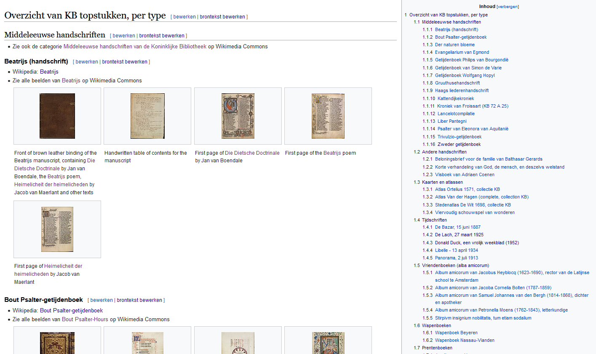
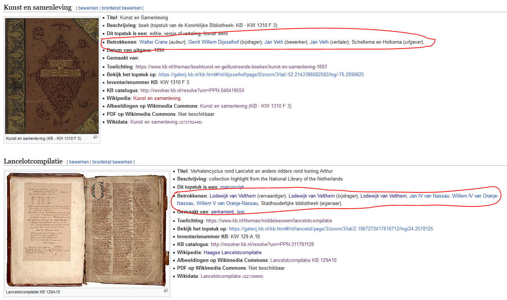

# 50 cool new things you can now do with KB's collection highlights - Part 2, Overviews of all highlights

*In this [series of 5 articles](index.md) I show the added value of putting images and metadata of [digitised collection highlights](https://www.kb.nl/galerij/digitale-topstukken) of the KB, national library of the Netherlands, into the Wikimedia infrastructure. By putting our collection highlights into Wikidata, Wikimedia Commons and Wikipedia, dozens of new functionalities have been added. As a result of Wikifying this collection, you can now do things with these highlights that were not possible before.*

In [Part 1](Part%201%2C%20Introduction.html) of this series, I discussed the bits of the left hand knife, so things you could already do with KB's collection highlights before we started the [WikiProject Collection highlights](https://www.wikidata.org/wiki/Wikidata:WikiProject_Collection_highlights_National_Library_of_the_Netherlands) in 2020. In this second article I'm going to unfold the first few tools of the right hand knife, ie. I'm going to look at which handy & useful *overviews of all highlights together* have become available as a result of the project.

Here we go:

1) A **[thumbnail gallery](https://nl.wikipedia.org/wiki/Wikipedia:GLAM/Koninklijke_Bibliotheek_en_Nationaal_Archief/Topstukken/Galerij)** of all highlights: a central visual entrance to the images of all highlights. By clicking on a thumb you will go to a gallery page (on Wikimedia Commons) containing all individual images of the highlight, if it is a public domain work. If the work is protected by copyright, you'll go to the browsable book on the KB website.

    <kbd></kbd> *[Thumbnail gallery](https://nl.wikipedia.org/wiki/Wikipedia:GLAM/Koninklijke_Bibliotheek_en_Nationaal_Archief/Topstukken/Galerij) of KB collection highlights. Screenshot Dutch Wikipedia d.d. 02-04-2021*

2) If you want to get a **[more extensive visual impression](https://commons.wikimedia.org/wiki/Collection_highlights_of_Koninklijke_Bibliotheek)** of (for example) the similarities and differences between the highlights, and you don't want to browse through all the individual [browse books on the KB website](https://www.kb.nl/galerij/digitale-topstukken), you can visit [this gallery page](https://commons.wikimedia.org/wiki/Collection_highlights_of_Koninklijke_Bibliotheek), providing a maximum of six previews per work. By clicking on the title you'll go to a gallery page with all images of the relevant highlight. Due to copyrights only works in the public domain are displayed.

   <kbd></kbd> *[Gallery overview](https://commons.wikimedia.org/wiki/Collection_highlights_of_Koninklijke_Bibliotheek) of KB collection highlights in the public domain. Screenshot Wikimedia Commons d.d. 02-04-2021*

3) It can be useful to see the highlights **[grouped by type/sort](https://nl.wikipedia.org/wiki/Wikipedia:GLAM/Koninklijke_Bibliotheek_en_Nationaal_Archief/Topstukken/Type)**, so all medieval manuscripts together, the atlases together, all children's picture books grouped, and the same for the alba amicorum and the magazines. This is available on [this page](https://nl.wikipedia.org/wiki/Wikipedia:GLAM/Koninklijke_Bibliotheek_en_Nationaal_Archief/Topstukken/Type), again with a maximum of six previews per work. As before, you can click to see all individual images (for public domain works), or go the browse books on the KB website for copyright protected highlights.

    <kbd></kbd> *[KB highlights grouped by type/sort](https://nl.wikipedia.org/wiki/Wikipedia:GLAM/Koninklijke_Bibliotheek_en_Nationaal_Archief/Topstukken/Type). Screenshot Dutch Wikipedia d.d. 02-04-2021*

4) But if you prefer an **[alphabetical overview](https://nl.wikipedia.org/wiki/Wikipedia:GLAM/Koninklijke_Bibliotheek_en_Nationaal_Archief/Topstukken/Alfabetisch/A-H)** of all highlights, that is also possible. In addition to the metadata, large thumbnails are displayed for works that are out of copyright. There are also consistent references to the browse books and the explanatory notes on the KB website, the KB catalog and - if available - the Dutch Wikipedia articles about the highlights.

    <kbd></kbd> *[Alphabetical overview](https://nl.wikipedia.org/wiki/Wikipedia:GLAM/Koninklijke_Bibliotheek_en_Nationaal_Archief/Topstukken/Alfabetisch/A-H) of KB collection highlights. Screenshot Dutch Wikipedia d.d. 02-04-2021*

    The cool thing about this overview is that it is mostly 'powered by Wikidata'. When you look at the [source code](https://nl.wikipedia.org/w/index.php?title=Wikipedia:GLAM/Koninklijke_Bibliotheek_en_Nationaal_Archief/Topstukken/Alfabetisch/A-H&action=edit), you'll notice all the [Wikidata templating](https://nl.wikipedia.org/wiki/Sjabloon:Wikidata), replacing the traditional static Wiki source code. This way the contents of the page will always be in sync with the information in Wikidata, without needing to update the source whenever changes in Wikidata are made.

   <kbd></kbd> *[Source code](https://nl.wikipedia.org/w/index.php?title=Wikipedia:GLAM/Koninklijke_Bibliotheek_en_Nationaal_Archief/Topstukken/Alfabetisch/A-H&action=edit) for the alphabetical overview. Note all the [{{wikidata}} templating](https://nl.wikipedia.org/wiki/Sjabloon:Wikidata) keeping the overview in sync with Wikidata. Screenshot Dutch Wikipedia d.d. 02-04-2021*

5) How nice, a **[sortable overview table](https://nl.wikipedia.org/wiki/Wikipedia:GLAM/Koninklijke_Bibliotheek_en_Nationaal_Archief/Topstukken/Listeria)** providing a handy illustrated overview that you can sort by title, type, KB inventory number or catalog code.

    <kbd></kbd> *[Sortable overview table](https://nl.wikipedia.org/wiki/Wikipedia:GLAM/Koninklijke_Bibliotheek_en_Nationaal_Archief/Topstukken/Listeria) of collection highlights. Screenshot Dutch Wikipedia d.d. 02-04-2021*

6) On the right hand side this table also shows the **manifest copyright status** of each highlight. For most objects it's [public domain](https://en.wikipedia.org/wiki/Public_domain), 11 highlights are copyright protected and with [Chassidische Legenden](https://www.wikidata.org/wiki/Q72752533) it is mixed: the graphics by [H.N. Werkman](https://en.wikipedia.org/wiki/Hendrik_Nicolaas_Werkman) are in the public domain, the texts by [Martin Buber](https://en.wikipedia.org/wiki/Martin_Buber) are not.

7) Some of the KB highlights are also **[available as PDFs](https://nl.wikipedia.org/wiki/Wikipedia:GLAM/Koninklijke_Bibliotheek_en_Nationaal_Archief/Topstukken/PDFs)** . You will find them conveniently together on [this overview page](https://nl.wikipedia.org/wiki/Wikipedia:GLAM/Koninklijke_Bibliotheek_en_Nationaal_Archief/Topstukken/PDFs). Due to copyrights only for works in the public domain.

    <kbd></kbd> *Collection highlights as [available as PDFs](https://nl.wikipedia.org/wiki/Wikipedia:GLAM/Koninklijke_Bibliotheek_en_Nationaal_Archief/Topstukken/PDFs). Screenshot Dutch Wikipedia d.d. 02-04-2021*

8) Which highlight is older, [Atlas van der Hagen](https://www.kb.nl/themas/atlassen/meer-atlassen/atlas-van-dirk-van-der-hagen) or [Visboeck Coenen](https://www.kb.nl/themas/middeleeuwen/visboek-van-adriaen-coenen)? If you want to discover the highlights in chronological order, this **[interactive timeline](https://nl.wikipedia.org/wiki/Wikipedia:GLAM/Koninklijke_Bibliotheek_en_Nationaal_Archief/Topstukken/Chronologie)** is very useful.

    <kbd></kbd> *[Interactive timeline](https://nl.wikipedia.org/wiki/Wikipedia:GLAM/Koninklijke_Bibliotheek_en_Nationaal_Archief/Topstukken/Chronologie) of KB collection highlights. Screenshot Dutch Wikipedia d.d. 02-04-2021*

9) Using the [alphabetical overview](https://nl.wikipedia.org/wiki/Wikipedia:GLAM/Koninklijke_Bibliotheek_en_Nationaal_Archief/Topstukken/Alfabetisch) mentioned in 4), you can also learn about the **persons & institutions related to the highlights**, and how they are related: as authors, makers, contributors, publishers, printers, illustrators, translators, owners, collectors etc. Clicking on the blue links will show the Dutch Wikipedia articles about these people.

    <kbd></kbd> *In the red boxes: persons & institutions related to KB highlights, and their roles. Screenshot Dutch Wikipedia d.d. 02-04-2021*

10) But if you prefer to see all those people involved in a [table sortable by role](https://www.wikidata.org/wiki/Wikidata:WikiProject_Collection_highlights_National_Library_of_the_Netherlands/Admin/Overview/People), no problem! This table is work in progress, more stakeholders will be added in the future.

    <kbd></kbd> *People related to KB's collection highlights, as a [table sortable by role](https://www.wikidata.org/wiki/Wikidata:WikiProject_Collection_highlights_National_Library_of_the_Netherlands/Admin/Overview/People). Screenshot Dutch Wikipedia d.d. 02-04-2021*

11) En ben je geïnteresseerd in nog meer detailtabellen waarin elk aspect van de topstukken opgesomd wordt, die zijn er uiteraard ook gewoon! Naast bovenstaande 'betrokkenentabel' zijn er ook tabellen voor locaties en jaartallen , fysieke eigenschappen, bronnen en beschrijvingen van onze topstukken in databases van anderen. Voor deze detailtabellen geldt ook: nog niet helemaal klaar, in de toekomst zullen er steeds meer gegevens aan worden toegevoegd.
11) And if you are interested in even more detailed tables in which every aspect of the highlights is listed, they are of course just there! In addition to the 'involved table' above, there are also tables for locations and years, physical properties, sources and descriptions of our top pieces in databases of others. The following also applies to these detail tables: not yet completely finished, more and more data will be added in the future.

12) Tot slot, nog even terugkomend op die Wikipedia-artikelen over de betrokkenen bij punt 9: je ziet in dat overzicht ook veel betrokken waarover nog geen Nederlandstalig Wikipedia-artikelen geschreven zijn, die hebben m.a.w. geen blauwe links. Om deze ontbrekende artikelen beter herkenbaar te maken is er een apart overzicht van al bestaande en nog gewenste Nederlandstalige Wikipeda-artikelen rondom de KB-topstukken beschikbaar. Hierin worden op 1 pagina de al bestaande (blauwe links) en de nog niet bestaande, dus gewenste Wikipedia-artikelen (d.m.v. in het oog springende rode links) opgesomd. Voor mensen die aan Wikipedia werken is een rode link een actieve uitnodiging om een artikel over dat onderwerp te gaan schrijven.
12) Finally, coming back to those Wikipedia articles about those involved in point 9: in that overview you also see many involved about which no Dutch Wikipedia articles have yet been written, in other words, they do not have blue links. To make these missing articles more recognizable, a separate overview of existing and still desired Dutch Wikipeda articles around the KB highlights is available. On 1 page, the already existing (blue links) and the not yet existing, so desired Wikipedia articles (by means of eye-catching red links) are listed on 1 page. For people working on Wikipedia, a red link is an active invitation to write an article on that topic.

    <kbd></kbd> *aaaa. Screenshot Wikipedia d.d. 02-04-2021*

Das war es, tot zover dit tweede deel. Hier staat Deel 3, waarin ik bespreek welke vernieuwde functionaliteiten er vanaf nu voor de individuele topstukken beschikbaar zijn.
Das war es, so far this second part. Here is Part 3, in which I discuss which new functionalities are available for the individual highlights from now on. 

### About the author

Olaf Janssen is the Wikimedia coordinator of the KB, the national library of the Netherlands. He contributes to
[Wikipedia](https://nl.wikipedia.org/wiki/Wikipedia:GLAM/Koninklijke_Bibliotheek_en_Nationaal_Archief), [Wikimedia Commons](https://commons.wikimedia.org/wiki/Category:Koninklijke_Bibliotheek) and [Wikidata](https://www.wikidata.org/wiki/Wikidata:GLAM/Koninklijke_Bibliotheek_Nederland) as [User:OlafJanssen](https://nl.wikipedia.org/wiki/Gebruiker:OlafJanssen) 

### Reusing this article
This text of this article is available under the [CC-BY 4.0](https://creativecommons.org/licenses/by/4.0/) license. 
<kbd></kbd>

<b>Image sources & credits</b> 
[Swiss_army_knife_open,_2012-(01)](https://commons.wikimedia.org/wiki/File:Swiss_army_knife_open,_2012-(01).jpg) -- Joe Loong, [CC BY-SA 2.0](https://creativecommons.org/licenses/by-sa/2.0), via Wikimedia Commons 
[Victorinox_Swiss_Army_SwissChamp_XAVT](https://commons.wikimedia.org/wiki/File:Victorinox_Swiss_Army_SwissChamp_XAVT.jpg) -- Dave Taylor from Boulder, CO, [CC BY 2.0](https://creativecommons.org/licenses/by/2.0>), via Wikimedia Commons
