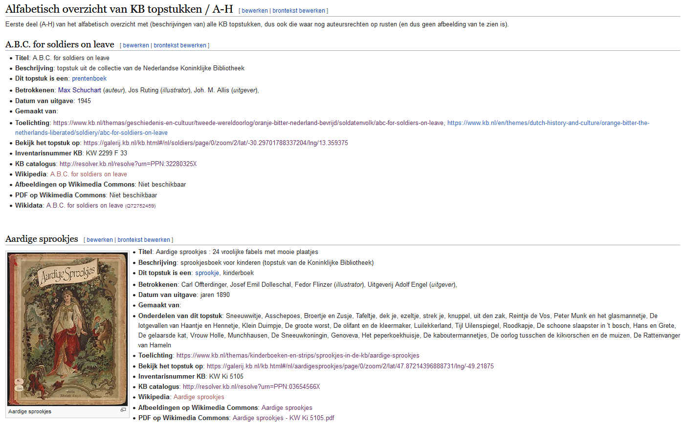
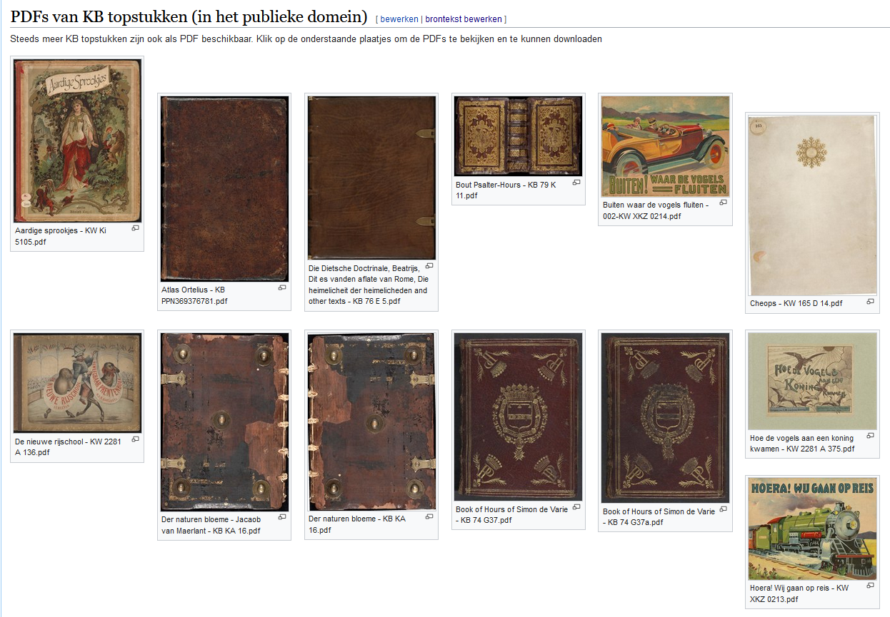
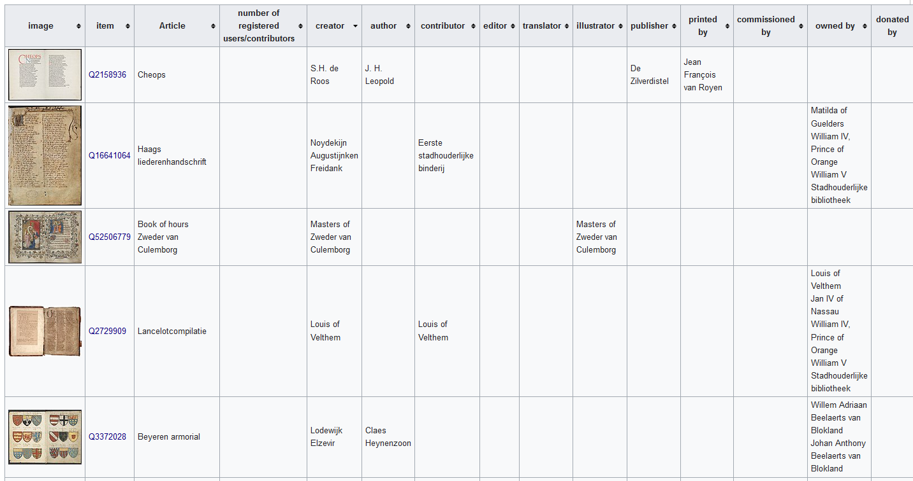

# 50 cool new things you can now do with KB's collection highlights - Part 2, Overviews of all highlights

*In this [series of 5 articles](index.md) I show the added value of putting images and metadata of [digitised collection highlights](https://www.kb.nl/galerij/digitale-topstukken) of the KB, national library of the Netherlands, into the Wikimedia infrastructure. By putting our collection highlights into Wikidata, Wikimedia Commons and Wikipedia, dozens of new functionalities have been added. As a result of Wikifying this collection, you can now do things with these highlights that were not possible before.*

In het eerste deel van deze reeks Plein-berichten heb ik de tools van het linker mes besproken, dingen die je voor het Topstukkenproject al met onze topstukken kon doen In dit tweede deel ga ik de eerste paar hulpstukken van het rechter mes uitklappen, dus kijken welke handige & nuttige overzichten van alle 70 topstukken samen er als resultaat van het project beschikbaar zijn gekomen.
In the first part of this series of Square posts I discussed the tools of the left knife, things you could already do with our highlights for the highlights project.In this second part I'm going to unfold the first few attachments of the right knife, so have a look which handy & useful overviews of all 70 highlights together have become available as a result of the project.

And herte we go:

1) Een thumbnailgallery van alle topstukken: een centrale visuele ingang naar de beelden van alle topstukken. Door te klikken op een thumb ga je voor rechtenvrije werken naar een galerijpagina met alle losse afbeeldingen van het topstuk. Is het werk auteursrechtelijk beschermd, dan ga je naar het bladerboek op kb.nl.
1) A thumbnail gallery of all highlights: a central visual entrance to the images of all highlights. By clicking on a thumb you will go to a gallery page with all loose images of the highlight for royalty-free works. If the work is protected by copyright, go to the browse book on kb.nl.

    <kbd></kbd> *aaaa. Screenshot Wikipedia d.d. 02-04-2021*

2) Wil je een uitgebreidere visuele indruk krijgen van bv. de overeenkomsten en diversiteit van alle topstukken, zonder daarbij te hoeven bladeren door alle aparte bladerboeken op kb.nl, dan kun je op deze galerijpagina terecht, met steeds maximaal zes previews per werk. Door op de titelkop te klikken ga je naar een galerij met losse afbeeldingen van het desbetreffende topstuk. Wegens auteursrechten wel alleen voor de werken in het publieke domein.
2) If you want to get a more extensive visual impression of, for example, the similarities and diversity of all highlights, without having to browse through all the separate browsing books on kb.nl, you can visit this gallery page, with a maximum of six previews per work. By clicking on the title you go to a gallery with separate images of the relevant highlight. Due to copyrights only for works in the public domain.

   <kbd></kbd> *aaaa. Screenshot Wikipedia d.d. 02-04-2021*

3) Het kan handig zijn om de topstukken gegroepeerd naar type/soort te zien, dus de middeleeuwse handschriften bij elkaar, de atlassen bij elkaar, de kinderprentenboeken bij elkaar, idem voor de vriendenboeken en tijdschriften. Dat kan heel makkelijk op deze pagina, met wederom maximaal zes previews per werk, en steeds de mogelijkheid door te klikken naar een galerijpagina met losse afbeeldingen (bij rechtenvrije werken), dan wel het bladerboek op kb.nl bij auteursrechtelijk beschermde topstukken.
3) It can be useful to see the highlights grouped by type / kind, so the medieval manuscripts together, the atlases together, the children's picture books together, ditto for the friends' books and magazines. This is very easy on this page, again with a maximum of six previews per work, and always the option to click through to a gallery page with separate images (for copyright-free works), or the browse book on kb.nl for copyright-protected highlights.

    <kbd></kbd> *aaaa. Screenshot Wikipedia d.d. 02-04-2021*

4) Maar heb je liever een alfabetisch overzicht van alle 70 topstukken, dat kan ook. Naast de metadata zie je bij rechtenvrije werken steeds een grote thumbnail, bij auteursrechtelijk beschermde topstukken zie je een passend copyrighticoon. Ook zijn er consequent doorverwijzingen naar het bladerboek en de toelichting op kb.nl, de KB-catalogus en - indien beschikbaar - het Wikipedia-artikel over het topstuk.
4) But if you prefer an alphabetical overview of all 70 highlights, that is also possible. In addition to the metadata, you will always see a large thumbnail for copyright-free works, and for copyright-protected highlights you will see an appropriate copyright icon. There are also consistent references to the browse book and the explanatory notes on kb.nl, the KB catalog and - if available - the Wikipedia article about the highlight.

5) Ook fijn, zo’n sorteerbare overzichtstabel met handig in 1 overzicht het KB-inventarisnummer, het PPN, en links naar de KB-catalogus en het bladerboek met toelichting op kb.nl.
5) Also nice, such a sortable overview table with a handy overview of the KB inventory number, the PPN, and links to the KB catalog and the leaflet with explanatory notes on kb.nl.

    <kbd></kbd> *aaaa. Screenshot Wikipedia d.d. 02-04-2021*

6) In die tabel is rechts ook de manifeste auteursrechtenstatus van elk topstuk te zien, meestal is dat publiek domein, bij 11 topstukken is dat ‘auteursrechtelijk beschermd’ en bij Chassidische Legenden is het gemengd: de grafiek van H.N. Werkman is rechtenvrij, de teksten van Martin Buber niet.
6) On the right, that table also shows the manifest copyright status of each highlight, usually that is public domain, with 11 highlights it is "copyright protected" and with Hasidic Legends it is mixed: the graph by H.N. Werkman is royalty-free, Martin Buber's lyrics are not.

    <kbd></kbd> *aaaa. Screenshot Wikipedia d.d. 02-04-2021*

7) Steeds meer KB-topstukken zijn ook als PDF beschikbaar. Je vindt ze handig bij elkaar op deze overzichtspagina. Wegens auteursrechten wel alleen voor de werken in het publieke domein.
7) More and more KB highlights are also available as PDF. You will find them conveniently together on this overview page. Due to copyrights only for works in the public domain.

    <kbd></kbd> *aaaa. Screenshot Wikipedia d.d. 02-04-2021*

8) Welk topstuk is ouder, Atlas van der Hagen of het Visboeck Coenen? Wil je de topstukken in chronologische volgorde ontdekken, dan is deze interactieve tijdlijn erg handig.
8) Which highlight is older, Atlas van der Hagen or Visboeck Coenen? If you want to discover the highlights in chronological order, this interactive timeline is very useful.

    <kbd></kbd> *aaaa. Screenshot Wikipedia d.d. 02-04-2021*

9) Met behulp van het bij punt 4 genoemde alfabetisch overzicht kun je ook zicht krijgen op bij de topstukken betrokken personen & instellingen, en welke rol zij daarbij vervulden: denk o.a. aan auteur, vervaardiger, bijdrager, uitgever, drukker, illustrator, vertaler, eigenaar of verzamelaar. Bovendien kun je doorklikken naar Wikipedia-artikelen over die personen (blauwe links).
9) With the help of the alphabetical overview mentioned in point 4, you can also gain insight into the persons & institutions involved in the highlights, and what role they played in this: think of author, maker, contributor, publisher, printer, illustrator, translator, etc. owner or collector. You can also click through to Wikipedia articles about those people (blue links).

    <kbd></kbd> *aaaa. Screenshot Wikipedia d.d. 02-04-2021*

10) Maar mocht je al die betrokkenen liever in een op rol sorteerbare tabel willen zien, geen probleem! Deze tabel is zeker nog niet compleet, in de toekomst zullen er steeds meer betrokkenen aan toegevoegd worden.
10) But if you prefer to see all those involved in a table that can be sorted by role, no problem! This table is certainly not complete yet, more and more stakeholders will be added in the future.

    <kbd></kbd> *aaaa. Screenshot Wikipedia d.d. 02-04-2021*

11) En ben je geïnteresseerd in nog meer detailtabellen waarin elk aspect van de topstukken opgesomd wordt, die zijn er uiteraard ook gewoon! Naast bovenstaande 'betrokkenentabel' zijn er ook tabellen voor locaties en jaartallen , fysieke eigenschappen, bronnen en beschrijvingen van onze topstukken in databases van anderen. Voor deze detailtabellen geldt ook: nog niet helemaal klaar, in de toekomst zullen er steeds meer gegevens aan worden toegevoegd.
11) And if you are interested in even more detailed tables in which every aspect of the highlights is listed, they are of course just there! In addition to the 'involved table' above, there are also tables for locations and years, physical properties, sources and descriptions of our top pieces in databases of others. The following also applies to these detail tables: not yet completely finished, more and more data will be added in the future.

12) Tot slot, nog even terugkomend op die Wikipedia-artikelen over de betrokkenen bij punt 9: je ziet in dat overzicht ook veel betrokken waarover nog geen Nederlandstalig Wikipedia-artikelen geschreven zijn, die hebben m.a.w. geen blauwe links. Om deze ontbrekende artikelen beter herkenbaar te maken is er een apart overzicht van al bestaande en nog gewenste Nederlandstalige Wikipeda-artikelen rondom de KB-topstukken beschikbaar. Hierin worden op 1 pagina de al bestaande (blauwe links) en de nog niet bestaande, dus gewenste Wikipedia-artikelen (d.m.v. in het oog springende rode links) opgesomd. Voor mensen die aan Wikipedia werken is een rode link een actieve uitnodiging om een artikel over dat onderwerp te gaan schrijven.
12) Finally, coming back to those Wikipedia articles about those involved in point 9: in that overview you also see many involved about which no Dutch Wikipedia articles have yet been written, in other words, they do not have blue links. To make these missing articles more recognizable, a separate overview of existing and still desired Dutch Wikipeda articles around the KB highlights is available. On 1 page, the already existing (blue links) and the not yet existing, so desired Wikipedia articles (by means of eye-catching red links) are listed on 1 page. For people working on Wikipedia, a red link is an active invitation to write an article on that topic.

    <kbd></kbd> *aaaa. Screenshot Wikipedia d.d. 02-04-2021*

Das war es, tot zover dit tweede deel. Hier staat Deel 3, waarin ik bespreek welke vernieuwde functionaliteiten er vanaf nu voor de individuele topstukken beschikbaar zijn.
Das war es, so far this second part. Here is Part 3, in which I discuss which new functionalities are available for the individual highlights from now on. 

### About the author

Olaf Janssen is the Wikimedia coordinator of the KB, the national library of the Netherlands. He contributes to
[Wikipedia](https://nl.wikipedia.org/wiki/Wikipedia:GLAM/Koninklijke_Bibliotheek_en_Nationaal_Archief), [Wikimedia Commons](https://commons.wikimedia.org/wiki/Category:Koninklijke_Bibliotheek) and [Wikidata](https://www.wikidata.org/wiki/Wikidata:GLAM/Koninklijke_Bibliotheek_Nederland) as [User:OlafJanssen](https://nl.wikipedia.org/wiki/Gebruiker:OlafJanssen) 

### Reusing this article
This text of this article is available under the [CC-BY 4.0](https://creativecommons.org/licenses/by/4.0/) license. 
<kbd></kbd>

<b>Image credits</b> 
[Swiss_army_knife_open,_2012-(01)](https://commons.wikimedia.org/wiki/File:Swiss_army_knife_open,_2012-(01).jpg) -- Joe Loong, [CC BY-SA 2.0](https://creativecommons.org/licenses/by-sa/2.0), via Wikimedia Commons 
[Victorinox_Swiss_Army_SwissChamp_XAVT](https://commons.wikimedia.org/wiki/File:Victorinox_Swiss_Army_SwissChamp_XAVT.jpg) -- Dave Taylor from Boulder, CO, [CC BY 2.0](https://creativecommons.org/licenses/by/2.0>), via Wikimedia Commons
