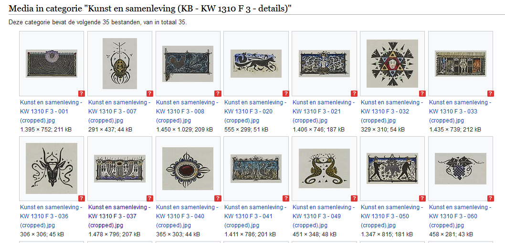
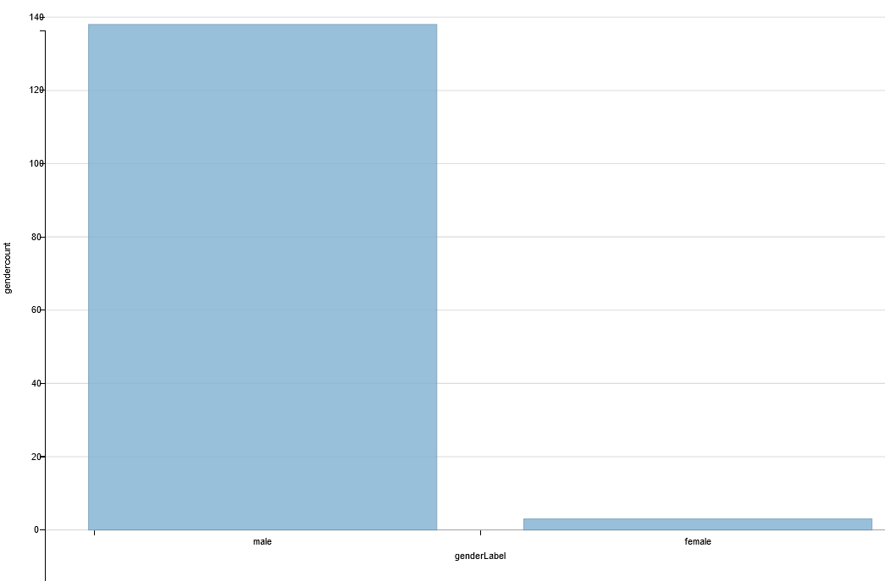
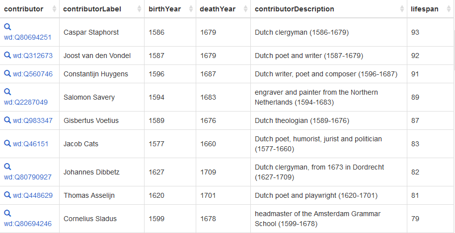

# 50 cool new things you can now do with KB's collection highlights - Part 3, Overviews per highlight

*In this [series of 5 articles](index.md) I show the added value of putting images and metadata of [digitised collection highlights](https://www.kb.nl/galerij/digitale-topstukken) of the KB, national library of the Netherlands, into the Wikimedia infrastructure. By putting our collection highlights into Wikidata, Wikimedia Commons and Wikipedia, dozens of new functionalities have been added: now you can do things with this digital collection that were not possible before.*

In the previous part of this series I folded out the first 12 bits of the right knife. We saw which [handy & useful overviews of all 70  highlights combined](Part%202%2C%20Overviews%20of%20all%20highlights.html) have become available as a result of the [WikiProject Collection highlights](https://www.wikidata.org/wiki/Wikidata:WikiProject_Collection_highlights_National_Library_of_the_Netherlands). These include [image galleries](https://commons.wikimedia.org/wiki/Collection_highlights_of_Koninklijke_Bibliotheek), [alphabetical overviews](https://nl.wikipedia.org/wiki/Wikipedia:GLAM/Koninklijke_Bibliotheek_en_Nationaal_Archief/Topstukken/Alfabetisch) & [tables](https://nl.wikipedia.org/wiki/Wikipedia:GLAM/Koninklijke_Bibliotheek_en_Nationaal_Archief/Topstukken/Listeria) and an [overview of existing and desired Wikipedia articles](https://nl.wikipedia.org/wiki/Wikipedia:GLAM/Koninklijke_Bibliotheek_en_Nationaal_Archief/Topstukken/Artikelen) for our highlights.

In this third article I'm going to discuss the next group of 14 tools of the right hand knife, ie. I'm going to look at which new functionalities *for individual highlights* are available from now on.

OK, time to start running....

## Overviews per highlight

13) As a start, I'd like to briefly go back to the metadata in the [alphabetical overview](https://nl.wikipedia.org/wiki/Wikipedia:GLAM/Koninklijke_Bibliotheek_en_Nationaal_Archief/Topstukken/Alfabetisch) we discussed in Part 2. 
Here, two worlds are merged into a single overview. In the red box the world of KB's collection highlights, with the browse book (*Bekijk het topstuk op*) and the explanatory notes (*Toelichting*), the inventory number (*Inventarisnummer KB*), and the persistent URL of the object in the KB catalog (*KB catalogus - http://resolver.kb.nl...*). In the blue box the world of Wikimedia, with the context of the highlight in Wikipedia, the images (and pdf) in Wikimedia Commons and the structured data in Wikidata.

   <kbd></kbd> *aaaa. Screenshot Wikipedia d.d. 02-04-2021*

14) Voor elk (rechtenvrij) topstuk is een overzichtspagina met alle losse beelden beschikbaar, waarop die in de juiste (blader)volgorde gepresenteerd worden. Erboven staat een blokje metadata voor het hele werk, incl. links naar KB-bronnen. Handig om snel en eenvoudig een overzicht van het hele topstuk te krijgen. Bekijk bv. Buiten! Waar de vogels fluiten of het Getijdenboek Wolfgang Hopyl.
14) For each (royalty-free) highlight, an overview page with all individual images is available, on which they are presented in the correct (scrolling) order. Above it is a block of metadata for the entire work, including links to KB sources. Handy to quickly and easily get an overview of the entire highlight. View eg Outside! Where the birds are singing or the Wolfgang Hopyl Book of Hours.

   <kbd></kbd> *aaaa. Screenshot Wikipedia d.d. 02-04-2021*

15) Naast de losse afbeeldingen zijn er voor de meeste topstukken ook nog (blad)openingen – zoals bij de KB-bladerboeken – beschikbaar. Zie bv. de openingen van Visboek Coenen of die van Die hystorie vanden grooten Coninck Alexander
15) In addition to the separate images, there are also (leaf) openings available for most highlights - such as with the KB browse books. See, for example, the openings of Visboek Coenen or those of Die hystorie vanden grooten Coninck Alexander
 
    <kbd></kbd> *aaaa. Screenshot Wikipedia d.d. 02-04-2021*

16) Bij steeds meer topstukken zijn er, naast de losse beelden en de openingen, ook aparte miniaturen en/of uitsneden van interessante pagina-onderdelen beschikbaar. Zie bv. de 461 miniaturen uit Der Naturen Bloeme, die uit Chroniques de Froissart) of de Escherachtige grafiek uit Kunst en samenleving.
16) With more and more highlights there are, in addition to the individual images and openings, also separate miniatures and / or cut-outs of interesting page parts available. See, for example, the 461 miniatures from Der Naturen Bloeme, those from Chroniques de Froissart) or the Escher-like graphics from Art and Society.

   <kbd></kbd> *aaaa. Screenshot Wikipedia d.d. 02-04-2021*

Naast afbeeldingen zijn ook andere mediatypen m.b.t. de topstukken beschikbaar gekomen.
In addition to images, other media types regarding the highlights have also become available.

17) Zo kun je luisteren naar 11 audiotracks van de Beatrijs, waarin belangrijke strofes uit het gedicht worden voorgelezen door oud-KBer Ad Leerintvelt. Deze mp3s stonden tamelijk verborgen in het Soundcloud-hoekje van de KB en waren nog niet onder een vrije licentie beschikbaar en daarmee niet herbruikbaar. Nu ze ook op Wikimedia Commons staan, zijn ze zichtbaar(der) en wel herbruikbaar onder een vrije licentie , zo zijn ze bv. opgenomen in het artikel over Beatrijs als ‘auditieve illustratie’.
17) You can listen to 11 audio tracks by the Beatrijs, in which important stanzas from the poem are read by former KBer Ad Leerintvelt. These mp3s were quite hidden in the Soundcloud corner of the KB and were not yet available under a free license and therefore not reusable. Now that they are also on Wikimedia Commons, they are visible (more) and can be reused under a free license, for example, they are included in the article about Beatrijs as "auditory illustration".

   <kbd></kbd> *aaaa. Screenshot Wikipedia d.d. 02-04-2021*

18) De video De Nieuwe Rijschool van @karinv die tot nu toe alleen op Youtube te zien was, is voorzien van een vrije licentie en zal binnenkort via Wikimedia Commons en in het artikel De nieuwe rijschool te zien zijn.
18) The video De Nieuwe Rijschool by @karinv, which until now could only be seen on Youtube, has a free license and will soon be available via Wikimedia Commons and in the article The new driving school.

   <kbd></kbd> *aaaa. Screenshot Wikipedia d.d. 02-04-2021*

Hopelijk kunnen we binnenkort ook de Youtube-videos over de Beatrijs en het Gruuthusehandschrift (met @evl010) op een vergelijkbare manier herbruikbaar maken
Hopefully we will soon also be able to make the Youtube videos about the Beatrijs and the Gruuthuse manuscript (with @ evl010) reusable in a similar way.

19) Alle toelichtende teksten op kb.nl over de topstukken zijn onlangs vrijgegeven onder een CC0-publiekdomeinverklaring. Hierdoor zijn de teksten bij het Zweder getijdenboek, Prentenboek 'De boerderij' en de 68 andere topstukken dus opeens vrij herbruikbaar voor iedereen.
19) All explanatory texts on kb.nl about the highlights have recently been released under a CC0 public domain statement. As a result, the texts for the Zweder Book of Hours, Picture Book 'The Farm' and the 68 other highlights are suddenly freely reusable for everyone.

   <kbd></kbd> *aaaa. Screenshot Wikipedia d.d. 02-04-2021*

20) Bovenstaande punten samenvattend: er komen dus steeds meer vrij herbruikbare bouwstenen onder open licenties voor onze topstukken beschikbaar:
20) Summarizing the above points: more and more freely reusable building blocks under open licenses are becoming available for our highlights:

    <kbd></kbd> *aaaa. Screenshot Wikipedia d.d. 02-04-2021*

 * Beelden: losse pagina’s, openingen, miniaturen, detailuitsneden
 * Audiobestanden (zie Beatrijs hierboven)
 * Videobestanden
 * Teksten van kb.nl

 * Images: single pages, openings, thumbnails, detail cuts
 * Audio files (see Beatrijs above)
 * Video files
 * Texts from kb.nl

Dankzij deze herbruikbare componenten wordt het steeds laagdrempeliger voor schrijvers van Wikipedia om een artikel over een KB-topstuk aan te maken of uit te breiden. Je kunt nu immers (delen van) de KB-webteksten zonder gevaar van copyvio overnemen in het artikel, en er is allerhande illustrerend beeld-, video- en audiomateriaal beschikbaar om een artikel mee te verrijken.
Thanks to these reusable components, it is becoming increasingly accessible for writers of Wikipedia to create or expand an article about a KB highlight. After all, you can now copy (parts of) the KB web texts into the article without the risk of copying, and all kinds of illustrative image, video and audio material are available to enrich an article.

Het onlangs aangemaakte artikel over Koninklijke Bibliotheek 79 K 2 (= Zweder getijdenboek) toont dan ook opvallende gelijkenissen met bovengenoemde KB-tekst over het handschrift. Ook zijn er nieuwe, geïllustreerde artikelbeginnetjes gemaakt over de vriendenboeken van Jacoba Maria Bolten, Petronella Moens en Samuel Johannes van den Bergh.
The recently created article about Koninklijke Bibliotheek 79 K 2 (= Zweder Book of Hours) therefore shows striking similarities with the above-mentioned KB text about the manuscript. New, illustrated article starts have also been made about the friends' books of Jacoba Maria Bolten, Petronella Moens and Samuel Johannes van den Bergh.

En in het eerder genoemde overzicht van al bestaande en nog gewenste Nederlandstalige Wikipeda-artikelen is precies te zien voor welke KB-topstukken er nog schrijfwerk te verzetten is.
And in the aforementioned overview of existing and still desired Dutch-language Wikipeda articles, you can see exactly for which KB highlights there is still writing work to be done.

   <kbd></kbd> *aaaa. Screenshot Wikipedia d.d. 02-04-2021*

21) Om duidelijk aan te geven dat de tekst in een Wikipedia-artikel gebaseerd is op kb.nl, is er een bronvermeldingssjabloon gemaakt waarin wordt aangegeven dat 'de informatie op deze pagina, of een eerdere versie daarvan, geheel of gedeeltelijk afkomstig is van kb.nl'. Je kunt het 'in actie' zien onderaan het artikel over het Zweder getijdenboek
21) In order to clearly indicate that the text in a Wikipedia article is based on kb.nl, a citation template has been created stating that 'the information on this page, or an earlier version of it, originates in whole or in part from kb.nl '. You can see it 'in action' at the bottom of the article about the Zweder Book of Hours

   <kbd></kbd> *aaaa. Screenshot Wikipedia d.d. 02-04-2021*

Als afsluiting van deze Plein-post wil ik nog even terugkomen op bij de topstukken betrokken personen (punten 9 en 10 uit Deel 2). En dan specifiek de 141 personen die aan het Vriendenboek van Jacob Heyblocq hebben bijgedragen. We kennen al hun namen (zie aldaar onderaan), maar hoe zagen ze eruit, wat voor werk deden ze, hoe was de M/V verdeling, en hoe oud zijn ze geworden? Al deze vragen kunnen we beantwoorden omdat al die bijdragers bekend zijn in Wikidata.
To conclude this Plein post, I would like to return to the people involved in the highlights (points 9 and 10 from Part 2). And specifically the 141 people who contributed to Jacob Heyblocq's Friends Book. We know all their names (see below), but what did they look like, what kind of work did they do, what was the M / F division, and how old did they get? We can answer all these questions because all those contributors are known in Wikidata.

22) Zo is er een smoelenboek (van slechts 52 bijdragers is een afbeelding bekend) ……
22) There is a face book (an image of only 52 contributors is known) ……

   <kbd></kbd> *aaaa. Screenshot Wikipedia d.d. 02-04-2021*

23) hebben er qua M/V-verdeling slechts drie vrouwen in dit vriendenboek geschreven (Anna Maria van Schurman, Sara van Schilde en Cornelia van der Veer) ….
23), in terms of M / F distribution, only three women have written in this book of friends (Anna Maria van Schurman, Sara van Schilde and Cornelia van der Veer)….

<kbd></kbd> *aaaa. Screenshot Wikipedia d.d. 02-04-2021*

24) hebben vooral professoren, geestelijken, dichters, schrijvers en schilders aan het album bijgedragen….
24) mainly professors, clergy, poets, writers and painters contributed to the album….

   <kbd></kbd> *aaaa. Screenshot Wikipedia d.d. 02-04-2021*

25) en is de bijdrager die het langst leefde maar liefs 93 jaar geworden (Caspar Staphorst, op de voet gevolgd door Joost van den Vondel, die slechts 92 werd, maar wel ouder dan Constantijn Huygens)
25) and the contributor who lived the longest lived no less than 93 years old (Caspar Staphorst, closely followed by Joost van den Vondel, who only turned 92, but older than Constantijn Huygens)

   <kbd></kbd> *aaaa. Screenshot Wikipedia d.d. 02-04-2021*

26) OK, nog een allerlaatste dan: voor topstukken waarin locaties & plaatsen centraal staan – denk aan Stedenatlas Frederik de Wit, Viervoudig schouwspel van wonderen of Atlas van der Hagen – zijn ook allerlei nuttige datavisualisaties te maken.
26) OK, last but not least: all kinds of useful data visualisations can be made for highlights in which locations and places are central - think of the Frederik de Wit City Atlas, the Fourfold spectacle of miracles or Atlas van der Hagen.

De alfabetische plaatsnaamindex van Atlas de Wit op kb.nl is natuurlijk een mooi begin, maar het is veel toffer & handiger om in 1 oogopslag al die plaatsen op de kaart te kunnen zien, gekoppeld aan de historische kaart uit de atlas.
The alphabetical place name index of Atlas de Wit on kb.nl is of course a good start, but it is much cooler & more convenient to be able to see all those places on the map at a glance, linked to the historical map from the atlas.

Zie ook deze eerdere Plein-post over de gestructureerde data van Atlas de Wit van @daniellejansen
See also this earlier Plein post about Atlas de Wit's structured data from @daniellejansen

   <kbd></kbd> *aaaa. Screenshot Wikipedia d.d. 02-04-2021*

OK, deze geit is nu wel leeggemolken, tot zover dit derde deel. In Deel 4 bespreek ik welke vernieuwde functionaliteiten er vanaf nu voor de losse Topstukafbeeldingen beschikbaar zijn.
OK, this goat has been milked empty now, so far this third part. In Part 4 I discuss which renewed functionalities are now available for the individual highlight images. 

## Summary
For convenience and overview, let's sum up all the cool new things for KB's collection highlights we have discussed in this article:

13)
14)
15)
16)
17)
18)
19)
20)
21)
22)
23)
24)
25)
26)

## Up next
So far for this third article. In [Part 4, Images](Part%204%2C%20Images.html), I'll discuss which new & innovative functionalities *for individual highlight images* have become  available as a result of the project. 

### About the author

Olaf Janssen is the Wikimedia coordinator of the KB, the national library of the Netherlands. He contributes to
[Wikipedia](https://nl.wikipedia.org/wiki/Wikipedia:GLAM/Koninklijke_Bibliotheek_en_Nationaal_Archief), [Wikimedia Commons](https://commons.wikimedia.org/wiki/Category:Koninklijke_Bibliotheek) and [Wikidata](https://www.wikidata.org/wiki/Wikidata:GLAM/Koninklijke_Bibliotheek_Nederland) as [User:OlafJanssen](https://nl.wikipedia.org/wiki/Gebruiker:OlafJanssen) 

### Reusing this article
This text of this article is available under the [CC-BY 4.0](https://creativecommons.org/licenses/by/4.0/) license. 
<kbd></kbd>

<b>Image sources & credits</b> 
[Swiss_army_knife_open,_2012-(01)](https://commons.wikimedia.org/wiki/File:Swiss_army_knife_open,_2012-(01).jpg) -- Joe Loong, [CC BY-SA 2.0](https://creativecommons.org/licenses/by-sa/2.0), via Wikimedia Commons 
[Victorinox_Swiss_Army_SwissChamp_XAVT](https://commons.wikimedia.org/wiki/File:Victorinox_Swiss_Army_SwissChamp_XAVT.jpg) -- Dave Taylor from Boulder, CO, [CC BY 2.0](https://creativecommons.org/licenses/by/2.0>), via Wikimedia Commons
