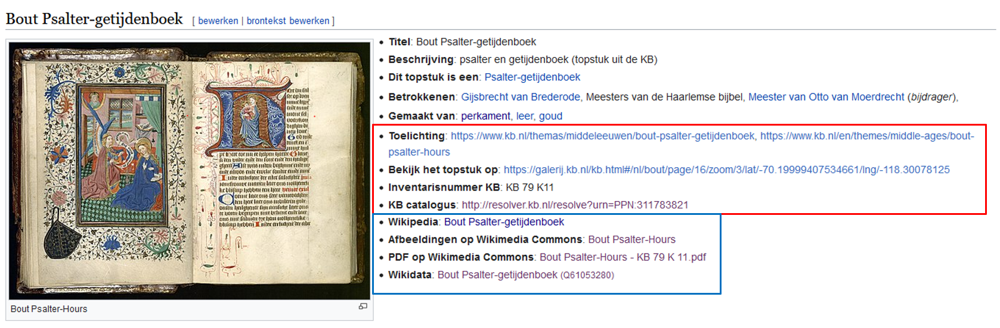
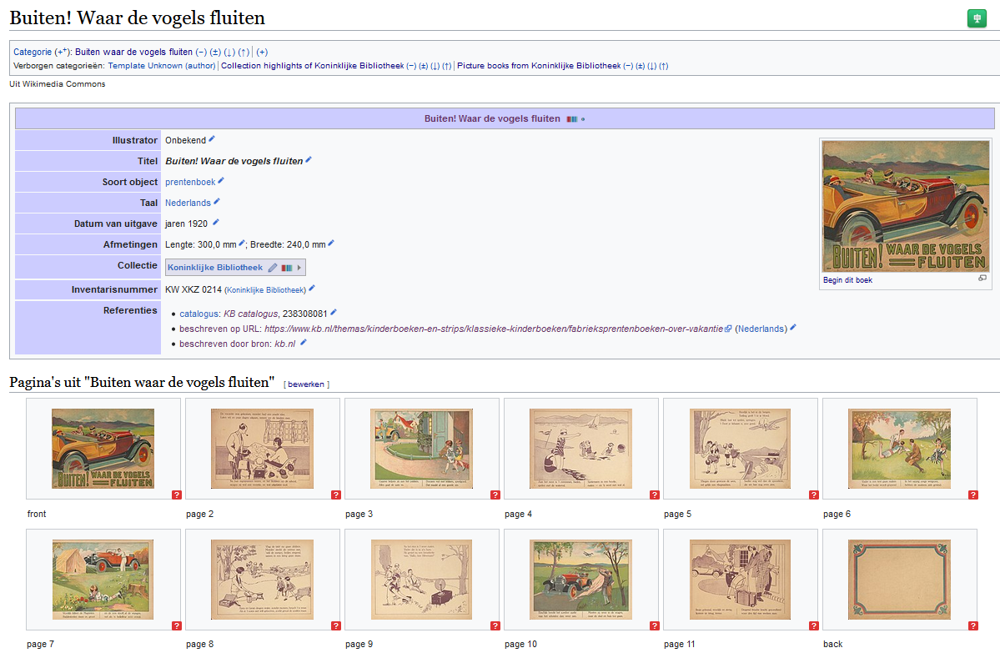
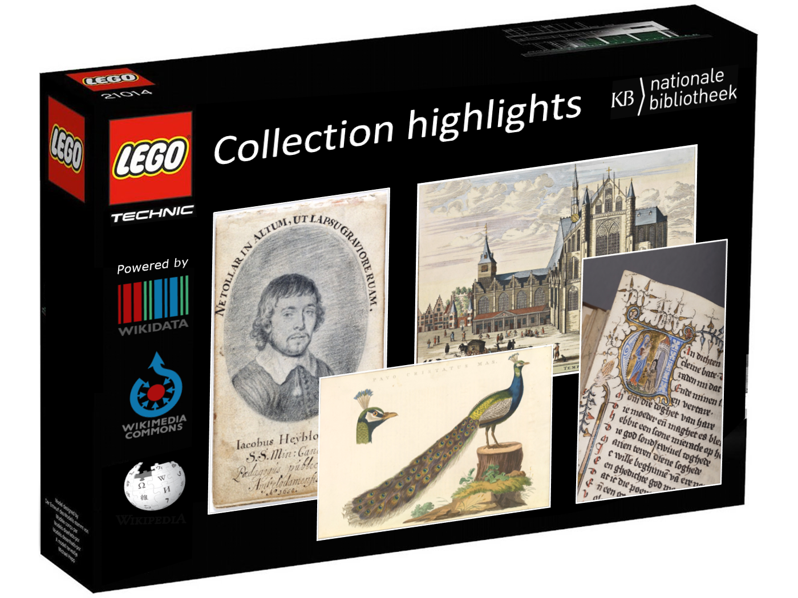

# 50 cool new things you can now do with KB's collection highlights - Part 3, Overviews per highlight

*In this [series of 5 articles](index.md) I show the added value of putting images and metadata of [digitised collection highlights](https://www.kb.nl/galerij/digitale-topstukken) of the KB, national library of the Netherlands, into the Wikimedia infrastructure. By putting our collection highlights into Wikidata, Wikimedia Commons and Wikipedia, dozens of new functionalities have been added: now you can do things with this digital collection that were not possible before.*

In the previous part of this series I folded out the first 12 bits of the right knife. We saw which [handy & useful overviews of all 70  highlights combined](Part%202%2C%20Overviews%20of%20all%20highlights.html) have become available as a result of the [WikiProject Collection highlights](https://www.wikidata.org/wiki/Wikidata:WikiProject_Collection_highlights_National_Library_of_the_Netherlands). These include [image galleries](https://commons.wikimedia.org/wiki/Collection_highlights_of_Koninklijke_Bibliotheek), [alphabetical overviews](https://nl.wikipedia.org/wiki/Wikipedia:GLAM/Koninklijke_Bibliotheek_en_Nationaal_Archief/Topstukken/Alfabetisch) & [tables](https://nl.wikipedia.org/wiki/Wikipedia:GLAM/Koninklijke_Bibliotheek_en_Nationaal_Archief/Topstukken/Listeria) and an [overview of existing and desired Wikipedia articles](https://nl.wikipedia.org/wiki/Wikipedia:GLAM/Koninklijke_Bibliotheek_en_Nationaal_Archief/Topstukken/Artikelen) for our highlights.

In this third article I'm going to discuss the next group of 14 tools of the right hand knife, ie. I'm going to look at which new functionalities *for individual highlights* are available from now on.

## Overviews per highlight

OK, time to start running....

13) As a start, I'd like to briefly go back to the metadata in the [alphabetical overview](https://nl.wikipedia.org/wiki/Wikipedia:GLAM/Koninklijke_Bibliotheek_en_Nationaal_Archief/Topstukken/Alfabetisch) we discussed in Part 2. 
Here, **KB's institutional and Wikimedia's participative worlds are merged** into a single overview. In the red box the world of KB's collection highlights, with the browse book (*Bekijk het topstuk op*) and the explanatory notes (*Toelichting*), the inventory number (*Inventarisnummer KB*), and the persistent URL of the object in the KB catalog (*KB catalogus - http://resolver.kb.nl...*). In the blue box the world of Wikimedia, with the context of the highlight in Wikipedia, the images (and pdf) in Wikimedia Commons and the structured data in Wikidata.

 <kbd></kbd> *Two metadata worlds in a single overview. Red box: KB links to KB's collection highlights. Blue box: Wikimedia links to KB's collection highlights. Screenshot Wikipedia d.d. 02-04-2021*

14) For each (public domain) highlight, an **gallery page with individual images** is available, on which the images are presented in the correct order. Above the images a block of Wikidata-driven metadata for the entire work is displayed, including links to KB sources. Very handy to quickly and easily get an overview of the entire highlight. See for example the galleries of [Buiten! Waar de vogels fluiten](https://commons.wikimedia.org/wiki/Buiten!_Waar_de_vogels_fluiten) (*Outside! Where the birds are singing*) or the [Wolfgang Hopyl Book of Hours](https://commons.wikimedia.org/wiki/Book_of_hours_Wolfgang_Hopyl).

 <kbd></kbd> *Gallery page for [Buiten! Waar de vogels fluiten](https://commons.wikimedia.org/wiki/Buiten!_Waar_de_vogels_fluiten). Screenshot Wikimedia Commons d.d. 02-04-2021*

15) In addition to the one page images in these galleries, **double page openings**, similar to those in the browse books on the KB website, are available for most highlights. See, for example, the openings of [Visboek Coenen](https://commons.wikimedia.org/wiki/Category:Visboeck_Coenen_(openings)) or those of [Die hystorie vanden grooten Coninck Alexander](https://commons.wikimedia.org/wiki/Category:Die_hystorie_vanden_grooten_Coninck_Alexander_(KW_172_C_22,_openings)).
 
 <kbd></kbd> *Double page openings for [Visboek Coenen](https://commons.wikimedia.org/wiki/Category:Visboeck_Coenen_(openings)). Screenshot Wikimedia Commons d.d. 02-04-2021*

16) In addition to the single pages (14) and double openings (15), for a number of highlights **miniatures** and/or cut-outs of **interesting page sections** are available as separte Commons files. For example, the [461 miniatures](https://commons.wikimedia.org/wiki/Category:Miniatures_from_Der_naturen_bloeme_-_KB_KA_16) from [Der Naturen Bloeme](https://commons.wikimedia.org/wiki/Der_naturen_bloeme_-_KB_KA_16), those from [Chroniques de Froissart](https://commons.wikimedia.org/wiki/Category:Chroniques_de_Froissart,_vol_1_-_Den_Haag,_KB_:_72_A_25_(details)) or the [Escher](https://en.wikipedia.org/wiki/M._C._Escher)-like [graphics](https://commons.wikimedia.org/wiki/Category:Kunst_en_samenleving_(KB_-_KW_1310_F_3_-_details)) from [Kunst en Samenleving](https://commons.wikimedia.org/wiki/Kunst_en_samenleving_(KB_-_KW_1310_F_3)) (*Art and Society*).

 <kbd></kbd> *[Escher](https://en.wikipedia.org/wiki/M._C._Escher)-like [graphics](https://commons.wikimedia.org/wiki/Category:Kunst_en_samenleving_(KB_-_KW_1310_F_3_-_details)) from [Kunst en Samenleving](https://commons.wikimedia.org/wiki/Kunst_en_samenleving_(KB_-_KW_1310_F_3)) . Screenshot Wikimedia Commons d.d. 02-04-2021*

So far we looked at images related to KB's collection highlights. However, besides images, **other media types** are now available as well.

17) You can listen to **[11 audio tracks](https://commons.wikimedia.org/wiki/Category:Beatrijs_(audio)) from the [Beatrijs](https://commons.wikimedia.org/wiki/Category:Beatrijs)** in which important stanzas from this poem are read by a former KB curator. These mp3s were 'forgotten about' in [KB's Soundcloud account](https://soundcloud.com/koninklijke-bibliotheek) and not yet available under Creative Commons licenses, making them unsuitable for Wikimedia purposes. We fixed the licensing and uploaded the files to Commons, making them more visible and reusable. As a result, tracks are now included as 'auditory illustrations' in the [Dutch Wikipedia article](https://nl.wikipedia.org/wiki/Beatrijs#Auteur) about Beatrijs.

 <kbd></kbd> *[Audio tracks](https://commons.wikimedia.org/wiki/Category:Beatrijs_(audio)) from the [Beatrijs](https://commons.wikimedia.org/wiki/Category:Beatrijs). Screenshot Wikimedia Commons d.d. 02-04-2021*

18) The KB curator for childrens's books created an **[explainer video](https://www.youtube.com/watch?v=Vnvr6WoyPKk)** about [De Nieuwe Rijschool](https://commons.wikimedia.org/wiki/Category:De_Nieuwe_Rijschool_(photos)) (*The New Riding school*). So far this video is only availabe on YouTube, but because the KB released it under a free license it will be uploaded to Wikimedia Commons and included in the Dutch Wikipedia article [De Nieuwe Rijschool](https://nl.wikipedia.org/wiki/De_nieuwe_rijschool) a.s.a.p.

 <kbd></kbd> *[Video](https://www.youtube.com/watch?v=Vnvr6WoyPKk) about [De Nieuwe Rijschool](https://commons.wikimedia.org/wiki/Category:De_Nieuwe_Rijschool_(photos)). Screenshot Youtube d.d. 02-04-2021*

Similarly, we are planning to make the [Beatrijs video](https://www.youtube.com/watch?v=ZhuLooAebcg) and the [Gruuthuse manuscript video](https://www.youtube.com/watch?v=hjk53XtWAao) reusable for Wikimedia purposes as well.

19) All **[introduction texts](https://www.kb.nl/galerij/digitale-topstukken)** for the highlights on the KB website have [been released](https://web.archive.org/web/20210126072215/https://www.kb.nl/auteursrecht) under a [CC0 Public Domain Mark](https://creativecommons.org/publicdomain/mark/1.0/deed.en). As a result, the texts for the [Zweder Book of Hours](https://www.kb.nl/themas/middeleeuwen/zweder-getijdenboek), the ['De boerderij' picture book](https://www.kb.nl/themas/kinderboeken-en-strips/klassieke-kinderboeken/prentenboek-de-boerderij) and all the other highlights have become freely reusable for everyone.

 <kbd></kbd> *The paragraph in the red brackets explains the [CC0 Public Domain Mark](https://creativecommons.org/publicdomain/mark/1.0/deed.en) for the highlights' introduction texts. Screenshot of the [copyright section](https://web.archive.org/web/20210126072215/https://www.kb.nl/auteursrecht) on KB's website d.d. 12-04-2021*
 
 <kbd></kbd> *Introduction text for the [Zweder Book of Hours](https://www.kb.nl/themas/middeleeuwen/zweder-getijdenboek), released under the [CC0 Public Domain Mark](https://creativecommons.org/publicdomain/mark/1.0/deed.en). Screenshot KB website d.d. 12-04-2021*

20) To summarize the points above: **openly licensed and freely reusable building blocks** are becoming increasingly available for our collection highlights: 
 * *Images* - single pages, double openings, miniatures, graphics, page details  
 * *Audio files* (see *Beatrijs* above)
 * *Video files*
 * *Texts* from the KB website

These reusable components make it easier for Wikipedia authors to create or expand articles about KB's collection highlights. After all, you can now reuse (parts of) KB web texts in Wikipedia articles without risks of [copyvio](https://en.wikipedia.org/wiki/Copyright_infringement). Furthermore, all kinds of free illustrative images, videos and audio materials are available for enriching articles.

As a result, the recently created article about [Koninklijke Bibliotheek 79 K 2](https://nl.wikipedia.org/wiki/Koninklijke_Bibliotheek_79_K_2) (= *Zweder Book of Hours*) shows strong similarities with [KB's text about that manuscript](https://www.kb.nl/themas/middeleeuwen/zweder-getijdenboek). Also new, illustrated article stubs have been written about the friendship books of [Jacoba Maria Bolten](https://nl.wikipedia.org/wiki/Album_amicorum_van_Jacoba_Maria_Bolten), [Petronella Moens](https://nl.wikipedia.org/wiki/Album_amicorum_van_Petronella_Moens) and [Samuel Johannes van den Bergh](https://nl.wikipedia.org/wiki/Album_amicorum_van_Samuel_Johannes_van_den_Bergh). And in the already mentioned [overview of existing and wanted Dutch-language Wikipeda articles](https://nl.wikipedia.org/wiki/Wikipedia:GLAM/Koninklijke_Bibliotheek_en_Nationaal_Archief/Topstukken/Artikelen), you can see from the red links which highlights are in need of Wikipedia articles.

 <kbd></kbd> *Dutch Wikipedia article about [Koninklijke Bibliotheek 79 K 2](https://nl.wikipedia.org/wiki/Koninklijke_Bibliotheek_79_K_2), based on KB's CC0 licensed [web text about that manuscript](https://www.kb.nl/themas/middeleeuwen/zweder-getijdenboek). Screenshot Wikipedia d.d. 14-04-2021*

21) To clearly indicate that the text in a Wikipedia article is based on a text from the KB website, a **[KB citation template](https://nl.wikipedia.org/wiki/Sjabloon:Bronvermelding_kb.nl)** has been created. It states (in Dutch) that 'the information on this page, or an earlier version of it, fully or partly originates from the KB website (kb.nl)'. You can see this template at the bottom of the [Zweder Book of Hours](https://nl.wikipedia.org/wiki/Koninklijke_Bibliotheek_79_K_2) article.

  <kbd></kbd> *[KB citation template](https://nl.wikipedia.org/wiki/Sjabloon:Bronvermelding_kb.nl) at the bottom of the [Zweder Book of Hours](https://nl.wikipedia.org/wiki/Koninklijke_Bibliotheek_79_K_2) article. Screenshot Wikipedia d.d. 14-04-2021*

To conclude this article, I would like to return to the **people related to KB's highlights**, as we already did in points 9 and 10 in [Part 2](Part%202%2C%20Overviews%20of%20all%20highlights.html). More specifically: to the 141 people who contributed to the [Album amicorum Jacob Heyblocq](https://nl.wikipedia.org/wiki/Wikipedia:GLAM/Koninklijke_Bibliotheek_en_Nationaal_Archief/Topstukken/Alfabetisch#Album_amicorum_van_Jacobus_Heyblocq_(1623-1690),_rector_van_de_Latijnse_school_te_Amsterdam). We know [all their names](https://www.kb.nl/themas/vriendenboeken/verwoede-verzamelaars/jacob-heyblocqs-vriendenboek) (see bottom of that page), but from that overview we don't know what they looked like, what occupations they had, or what age they died at. But because all those contributors have been described in Wikidata, we can easily answer all these questions:

22) There is a **[facebook](https://w.wiki/phx)**, currently images of (only) 52 contributors are known...

  <kbd></kbd> *[Gallery of contributors](https://w.wiki/phx) to the [Album amicorum Jacob Heyblocq](https://www.kb.nl/themas/vriendenboeken/verwoede-verzamelaars/jacob-heyblocqs-vriendenboek). Screenshot Wikidata d.d. 14-04-2021*

23) in terms of the **gender distribution**, only [three women](https://w.wiki/F5J) have contributed to this album: ([Anna Maria van Schurman](http://www.wikidata.org/entity/Q255261), [Sara van Schilde](http://www.wikidata.org/entity/Q80694244) and [Cornelia van der Veer](http://www.wikidata.org/entity/Q2291725))...

<kbd></kbd> *Gender distribution of contributors to the Album amicorum Jacob Heyblocq, 3 women. Screenshot Wikidata d.d. 15-04-2021*

24) in terms of **occupations**, mainly [professors, clergy, poets, writers and painters](https://w.wiki/F5N) have contributed to the album....

  <kbd></kbd> *Occupations of the contributors to the Album amicorum Jacob Heyblocq. Screenshot Wikidata d.d. 15-04-2021*

25) and in terms of **life spans**, [Caspar Staphorst](https://www.wikidata.org/wiki/Q80694251) is the [contributor who lived longest](https://w.wiki/qzx), no less than 93 years. He is closely followed by the poet and writer [Joost van den Vondel](https://nl.wikipedia.org/wiki/Joost_van_den_Vondel) (92), slighlty older than [Constantijn Huygens](https://www.wikidata.org/wiki/Q560746) (91).

  <kbd></kbd> *Life spans of the contributors to the Album amicorum Jacob Heyblocq. Screenshot Wikidata d.d. 15-04-2021*

26) OK, to finish off with, one last item: For highlights in which **locations and places** play key roles - eg. [Atlas de Wit](https://commons.wikimedia.org/wiki/Atlas_de_Wit_1698), [Admirandorum quadruplex spectaculum ](https://commons.wikimedia.org/wiki/Admirandorum_quadruplex_spectaculum) (*Fourfold spectacle of miracles*) or [Atlas van der Hagen](https://commons.wikimedia.org/wiki/Atlas_van_der_Hagen) - all kinds of useful data visualisations can be made. 

The [alphabetical place name index](https://www.kb.nl/themas/atlassen/stedenatlas-de-wit) of Atlas de Wit on the KB website is a nice functionality, but visualising [all those cities on a map](https://tinyurl.com/y2y7pfbj) and linking them to the historical maps is a pretty neat feature as well.

  <kbd></kbd> *Map of cities in [Atlas de Wit](https://commons.wikimedia.org/wiki/Atlas_de_Wit_1698). Screenshot Wikimedia Commons d.d. 02-04-2021*

## Summary
For convenience and overview, let me summarize all the cool new things for KB's collection highlights we have seen in this article:

13) Merging KB's institutional and Wikimedia's participative worlds for each highlight 
14) A [gallery page with individual images](https://commons.wikimedia.org/wiki/Buiten!_Waar_de_vogels_fluiten) for each public domain highlight 
15) [Double page openings](https://commons.wikimedia.org/wiki/Category:Visboeck_Coenen_(openings)) for most public domain highlights 
16) [Miniatures](https://commons.wikimedia.org/wiki/Category:Miniatures_from_Der_naturen_bloeme_-_KB_KA_16) and/or cut-outs of [interesting page sections](https://commons.wikimedia.org/wiki/Category:Kunst_en_samenleving_(KB_-_KW_1310_F_3_-_details)) for selected public domain highlights 
17) Openly licensed [audio tracks](https://commons.wikimedia.org/wiki/Category:Beatrijs_(audio)) and  
18) [explainer videos](https://www.youtube.com/watch?v=Vnvr6WoyPKk) for selected highlights 
19) Reusable [introduction texts under CC0-licensing](https://web.archive.org/web/20210126072215/https://www.kb.nl/auteursrecht) for each highligt  
20) Openly licensed and freely reusable building blocks (images, audio, videos, texts) for each highligt 
21) A [KB citation template](https://nl.wikipedia.org/wiki/Sjabloon:Bronvermelding_kb.nl) for use on Dutch Wikipedia  
22) A [facebook](https://w.wiki/phx) of contributors to the [Album amicorum Jacob Heyblocq](https://nl.wikipedia.org/wiki/Wikipedia:GLAM/Koninklijke_Bibliotheek_en_Nationaal_Archief/Topstukken/Alfabetisch#Album_amicorum_van_Jacobus_Heyblocq_(1623-1690),_rector_van_de_Latijnse_school_te_Amsterdam) 
23) Overviews of the [gender distribution](https://w.wiki/F5J),  
24) the [occupations](https://w.wiki/F5N) and  
25) the [life spans](https://w.wiki/qzx) of those contributors 
26) [Map visualisations](https://tinyurl.com/y2y7pfbj) for selected highlights in which locations and places play key roles 

## Up next
So far for this third article. In [Part 4, Images](Part%204%2C%20Images.html), I'll discuss which new & innovative functionalities *for individual highlight images* have become  available as a result of the project. 

### About the author

Olaf Janssen is the Wikimedia coordinator of the KB, the national library of the Netherlands. He contributes to
[Wikipedia](https://nl.wikipedia.org/wiki/Wikipedia:GLAM/Koninklijke_Bibliotheek_en_Nationaal_Archief), [Wikimedia Commons](https://commons.wikimedia.org/wiki/Category:Koninklijke_Bibliotheek) and [Wikidata](https://www.wikidata.org/wiki/Wikidata:GLAM/Koninklijke_Bibliotheek_Nederland) as [User:OlafJanssen](https://nl.wikipedia.org/wiki/Gebruiker:OlafJanssen) 

### Reusing this article
This text of this article is available under the [CC-BY 4.0](https://creativecommons.org/licenses/by/4.0/) license. 
<kbd></kbd>

### Image sources & credits
* [Swiss_army_knife_open,_2012-(01)](https://commons.wikimedia.org/wiki/File:Swiss_army_knife_open,_2012-(01).jpg) -- Joe Loong, [CC BY-SA 2.0](https://creativecommons.org/licenses/by-sa/2.0), via Wikimedia Commons
* [Victorinox_Swiss_Army_SwissChamp_XAVT](https://commons.wikimedia.org/wiki/File:Victorinox_Swiss_Army_SwissChamp_XAVT.jpg) -- Dave Taylor from Boulder, CO, [CC BY 2.0](https://creativecommons.org/licenses/by/2.0>), via Wikimedia Commons
* KB collection highlights LEGO® box - based upon the [Villa Savoye box from the LEGO® Architecture series](https://i.ebayimg.com/images/g/n4AAAOSwjIpgTPWQ/s-l1600.jpg)
