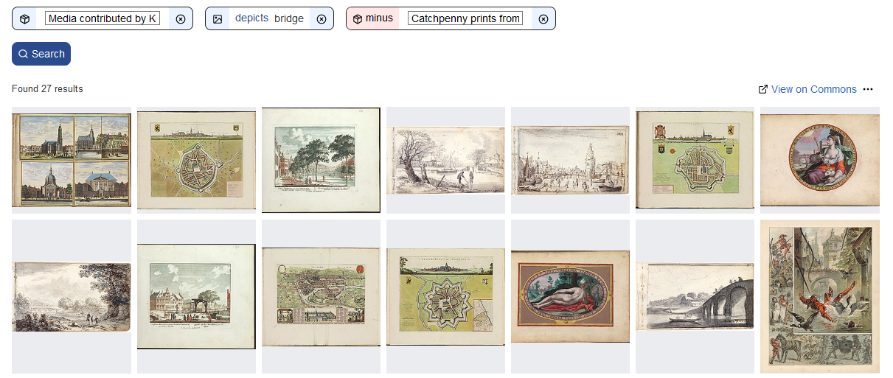

# 50 cool new things you can now do with KB's collection highlights - Part 4, Images

*In this [series of 5 articles](index.md) I show the added value of putting images and metadata of [digitised collection highlights](https://www.kb.nl/galerij/digitale-topstukken) of the KB, national library of the Netherlands, into the Wikimedia infrastructure. By putting our collection highlights into Wikidata, Wikimedia Commons and Wikipedia, dozens of new functionalities have been added. As a result of Wikifying this collection, you can now do things with these highlights that were not possible before.*

In the previous (third) part of this series I discussed 14 tools of the right hand knife. We saw [which new functionalities](Part%203%2C%20Overviews%20per%20highlight.html) have become available for individual highlights. These include [individual images](https://commons.wikimedia.org/wiki/Buiten!_Waar_de_vogels_fluiten), [double page openings](https://commons.wikimedia.org/wiki/Category:Visboeck_Coenen_(openings)), [miniatures](https://commons.wikimedia.org/wiki/Category:Miniatures_from_Der_naturen_bloeme_-_KB_KA_16) & [page details](https://commons.wikimedia.org/wiki/Category:Kunst_en_samenleving_(KB_-_KW_1310_F_3_-_details)), freely reusable video, [audio](https://commons.wikimedia.org/wiki/Category:Beatrijs_(audio)) and texts, a [facebook](https://w.wiki/phx) or an interactive [city map](https://tinyurl.com/y2y7pfbj).

In this fourth part I am going to expand the next group of 11 tools of this knife, i.e. I'm going to show which new functionalities for *individual highlight images* are available from now on.

## Individual highlight images 
OK, let's rock 'n roll...

As a result of the [WikiProject Collection highlights](https://www.wikidata.org/wiki/Wikidata:WikiProject_Collection_highlights_National_Library_of_the_Netherlands) over 10,000 media files, mostly images, from the KB collection have been [added to Wikimedia Commons](https://commons.wikimedia.org/wiki/Category:Media_contributed_by_Koninklijke_Bibliotheek). A [typical file page](https://commons.wikimedia.org/wiki/File:Atlas_Van_der_Hagen-KW1049B12_002-HISPANIAE_ET_PORTUGALIAE_REGNA.jpeg) (in the Dutch language interface) on Commons looks like this:

  <kbd></kbd> *File page for a [map of the Iberian Peninsula](https://commons.wikimedia.org/wiki/File:Atlas_Van_der_Hagen-KW1049B12_002-HISPANIAE_ET_PORTUGALIAE_REGNA.jpeg) from [Atlas van der Hagen](https://commons.wikimedia.org/wiki/Atlas_van_der_Hagen_(Volume_3)). Screenshot Wikimedia Commons d.d. 12-04-2021*

Such a page not only contains the image itself (the .jpg), but also offers all kinds of extra functionalities. Let's have a look at those:

27) You can **download the image**, in **various resolutions**. In the corresponding [browsable book on the KB website](https://galerij.kb.nl/kb.html#/nl/vanderhagen3/page/1/zoom/2/lat/-64.62387720204688/lng/-51.328125) it is *not* possible to download images .

 <kbd></kbd> *Image downloads in various resolutions for the [map of the Iberian Peninsula](https://commons.wikimedia.org/wiki/File:Atlas_Van_der_Hagen-KW1049B12_002-HISPANIAE_ET_PORTUGALIAE_REGNA.jpeg). Screenshot Wikimedia Commons d.d. 12-04-2021*

28) For each image **file level descriptive metadata** is available. Here the most important bibliographic characteristics of the image are summarized, often with direct links to Wikipedia and/or Wikidata articles, eg. about the makers or the techniques used to manufacture the original map.

 <kbd></kbd> *File level descriptive metadata for the [map of the Iberian Peninsula](https://commons.wikimedia.org/wiki/File:Atlas_Van_der_Hagen-KW1049B12_002-HISPANIAE_ET_PORTUGALIAE_REGNA.jpeg). Note the links to Wikipedia articles about the makers and the manufacturing techniques ('Medium'). Screenshot Wikimedia Commons d.d. 12-04-2021*

29) What stands out is the manifest, almost lavish **source attribution of the KB** as the image and data provider, both textual (URLs, library name, catalog number, shelfmark) and visual (KB logo) in multiple places.

  <kbd></kbd> *Manifest source attribution of the KB, both textual and visual. Screenshot Wikimedia Commons d.d. 12-04-2021*

30) In addition, every KB image on Commons has a **manifest copyrights status**. With very few exceptions all our images are in the public domain, due to the age of the KB materials no copyright restrictions apply.

 <kbd></kbd> *Typical Public Domain tag for a KB image on Wikimedia Commons. Screenshot Wikimedia Commons d.d. 12-04-2021*

31) All KB images on Commons are **divided into one or more categories**. The above 17th century image of the Iberian Peninsula by Nicolaes Visscher II from *Altas van der Hagen* is not only divided into its 'home category' [Category:Atlas van der Hagen](https://commons.wikimedia.org/wiki/Category:Atlas_van_der_Hagen), but also into the thematic categories [Category:17th-century maps of Spain](https://commons.wikimedia.org/wiki/Category:17th-century_maps_of_Spain), [Category:Old maps of the Iberian Peninsula](https://commons.wikimedia.org/wiki/Category:Old_maps_of_the_Iberian_Peninsula), [Category:Maps with cartouches](https://commons.wikimedia.org/wiki/Category:Maps_with_cartouches) and [Category:Nicolaes Visscher II](https://commons.wikimedia.org/wiki/Category:Nicolaes_Visscher_II). Very handy if you are looking for other old maps of Spain and Portugal and/or from that specific map maker. Besides these thematic categories, you also see a lot of hidden (administrative) categories, which I will not further discuss here.

  <kbd></kbd> *The 17th century [image of the Iberian Peninsula](https://commons.wikimedia.org/wiki/File:Atlas_Van_der_Hagen-KW1049B12_002-HISPANIAE_ET_PORTUGALIAE_REGNA.jpeg) by Nicolaes Visscher II from Altas van der Hagen is divided into multiple (thematic) categories. Screenshot Wikimedia Commons d.d. 12-04-2021*
   
32) Map materials might be tagged with **geo coordinates**, for example the [Gezicht bij de Doelen over de Korte Vijverberg, tot aan het Plein](https://commons.wikimedia.org/wiki/File:Den_Haag,_gezicht_bij_de_Doelen_over_de_Korte_Vijverberg,_tot_aan_het_Plein_(7985085070).jpg) (*View at the Doelen over the Korte Vijverberg, up to the Plein*) from the [Admirandorum quadruplex spectaculum](https://commons.wikimedia.org/wiki/Admirandorum_quadruplex_spectaculum) (*Fourfold spectacle of miracles*). The 'camera location' from which this drawing was made is known exactly and can be directly connected to contemporary views from the same location via [various map services](https://geohack.toolforge.org/geohack.php?pagename=File:Den_Haag,_gezicht_bij_de_Doelen_over_de_Korte_Vijverberg,_tot_aan_het_Plein_(7985085070).jpg&params=052.081352_N_0004.313528_E_globe:Earth_type:camera_source:Flickr_&language=nl) ([OpenStreetMap](https://www.openstreetmap.org/?mlat=52.081352&mlon=4.313528&zoom=17), [Google Maps](https://www.google.nl/maps/@52.0813293,4.3135965,3a,48.8y,126.32h,95.34t/data=!3m6!1e1!3m4!1sXHh8WjGjGVGybUHV9Nfjfw!2e0!7i16384!8i8192?hl=nl), etc.). This way you can discover the similarities and differences between both views.

  <kbd></kbd> *Comparison between historic and comtemporary views of [Gezicht bij de Doelen over de Korte Vijverberg, tot aan het Plein](https://commons.wikimedia.org/wiki/File:Den_Haag,_gezicht_bij_de_Doelen_over_de_Korte_Vijverberg,_tot_aan_het_Plein_(7985085070).jpg) from [Admirandorum quadruplex spectaculum](https://commons.wikimedia.org/wiki/Admirandorum_quadruplex_spectaculum) using [various map services](https://geohack.toolforge.org/geohack.php?pagename=File:Den_Haag,_gezicht_bij_de_Doelen_over_de_Korte_Vijverberg,_tot_aan_het_Plein_(7985085070).jpg&params=052.081352_N_0004.313528_E_globe:Earth_type:camera_source:Flickr_&language=nl). Compilation of multiples screenshots d.d. 21-04-2021*

33) In addition to the bibliographic metadata discussed at 28, an increasing number of highlight images are enriched with **structured, machine-readable data**, [linking these images to Wikidata](https://commons.wikimedia.org/wiki/Commons:Structured_data). Because Wikidata is part of the [Linked Open Data Cloud](https://lod-cloud.net/), the KB images are connected to other data sources outside the KB. This will stimulate the findability, visibility and reusability of our highlights.

For the [file](https://commons.wikimedia.org/wiki/File:Den_Haag,_gezicht_bij_de_Doelen_over_de_Korte_Vijverberg,_tot_aan_het_Plein_(7985085070).jpg) we looked at above, various image properties have been recorded in the 'Gestructureerde data' (*Structured data*) tab. These include the [things that are depicted](https://www.wikidata.org/wiki/Property:P180) in the image ([Mauritshuis](https://www.wikidata.org/wiki/Special:EntityPage/Q47490149), [Hofvijver](https://www.wikidata.org/wiki/Special:EntityPage/Q2290298), [Plein](https://www.wikidata.org/wiki/Special:EntityPage/Q2491557)), the [illustrator](https://www.wikidata.org/wiki/Property:P110) ([Jan van Call](https://www.wikidata.org/wiki/Special:EntityPage/Q2197512)) or the [copyright status](https://www.wikidata.org/wiki/Property:P6216) ([public domain](https://www.wikidata.org/wiki/Special:EntityPage/Q19652)), all expressed as Wikidata properties (P numbers) and items (Q numbers).

  <kbd></kbd> *Example of using [structured data](https://commons.wikimedia.org/wiki/Commons:Structured_data) from Wikidata (with Dutch labels) in [a media file](https://commons.wikimedia.org/wiki/File:Den_Haag,_gezicht_bij_de_Doelen_over_de_Korte_Vijverberg,_tot_aan_het_Plein_(7985085070).jpg) on Wikimedia Commons. Screenshot Wikimedia Commons d.d. 20-04-2021*
  
Obviously, some of these statements can also be seen in the regular, free-text bibliographic metadata in the 'Bestandsinformatie' (*File information*) tab. However, there they are not listed as 100% structured data, making it very difficult (or even impossible) to reliably machine-read that data.

34) As you can see from the screenshot above, the structured data is shown in Dutch. The regular bibliographic metadata is a mix of Dutch and English. But what if you cannot read Dutch and/or English very well? How can you discover this image when you can only read French, Russian or Chinese for example? Fortunately, Wikidata is a service that stores data in as many languages as possible, enabling **'automatic multilinguality'**. By changing the Wikimedia Commons interface language you can request that structured data in for example German, French, Russian or Chinese. The completeness of the translations on Commons depends on the completeness of the multilingual labeling in Wikidata, which is improving year by year. In this way, hundreds of millions of people (and machines!) can suddenly understand what this Dutch image is about. Moreover, you can also **search multilingually**, so you can enter a keyword in for example Russian or French and still find this Dutch print.
   
  <kbd></kbd> *Example of multilingual interfaces (German, French, Russian and Chinese) for the structured data on Wikimedia Commons for [this media file](https://commons.wikimedia.org/wiki/File:Den_Haag,_gezicht_bij_de_Doelen_over_de_Korte_Vijverberg,_tot_aan_het_Plein_(7985085070).jpg). Screenshot Wikimedia Commons d.d. 02-04-2021*
   
35) For the final part of this article I would like to zoom in on one specific aspect of the structured data, that is: **what can be seen on KB images**. In the English language interface of the example above, this is described under *Items portrayed in this file - depicts*. In this section, all kinds of things (entities) are listed: buildings ([Building Mauritshuis](https://www.wikidata.org/wiki/Special:EntityPage/Q47490149)), ponds ([Hofvijver](https://www.wikidata.org/wiki/Special:EntityPage/Q2290298)), locations ([The Hague](https://www.wikidata.org/wiki/Special:EntityPage/Q41795540)) and squares ([Plein](https://www.wikidata.org/wiki/Special:EntityPage/Q2491557)). As a result, this image in not only discoverable via the regular metadata, but also **searchable by content** (What's depicted in it?).

Last year I asked my KB colleagues for help in making our highlight images more findable, visible and reusable by **indicating (tagging) which things can be seen** in those files. For that purpose I created a [step by step manual](https://commons.wikimedia.org/wiki/File:Instructie_KB-beelden_op_Commons_taggen_met_Wikidata_-_26032020.pdf) (in Dutch) with instructions on how to connect entities that are depicted in those images to Wikidata.  

 <kbd></kbd> *[Step by step tutorial](https://commons.wikimedia.org/wiki/File:Instructie_KB-beelden_op_Commons_taggen_met_Wikidata_-_26032020.pdf) explaining how to tag things that can be seen in images of KB collection highlights. Screenshot Wikimedia Commons d.d. 02-04-2021*
   
As a result of this call my colleagues set to work, some with great enthusiasm. At the time of writing they have tagged over [5000 different images](https://hay.toolforge.org/sdsearch/#q=incategory:%22Media%20contributed%20by%20Koninklijke%20Bibliotheek%22%20-incategory:%22Catchpenny%20prints%20from%20Koninklijke%20Bibliotheek%22%20haswbstatement:P180), indicating which animals, people, cities, villages, streets, buildings, rivers, ships, vehicles, utensils, etc. can be seen. This represents about 20% of the [total number of KB images](https://commons.wikimedia.org/wiki/Category:Media_contributed_by_Koninklijke_Bibliotheek) on Commons (nearly 25K at the time of writing). The undisputed KB tagging champion is Madeleine van den Berg, with [tens of thousands of tags](https://commons.wikimedia.org/w/index.php?title=Special:Contributions/Madeleine_van_den_Berg&offset=&limit=500&target=Madeleine+van+den+Berg) to her name. 

  <kbd></kbd> *[Wikimedia Commons contributions](https://commons.wikimedia.org/w/index.php?title=Special:Contributions/Madeleine_van_den_Berg&offset=&limit=500&target=Madeleine+van+den+Berg) of KB employee Madeleine van den Berg, having identified many thousands of things depicted in KB collection highlights. Screenshot Wikimedia Commons d.d. 21-04-2021*

36) This tagging effort is not the sole domain of KB employees. It is also a great way to **stimulate (inter)national public participation** for enriching our collections. For example, [Adam Harangozó](https://commons.wikimedia.org/wiki/User:Adam%20Harangoz%C3%B3) from Hungary particpated in a [public tagging campaign](https://isa.toolforge.org/campaigns/74) for our medival manuscript of [Der Naturen Bloeme](https://commons.wikimedia.org/wiki/Category:Der_naturen_bloeme_-_KB_KA_16). He has tagged 372 things that are depicted in [183](https://hay.toolforge.org/sdsearch/#q=incategory:%22Miniatures%20from%20Der%20naturen%20bloeme%20-%20KB%20KA%2016%22%20haswbstatement:P180) of the [461 miniatures](https://commons.wikimedia.org/wiki/Category:Miniatures_from_Der_naturen_bloeme_-_KB_KA_16) from this manuscript.

  <kbd></kbd> *Miniature from [Der Naturen Bloeme](https://commons.wikimedia.org/wiki/Category:Miniatures_from_Der_naturen_bloeme_-_KB_KA_16) with three depicted Wikidata entities (blue boxes). Screenshot [ISA tool](https://isa.toolforge.org/) d.d. 02-04-2021*

37) I already mentioned that by tagging KB images you will make them searchable by content, enabling **new search options for KB's collections**. Let's look at a number of examples. Between brackets the number of matching images (at the time of writing).

* Images from our highlights [depicting bridges](https://hay.toolforge.org/sdsearch/#q=incategory:%22Media%20contributed%20by%20Koninklijke%20Bibliotheek%22%20haswbstatement:P180=Q12280%20-incategory:%22Catchpenny%20prints%20from%20Koninklijke%20Bibliotheek%22) (27)
  <kbd></kbd>
* or [dogs](https://hay.toolforge.org/sdsearch/#q=incategory:%22Media%20contributed%20by%20Koninklijke%20Bibliotheek%22%20haswbstatement:P180=Q144%20-incategory:%22Catchpenny%20prints%20from%20Koninklijke%20Bibliotheek%22) (99)
* or [both cats and dogs](https://hay.toolforge.org/sdsearch/#q=incategory:%22Media%20contributed%20by%20Koninklijke%20Bibliotheek%22%20haswbstatement:P180=Q146%20haswbstatement:P180=Q144%20-incategory:%22Catchpenny%20prints%20from%20Koninklijke%20Bibliotheek%22) (5)
* or [walking sticks](https://hay.toolforge.org/sdsearch/#q=incategory:%22Media%20contributed%20by%20Koninklijke%20Bibliotheek%22%20haswbstatement:P180=Q1347864%20-incategory:%22Catchpenny%20prints%20from%20Koninklijke%20Bibliotheek%22) (43) - you might need to look really closely!
* [Cities bordering the Zuiderzee](https://hay.toolforge.org/sdsearch/#q=incategory:%22Media%20contributed%20by%20Koninklijke%20Bibliotheek%22%20haswbstatement:P180=Q228655%20-incategory:%22Catchpenny%20prints%20from%20Koninklijke%20Bibliotheek%22) (14)
  <kbd></kbd>
* Images from the [Album amicorum Jacob Heyblocq](https://commons.wikimedia.org/wiki/Album_amicorum_van_Jacobus_Heyblocq) depicting [sailing boats](https://hay.toolforge.org/sdsearch/#q=incategory:%22Album%20amicorum%20van%20Jacobus%20Heyblocq%22%20haswbstatement:P180=Q1075310) (6)
* Miniatures from *Der Naturen Bloeme* showing [trees](https://hay.toolforge.org/sdsearch/#q=incategory:%22Miniatures%20from%20Der%20naturen%20bloeme%20-%20KB%20KA%2016%22%20haswbstatement:P180=Q10884) (108) or [fish](https://hay.toolforge.org/sdsearch/#q=incategory:%22Miniatures%20from%20Der%20naturen%20bloeme%20-%20KB%20KA%2016%22%20haswbstatement:P180=Q152) (17)
  <kbd></kbd>

## Summary
For convenience and overview, let me summarize all the cool new things for KB's collection highlights we have seen in this article:

27) Image downloads in various resolutions 
28) [File level descriptive metadata](https://commons.wikimedia.org/wiki/File:Atlas_Van_der_Hagen-KW1049B12_002-HISPANIAE_ET_PORTUGALIAE_REGNA.jpeg#Summary) including 
29) textual and visiual source attribution of the KB, 
30) manifest copyrights status (public domain) and  
31) multiple thematic categorisations. 
32) Geo coordinates for selected images, linking them to [various map services](https://geohack.toolforge.org/geohack.php?pagename=File:Den_Haag,_gezicht_bij_de_Doelen_over_de_Korte_Vijverberg,_tot_aan_het_Plein_(7985085070).jpg&params=052.081352_N_0004.313528_E_globe:Earth_type:camera_source:Flickr_&language=nl) 
33) Structured, machine-readable data, [linking images to Wikidata](https://commons.wikimedia.org/wiki/Commons:Structured_data), enabling  
34) 'automatic multilinguality' and multilingual search, and  
35) making them searchable by content (*What is depicted in the images?*). 
36) Stimulate (inter)national participation for enriching KB's collections by [public tagging campaigns](https://isa.toolforge.org/campaigns/74), enabling  
37) [new search options](https://hay.toolforge.org/sdsearch/) for these collections. 

## Up next
OK, that's it for this fourth article. In [Part 5, Reuse](Part%205%2C%20Reuse.html) I will explain how you can reuse KB's collection highlights *outside of the Wikimedia context*, that is, for/in your own websites, services, apps, hackathons and projects. I'm going to talk about REST APIs, SPARQL, image bulk downloading, Python scripts and machine interactions with our highlights. 

### About the author

Olaf Janssen is the Wikimedia coordinator of the KB, the national library of the Netherlands. He contributes to
[Wikipedia](https://nl.wikipedia.org/wiki/Wikipedia:GLAM/Koninklijke_Bibliotheek_en_Nationaal_Archief), [Wikimedia Commons](https://commons.wikimedia.org/wiki/Category:Koninklijke_Bibliotheek) and [Wikidata](https://www.wikidata.org/wiki/Wikidata:GLAM/Koninklijke_Bibliotheek_Nederland) as [User:OlafJanssen](https://nl.wikipedia.org/wiki/Gebruiker:OlafJanssen) 

### Reusing this article
This text of this article is available under the [CC-BY 4.0](https://creativecommons.org/licenses/by/4.0/) license. 
<kbd></kbd>

### Image sources & credits
* [Swiss_army_knife_open,_2012-(01)](https://commons.wikimedia.org/wiki/File:Swiss_army_knife_open,_2012-(01).jpg) -- Joe Loong, [CC BY-SA 2.0](https://creativecommons.org/licenses/by-sa/2.0), via Wikimedia Commons
* [Victorinox_Swiss_Army_SwissChamp_XAVT](https://commons.wikimedia.org/wiki/File:Victorinox_Swiss_Army_SwissChamp_XAVT.jpg) -- Dave Taylor from Boulder, CO, [CC BY 2.0](https://creativecommons.org/licenses/by/2.0>), via Wikimedia Commons
