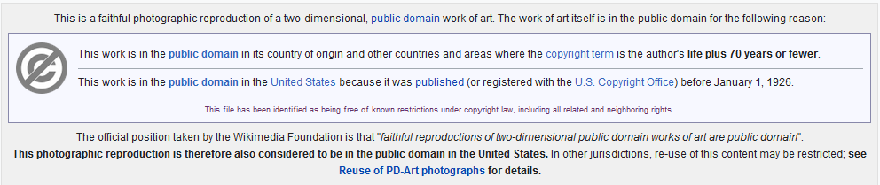
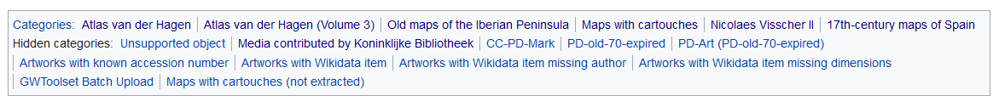
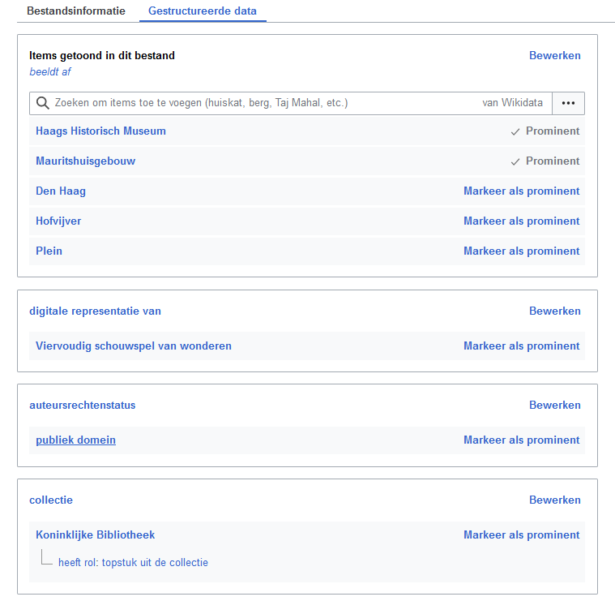
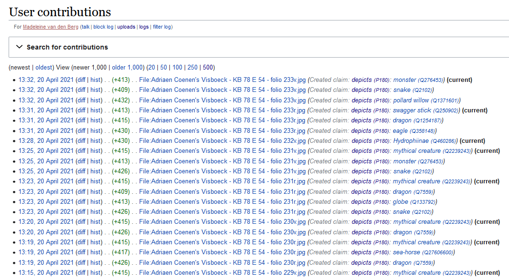
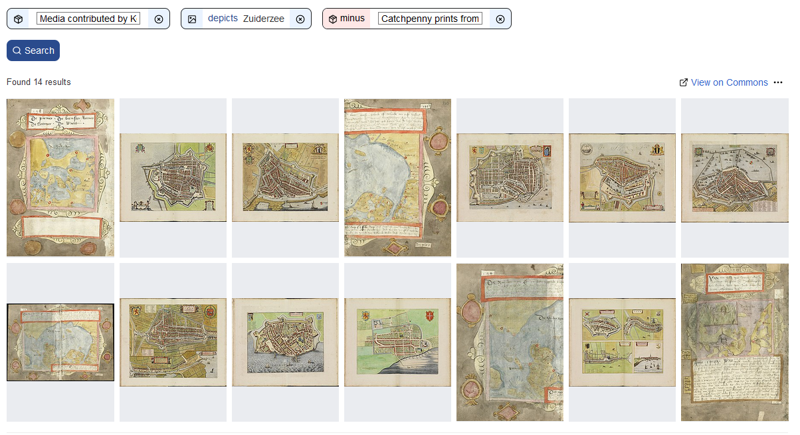
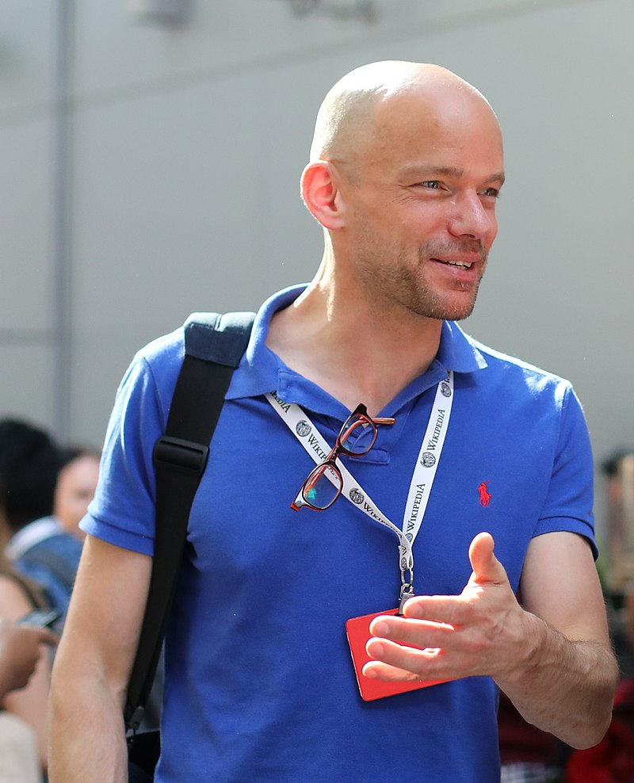

# 50 cool new things you can now do with KB's collection highlights - Part 4, Images

*In this [series of 5 articles](index.md) I show the added value of putting images and metadata of [digitised collection highlights](https://www.kb.nl/galerij/digitale-topstukken) of the KB, national library of the Netherlands, into the Wikimedia infrastructure. By putting our collection highlights into Wikidata, Wikimedia Commons and Wikipedia, dozens of new functionalities have been added. As a result of Wikifying this collection, you can now do things with these highlights that were not possible before.*

In the previous (third) part of this series I discussed 14 tools of the right hand knife. We saw [which new functionalities](Part%203%2C%20Overviews%20per%20highlight.html) have become available for individual highlights. These include [individual images](https://commons.wikimedia.org/wiki/Buiten!_Waar_de_vogels_fluiten), [double page openings](https://commons.wikimedia.org/wiki/Category:Visboeck_Coenen_(openings)), [miniatures](https://commons.wikimedia.org/wiki/Category:Miniatures_from_Der_naturen_bloeme_-_KB_KA_16) & [page details](https://commons.wikimedia.org/wiki/Category:Kunst_en_samenleving_(KB_-_KW_1310_F_3_-_details)), freely reusable video, [audio](https://commons.wikimedia.org/wiki/Category:Beatrijs_(audio)) and texts, a [facebook](https://w.wiki/phx) or an interactive [city map](https://tinyurl.com/y2y7pfbj).

In this fourth part I am going to expand the next group of 11 tools of this knife, i.e. I'm going to show which new functionalities for *individual highlight images* are available from now on.

OK, let's rock 'n roll...

As a result of the [WikiProject Collection highlights](https://www.wikidata.org/wiki/Wikidata:WikiProject_Collection_highlights_National_Library_of_the_Netherlands), over 10,000 media files, mostly images, from the KB collection have been [added to Wikimedia Commons](https://commons.wikimedia.org/wiki/Category:Media_contributed_by_Koninklijke_Bibliotheek). A [typical file page](https://commons.wikimedia.org/wiki/File:Atlas_Van_der_Hagen-KW1049B12_002-HISPANIAE_ET_PORTUGALIAE_REGNA.jpeg) (in the Dutch language interface) on Commons looks like this:

  <kbd></kbd> *File page for a [map of the Iberian Peninsula](https://commons.wikimedia.org/wiki/File:Atlas_Van_der_Hagen-KW1049B12_002-HISPANIAE_ET_PORTUGALIAE_REGNA.jpeg) from [Atlas van der Hagen](https://commons.wikimedia.org/wiki/Atlas_van_der_Hagen_(Volume_3)). Screenshot Wikimedia Commons d.d. 12-04-2021*

Such a page does not only contain the image itself (the .jpg), but also offers all kinds of extra functionalities. Let's have a look at those:

27) You can **download the image**, in **various resolutions**. In the corresponding [browsable book on kb.nl](https://galerij.kb.nl/kb.html#/nl/vanderhagen3/page/1/zoom/2/lat/-64.62387720204688/lng/-51.328125) it is *not* possible to download images .

 <kbd></kbd> *Image downloads in various resolutions for the [map of the Iberian Peninsula](https://commons.wikimedia.org/wiki/File:Atlas_Van_der_Hagen-KW1049B12_002-HISPANIAE_ET_PORTUGALIAE_REGNA.jpeg). Screenshot Wikimedia Commons d.d. 12-04-2021*

28) For each image **file level descriptive metadata** is available. Here the most important bibliographic characteristics of the image are summarized, often with direct links to Wikipedia articles, eg. about the makers or the techniques used to manufacture the original map.

 <kbd></kbd> *File level descriptive metadata for the [map of the Iberian Peninsula](https://commons.wikimedia.org/wiki/File:Atlas_Van_der_Hagen-KW1049B12_002-HISPANIAE_ET_PORTUGALIAE_REGNA.jpeg). Screenshot Wikimedia Commons d.d. 12-04-2021*

29) What stands out is the manifest, almost lavish **source attribution of the KB** as the provider, both textual (URLs, library name, catalog number, shelfmark) and visual (KB logo) in multiple places.

  <kbd></kbd> *Manifest source attribution of the KB, both textual and visual. Screenshot Wikimedia Commons d.d. 12-04-2021*

30) In addition, every KB image on Commons has a **manifest copyrights status**. With very few exceptions this is Public Domain, due to the age of the KB materials no copyright restrictions apply.

 <kbd></kbd> *Typical Public Domain tag for a KB image on Wikimedia Commons. Screenshot Wikimedia Commons d.d. 12-04-2021*

31) All KB images on Commons are **divided into one or more categories**. The above 17th century image of the Iberian Peninsula by Nicolaes Visscher II from *Altas van der Hagen* is not only divided into its 'home category' [Category:Atlas van der Hagen](https://commons.wikimedia.org/wiki/Category:Atlas_van_der_Hagen), but also into the thematic categories [Category:17th-century maps of Spain](https://commons.wikimedia.org/wiki/Category:17th-century_maps_of_Spain), [Category:Old maps of the Iberian Peninsula](https://commons.wikimedia.org/wiki/Category:Old_maps_of_the_Iberian_Peninsula), [Category:Maps with cartouches](https://commons.wikimedia.org/wiki/Category:Maps_with_cartouches) and [Category:Nicolaes Visscher II](https://commons.wikimedia.org/wiki/Category:Nicolaes_Visscher_II). Very handy if you are looking for other old maps of Spain and Portugal and/or from that specific map maker. Besides these thematic categories, you also see a lot of administrative categories, which I will not further discuss here.

  <kbd></kbd> *The 17th century [image of the Iberian Peninsula](https://commons.wikimedia.org/wiki/File:Atlas_Van_der_Hagen-KW1049B12_002-HISPANIAE_ET_PORTUGALIAE_REGNA.jpeg) by Nicolaes Visscher II from Altas van der Hagen is divided into multiple (thematic) categories. Screenshot Wikimedia Commons d.d. 12-04-2021*
   
32) KB-kaartmateriaal is soms voorzien van geo-coördinaten, zoals het Gezicht bij de Doelen over de Korte Vijverberg, tot aan het Plein uit het Viervoudig Schouwspel van Wonderen.
De ‘cameralocatie’ van waaruit deze tekening gemaakt is, is precies bekend en kan via diverse kaartdiensten (OpenStreetMap, Google Maps etc.) direct verbonden worden met het hedendaagse aanzicht vanaf dezelfde locatie. Zo kun je heel makkelijk de overeenkomsten én verschillen tussen beide aanzichten ontdekken.
32) KB map material is sometimes provided with **geo-coordinates**, such as the View at the Doelen over the Korte Vijverberg, up to the Plein from the Fourfold Spectacle of Miracles. The "camera location" from which this drawing was made is precisely known and can be directly connected to the contemporary view from the same location via various map services (OpenStreetMap, Google Maps, etc.). This way you can easily discover the similarities and differences between both views.

  <kbd></kbd> *aaaa. Screenshot Wikipedia d.d. 02-04-2021*

33) Steeds meer KB-topstukafbeeldingen zijn, naast de bij 28) genoemde bibliografische metadata, ook voorzien van gestructureerde, machineleesbare data. Hiermee worden deze afbeeldingen met Wikidata verbonden. Omdat Wikidata onderdeel is van de Linked Open Data Cloud, worden de KB-beelden verbonden met andere databronnen buiten de KB. Daardoor worden onze topstukken uiteindelijk beter vindbaar, zichtbaar en herbruikbaar.
33) More and more KB highlight images are, in addition to the bibliographic metadata mentioned at 28), also provided with structured, machine-readable data. This will associate these images with Wikidata. Because Wikidata is part of the Linked Open Data Cloud, the KB images are connected to other data sources outside the KB. This ultimately makes our highlights easier to find, visible and reusable.

  <kbd></kbd> *aaaa. Screenshot Wikipedia d.d. 02-04-2021*
   
Bij bovengenoemd uitzicht op het Mauritshuis zijn in het tabblad “Gestructureerde data” diverse kenmerken van de afbeelding opgenomen. Deze zijn deels ook al als vrije tekst in de bibliografische metadata te zien (tabblad “Bestandsinformatie”), maar hier zijn ze als 100% gestructureerde - en dus machineleesbare – data vermeld.
With the above view of the Mauritshuis, various features of the image have been included in the “Structured data” tab. These can partly also be seen as free text in the bibliographic metadata (tab “File information”), but here they are listed as 100% structured - and therefore machine-readable - data.

  <kbd></kbd> *aaaa. Screenshot Wikipedia d.d. 02-04-2021*
   
34) Zoals je ziet is de gestructureerde data hierboven in het Nederlands weergegeven. De gewone bibliografische metadata (tabblad “Bestandsinformatie”) is deels in het Nederlands, deels in het Engels. Maar wat nu als je noch Nederlands, noch goed Engels kan lezen, hoe ontdek je deze afbeelding dan? Gelukkig is Wikidata een dienst waarin gegevens in zoveel mogelijk talen worden opgeslagen, waardoor automatische meertaligheid mogelijk wordt. Zo kun je bovenstaande gestructureerde gegevens (grotendeels) ook in bv. het Duits, Frans, Russisch of Chinees opvragen, waardoor honderden miljoenen mensen (en machines!) opeens wél kunnen begrijpen waar de afbeelding over gaat. Bovendien kun je ook meertalig zoeken, je kunt dus bv. een zoekwoord in het Russisch of Frans opgeven en dan toch deze Nederlandse prent vinden.
34) As you can see, the structured data above is shown in Dutch. The normal bibliographic metadata (tab “File information”) is partly in Dutch, partly in English. But what if you cannot read Dutch or English well, how do you discover this image? Fortunately, Wikidata is a service that stores data in as many languages ​​as possible, enabling automatic multilingualism. For example, you can (largely) also request the above structured data in German, French, Russian or Chinese, for example, so that hundreds of millions of people (and machines!) Can suddenly understand what the image is about. Moreover, you can also search multilingual, so you can enter a keyword in Russian or French, for example, and still find this Dutch print.
   
  <kbd></kbd> *aaaa. Screenshot Wikipedia d.d. 02-04-2021*
   
35) Ik wil ik graag wat verder inzoomen op één specifiek aspect van de gestructureerde data, nl. de beschrijving van wat er op KB-afbeeldingen te zien is. In bovenstaand voorbeeld staat dat bij “Items getoond in dit bestand - beeldt af”. Hier worden dus op een gestructureerde manier allerlei zaken opgesomd die je op die afbeelding kunt zien: gebouwen, locaties, vijvers en pleinen. Hiermee wordt deze afbeelding niet alleen via de reguliere metadata, maar ook op inhoud (‘wat staat erop?’) doorzoekbaar.
35) I would like to zoom in a little further on one specific aspect of the structured data, namely the description of what can be seen on KB images. In the example above, it says that at “Items shown in this file - displays”. So here are listed in a structured way all kinds of things that you can see in that image: buildings, locations, ponds and squares. This makes this image searchable not only via the regular metadata, but also by content ("what's on it?").

  <kbd></kbd> *aaaa. Screenshot Wikipedia d.d. 02-04-2021*

Aan het begin van de coronacrisis het ik jullie hulp gevraagd om onze topstukken beter vindbaar, zichtbaar en herbruikbaar te maken door aan te geven (te taggen) welke dingen er te zien zijn op afbeeldingen uit KB-Topstukken.
At the start of the corona crisis, I asked for your help to make our highlights easier to find, visible and reusable by indicating (tagging) which things can be seen in images from KB highlights.
   
  <kbd></kbd> *aaaa. Screenshot Wikipedia d.d. 02-04-2021*
   
Naar aanleiding van deze oproep – die overigens nog steeds geldig is - zijn enkelen van jullie fanatiek aan de slag gegaan. Inmiddels hebben jullie bij meer dan 2.500 topstukbeelden aangegeven welke dieren, personen, steden, dorpen, straten, gebouwen, rivieren, schepen, voertuigen, gebruiksvoorwerpen etc. er op te zien zijn.
Onbetwiste KB-tagkampioene is @madeleinevandenberg, met inmiddels vele duizenden tags op haar naam. Lekker bezig!
As a result of this call - which, incidentally, is still valid - some of you have set to work fanatically. In the meantime you have indicated in more than 2,500 highlight images which animals, people, cities, villages, streets, buildings, rivers, ships, vehicles, utensils, etc. can be seen.
The undisputed KB tag champion is @madeleinevandenberg, with many thousands of tags to her name. On a roll!

  <kbd></kbd> *aaaa. Screenshot Wikipedia d.d. 02-04-2021*

36) Bij dit taggen zijn overigens niet alleen KB-medewerkers betrokken, het is ook een middel om publieksparticipatie rondom de collectie buiten de KB te stimuleren. Zo heeft Adam Harangozó uit Hongarije via deze publiekscampagne rond Der Naturen Bloeme ondertussen bij 183 van de 461 miniaturen uit dit handschrift 372 keer aangegeven wat er zoal op te zien is.
36) Incidentally, not only KB employees are involved in this tagging, it is also a means of stimulating public participation around the collection outside the KB. Adam Harangozó from Hungary, for example, has indicated 372 times what can be seen in 183 of the 461 miniatures from this manuscript through this public campaign around Der Naturen Bloeme.

  <kbd></kbd> *aaaa. Screenshot Wikipedia d.d. 02-04-2021*

37) Hierboven vertelde ik dat door KB-afbeeldingen te taggen je ze ook op inhoud doorzoekbaar maakt. Dit leidt tot nieuwe zoekmogelijkheden binnen de KB-collectie. Wat kun je bv. zoeken & vinden? (met tussen haakjes het aantal beelden)
37) Above I mentioned that by tagging KB images you also make them searchable by content. This leads to new search options within the KB collection. For example, what can you search & find? (with the number of images in brackets)

    Afbeeldingen uit onze topstukken waar bruggen op staan (20)
    Images from our highlights with bridges (20)
       <kbd></kbd> *aaaa. Screenshot Wikipedia d.d. 02-04-2021*
  
    of waar honden op staan (57)
    or where dogs stand (57)
    of waar zowel honden als katten op staan (2)
    or where both dogs and cats are on (2)
    of waar een wandelstok op te zien is (27) - je moet soms héél goed kijken!
    or where a walking stick can be seen (27) - sometimes you have to look very carefully!
  
  Steden aan de Zuiderzee (9)
    Cities on the Zuiderzee (9)
     <kbd></kbd> *aaaa. Screenshot Wikipedia d.d. 02-04-2021*
  
  Pagina’s uit het Vriendenboek van Jacob Heyblocq waar zeilboten op staan afgebeeld (6)
  Pages from Jacob Heyblocq's Friends Book depicting sailing boats (6)
  
  Miniaturen uit Der Naturen Bloeme waarop een boom te zien is (108), of vissen (17)
  Miniatures from Der Naturen Bloeme showing a tree (108), or fish (17)
   <kbd></kbd> *aaaa. Screenshot Wikipedia d.d. 02-04-2021*
   
OK, die beer is nu wel uitgerend, tot zover dit vierde deel. Volgende maand het vijfde, tevens laatste deel. Daarin zal ik uitleggen hoe je de Topstukken kunt gebruiken buiten de Wikimedia-context, dus t.b.v. je eigen websites, diensten, apps, hackathons en projecten. Dan ga ik het hebben over REST APIs, SPARQL, datadumps, Python en script- en machinematige interacties met onze topstukken.
OK, that it for this fourth article. Next month the fifth, also last part. In it I will explain how you can use the highlights outside the Wikimedia context, so for your own websites, services, apps, hackathons and projects. Then I'm going to talk about REST APIs, SPARQL, data dumps, Python and script and machine interactions with our top pieces. 

### About the author

Olaf Janssen is the Wikimedia coordinator of the KB, the national library of the Netherlands. He contributes to
[Wikipedia](https://nl.wikipedia.org/wiki/Wikipedia:GLAM/Koninklijke_Bibliotheek_en_Nationaal_Archief), [Wikimedia Commons](https://commons.wikimedia.org/wiki/Category:Koninklijke_Bibliotheek) and [Wikidata](https://www.wikidata.org/wiki/Wikidata:GLAM/Koninklijke_Bibliotheek_Nederland) as [User:OlafJanssen](https://nl.wikipedia.org/wiki/Gebruiker:OlafJanssen) 

### Reusing this article
This text of this article is available under the [CC-BY 4.0](https://creativecommons.org/licenses/by/4.0/) license. 
<kbd></kbd>

### Image sources & credits
* [Swiss_army_knife_open,_2012-(01)](https://commons.wikimedia.org/wiki/File:Swiss_army_knife_open,_2012-(01).jpg) -- Joe Loong, [CC BY-SA 2.0](https://creativecommons.org/licenses/by-sa/2.0), via Wikimedia Commons
* [Victorinox_Swiss_Army_SwissChamp_XAVT](https://commons.wikimedia.org/wiki/File:Victorinox_Swiss_Army_SwissChamp_XAVT.jpg) -- Dave Taylor from Boulder, CO, [CC BY 2.0](https://creativecommons.org/licenses/by/2.0>), via Wikimedia Commons
