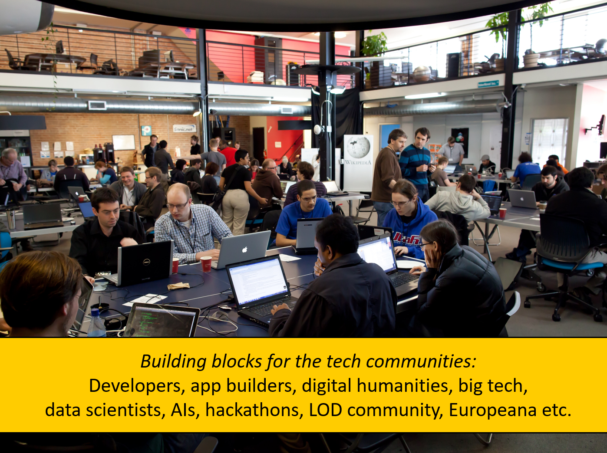

# 50 cool new things you can now do with KB's collection highlights - Part 5, Reuse

*In this [series of 5 articles](index.md) I show the added value of putting images and metadata of [digitised collection highlights](https://www.kb.nl/galerij/digitale-topstukken) of the KB, national library of the Netherlands, into the Wikimedia infrastructure. By putting our collection highlights into Wikidata, Wikimedia Commons and Wikipedia, dozens of new functionalities have been added. As a result of Wikifying this collection, you can now do things with these highlights that were not possible before.*

In het vorige (vierde) deel van deze vijfdelige Plein-serie heb ik 11 hulpstukken van het rechter mes uitgeklapt. We bekeken welke vernieuwende functionaliteiten er voor losse Topstukafbeeldingen beschikbaar zijn gekomen; we lieten o.a. het kunnen downloaden van afbeeldingen in meerdere resoluties, metadatering per beeld met manifeste bronvermelding en rechtenstatus, geo-coördinaten , gestructureerde data, meertalige ontsluiting en nieuwe zoekmogelijkheden op basis van inhoud (‘wat staat erop?’) de revue passeren.

In dit vijfde deel ga ik het laatste groepje gereedschappen van het rechter mes uitklappen. Ik ga uitleggen hoe je op basis van de Wikimedia-infrastructuur onze topstukken buiten de Wikimedia-context kunt hergebruiken. Hoe je de topstukken als technisch LEGO kunt gebruiken t.b.v. je eigen websites, diensten, apps, hackathons en projecten.

<kbd></kbd><kbd></kbd><kbd></kbd>

 In Part 5, Reuse I will explain how you can reuse KB's collection highlights outside of the Wikimedia context, that is, for/in your own websites, services, apps, hackathons and projects. I'm going to talk about REST APIs, SPARQL, data dumps, Python scripts and machine interactions with our highlights.

Ik ga het m.a.w. hebben over APIs, SPARQL, datadumps, Python en script- en machinematige interacties met onze topstukken. Toffe dingen voor onze doelgroep van ontwikkelaars, appbouwers, digital humanists, data scientists, LOD-afficionados en andere leuke nerds.

I'll Try to Follow the same orfer as in parts 2, 3 and 4, so 
- all highlights
- indivdial highlghts
- individual highlght images
and explain how you can retrieve some of the images, data, and texts we requested requested via the GUI (so in HTML)  in the previos parts now in their machine readable fromats(json, rdf, xnl, csv) via API and sparql services in the wikimedia infra, giving more controll & felixibilty over the excat ouptut, cutom made for ypour needs

## Reuse - all highlights

=====================================

38) Let's start with recreating the [image grid](https://nl.wikipedia.org/wiki/Wikipedia:GLAM/Koninklijke_Bibliotheek_en_Nationaal_Archief/Topstukken/Galerij) we started out with in [Part 2](Part%202%2C%20Overviews%20of%20all%20highlights.html) using the [Wikidata SPARQL query service](https://www.wikidata.org/wiki/Wikidata:SPARQL_query_service). A short [SPARQL query](https://w.wiki/3E8w) does the job: 

 <kbd></kbd> *[SPARQL query](https://w.wiki/3E8w) for generating a thumbnail gallery of KB collection highlights using the Wikidata query service. Screenshot Wikidata query service d.d. 23-04-2021*

resulting into a **[SPARQL driven thumbnail gallery](https://w.wiki/3E8z)** of KB highlights.

 <kbd></kbd> *The [image grid](https://w.wiki/3E8z) of KB highlights for the above SPARQL query. Screenshot Wikidata query service d.d. 23-04-2021*

39) Next, let's look at lists and tables. The [list of highlights](https://www.kb.nl/galerij/digitale-topstukken) on the KB website is only availabe as HTML. For effective reuse you'd prefer it in a structured and open format such as JSON, XML or RDF. Let's look how we can request **structured list of KB highlights, both simple and more elaborate** from the Wikidata query service: 

  a) **[Simple list](https://w.wiki/3FWz)**, with the names, labels and descriptions of the highlights in English 

  <kbd></kbd> *[Simple list](https://w.wiki/3FW$) of KB collection highlights, with the names, labels and descriptions of the highlights in English. Screenshot Wikidata query service d.d. 28-04-2021*

You can also request the [result as JSON](https://query.wikidata.org/sparql?query=%23%20Simple%20list%20of%20KB%20collection%20highlights%20%0ASELECT%20DISTINCT%20%3Fhighlight%20%3FhighlightLabel%20%3FhighlightDescription%0AWHERE%20%7B%0A%20%20%23%20the%20thing%20is%20part%20of%20the%20KB%20collection%2C%20and%20has%20role%20'collection%20highlight'%20within%20that%20collection%0A%20%20%3Fhighlight%20(p%3AP195%2Fps%3AP195)%20wd%3AQ1526131%3B%20p%3AP195%20%5Bpq%3AP2868%20wd%3AQ29188408%5D.%20%0A%20%20SERVICE%20wikibase%3Alabel%20%7B%20bd%3AserviceParam%20wikibase%3Alanguage%20%22en%22.%20%7D%0A%7D%0AORDER%20BY%20%3FhighlightLabel&format=json) and as an [XML download](https://query.wikidata.org/bigdata/namespace/wdq/sparql?query=%23%20Simple%20list%20of%20KB%20collection%20highlights%20%0ASELECT%20DISTINCT%20%3Fhighlight%20%3FhighlightLabel%20%3FhighlightDescription%0AWHERE%20%7B%0A%20%20%23%20the%20thing%20is%20part%20of%20the%20KB%20collection%2C%20and%20has%20role%20'collection%20highlight'%20within%20that%20collection%0A%20%20%3Fhighlight%20(p%3AP195%2Fps%3AP195)%20wd%3AQ1526131%3B%20p%3AP195%20%5Bpq%3AP2868%20wd%3AQ29188408%5D.%20%0A%20%20SERVICE%20wikibase%3Alabel%20%7B%20bd%3AserviceParam%20wikibase%3Alanguage%20%22en%22.%20%7D%0A%7D%0AORDER%20BY%20%3FhighlightLabel)

  b) **[Elaborate list]()** 
Moe elabvorate list, we [alreay saw in part 2](https://nl.wikipedia.org/wiki/Wikipedia:GLAM/Koninklijke_Bibliotheek_en_Nationaal_Archief/Topstukken/Listeria)
--m aar dan als ruwe sparql en json
SPARQL https://w.wiki/3DuJ (maar nog verbeteen)
JSON
(XML download)

===================================================

39) Tables about conytributotrs & roles sortable by role

40) Request which Wikipedia aricles about KB high;iogfhts in Dutch,
40a) and in othger languiqwges are availabe

=============================================

## Reuse - individual highlights

Wikimedia Commons API documentation:
https://commons.wikimedia.org/w/api.php?action=help&modules=main - General, with 
https://commons.wikimedia.org/w/api.php?action=help&modules=query - Fetch data from and about Wikimedia Commons. Mostly used, with here some 
https://commons.wikimedia.org/wiki/Commons:API/MediaWiki - Examples of using the MediaWiki API to request Commons content. 

4x) Request the images from [Armorial de Beyeren](https://commons.wikimedia.org/wiki/Category:Armorial_de_Beyeren) as a JSON file
as json https://commons.wikimedia.org/w/api.php?action=query&generator=categorymembers&gcmlimit=500&gcmtitle=Category:Armorial%20de%20Beyeren&format=json&gcmnamespace=6
as xml https://commons.wikimedia.org/w/api.php?action=query&generator=categorymembers&gcmlimit=500&gcmtitle=Category:Armorial%20de%20Beyeren&format=xml&gcmnamespace=6

List of deicted things in a highlight via sparql: 

## Reuse - individual highlight images
https://tools.wmflabs.org/magnus-toolserver/commonsapi.php - request image info

## Summary
OK, that's it for this fifth and last article.  For convenience and overview, let me summarize all the cool new things for KB's collection highlights we have seen in this article:

38) A [SPARQL driven thumbnail gallery](https://w.wiki/3E8z) of KB highlights 
39) A structured list of all KB highlights, both [basic]() and [more elaborate]() in varrious formats (json, xml..) 
40)  
41)  
42)  
43)  
44)  
45)  
46)  
47)  
48)  
49)  
50)  

## Summary of summaries
As a bonus, amd for overview., part 6 is a summary of all 50 new cool things

### About the author

Olaf Janssen is the Wikimedia coordinator of the KB, the national library of the Netherlands. He contributes to
[Wikipedia](https://nl.wikipedia.org/wiki/Wikipedia:GLAM/Koninklijke_Bibliotheek_en_Nationaal_Archief), [Wikimedia Commons](https://commons.wikimedia.org/wiki/Category:Koninklijke_Bibliotheek) and [Wikidata](https://www.wikidata.org/wiki/Wikidata:GLAM/Koninklijke_Bibliotheek_Nederland) as [User:OlafJanssen](https://nl.wikipedia.org/wiki/Gebruiker:OlafJanssen) 

### Reusing this article
This text of this article is available under the [CC-BY 4.0](https://creativecommons.org/licenses/by/4.0/) license. 
<kbd></kbd>

### Image sources & credits
* [Swiss_army_knife_open,_2012-(01)](https://commons.wikimedia.org/wiki/File:Swiss_army_knife_open,_2012-(01).jpg) -- Joe Loong, [CC BY-SA 2.0](https://creativecommons.org/licenses/by-sa/2.0), via Wikimedia Commons
* [Victorinox_Swiss_Army_SwissChamp_XAVT](https://commons.wikimedia.org/wiki/File:Victorinox_Swiss_Army_SwissChamp_XAVT.jpg) -- Dave Taylor from Boulder, CO, [CC BY 2.0](https://creativecommons.org/licenses/by/2.0>), via Wikimedia Commons
