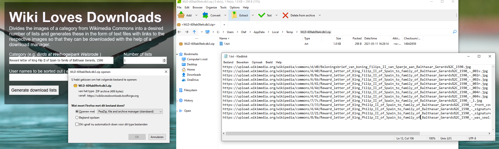

# 50 cool new things you can now do with KB's collection highlights - Part 5, Reuse


*In this [series of 5 articles](index.md) I show the added value of putting images and metadata of [digitised collection highlights](https://www.kb.nl/galerij/digitale-topstukken) of the KB, national library of the Netherlands, into the Wikimedia infrastructure. By putting our collection highlights into Wikidata, Wikimedia Commons and Wikipedia, dozens of new functionalities have been added. As a result of Wikifying this collection, you can now do things with these highlights that were not possible before.*

In the previous (fourth) part of this series I discussed 11 tools of the right hand knife. We looked at [which new functionalities](Part%204%2C%20Images.html) have become available for individual highlight images. We talked about the ability to download images in multiple resolutions, [file level descriptive metadata](https://commons.wikimedia.org/wiki/File:Atlas_Van_der_Hagen-KW1049B12_002-HISPANIAE_ET_PORTUGALIAE_REGNA.jpeg#Summary) with manifest attributions and copyrights status, geo coordinates linking images to [various map services](https://geohack.toolforge.org/geohack.php?pagename=File:Den_Haag,_gezicht_bij_de_Doelen_over_de_Korte_Vijverberg,_tot_aan_het_Plein_(7985085070).jpg&params=052.081352_N_0004.313528_E_globe:Earth_type:camera_source:Flickr_&language=nl), [linking images to Wikidata](https://commons.wikimedia.org/wiki/Commons:Structured_data), as well as enabling [multilingual search by content](https://hay.toolforge.org/sdsearch/#q=incategory:%22Media%20contributed%20by%20Koninklijke%20Bibliotheek%22%20haswbstatement:P180) (*What is depicted in the images?*)

In this fifth part I am going to unfold the last group of tools. I am going to illustrate how you can *reuse KB's collection highlights outside of the Wikimedia context*, that is, for/in your own websites, services, apps, hackathons and projects. I'm going to talk about SPARQL, APIs, Python scripts, image bulk downloading and machine interactions with our highlights. Cool LEGO Technic® blocks for KB's target group of developers, app builders, digital humanists, data scientists, LOD afficionados and other nice nerds. 

<kbd></kbd><kbd></kbd><kbd></kbd>

I'll try to follow the same order as in [Part 2](Part%202%2C%20Overviews%20of%20all%20highlights.html) , [3](Part%203%2C%20Overviews%20per%20highlight.html) and [4](Part%204%2C%20Images.html), so 
* all highlights together
* indivudual highlights
* individual highlight images.

I'll illustrate how you can retrieve the same images, data and texts we requested via the GUI (so in HTML) in these previous parts, but now in their raw, machine readable formats (JSON, XML etc.) using Wikimedia's APIs and SPARQL services. This will give you more control & flexibilty over the exact outputs, custom made for your needs.

## Reuse - all highlights

38) Let's start with recreating the [image grid](https://nl.wikipedia.org/wiki/Wikipedia:GLAM/Koninklijke_Bibliotheek_en_Nationaal_Archief/Topstukken/Galerij) we started out with in [Part 2](Part%202%2C%20Overviews%20of%20all%20highlights.html) using the [Wikidata SPARQL query service](https://www.wikidata.org/wiki/Wikidata:SPARQL_query_service). A short [SPARQL query](https://w.wiki/3E8w) does the job: 
```sparql
   # Thumbnail gallery of KB collection highlights
   #defaultView:ImageGrid
   SELECT DISTINCT ?item ?itemLabel ?image WHERE {
     # the thing is part of the KB collection, and has role 'collection highlight' within that collection
     ?item (p:P195/ps:P195) wd:Q1526131; p:P195 [pq:P2868 wd:Q29188408]. 
     OPTIONAL{?item wdt:P18 ?image.}
     SERVICE wikibase:label { bd:serviceParam wikibase:language "en". }
   } ORDER BY ?itemLabel
```
This query results into a **[SPARQL driven thumbnail gallery](https://w.wiki/3E8z)** of KB highlights.

 <kbd></kbd><br/><sub>*The [image grid](https://w.wiki/3E8z) of KB highlights for the above SPARQL query. Screenshot Wikidata query service d.d. 23-04-2021*</sub>

39) Next, let's look at lists and tables. The [list of highlights](https://www.kb.nl/galerij/digitale-topstukken) on the KB website is only availabe as HTML. For effective reuse you'd prefer it in a structured and open format such as JSON, XML or RDF. Let's look how we can request **structured lists of KB highlights, both simple and more elaborate** from the Wikidata query service: 

- *Simple list*, using [this query](https://w.wiki/3FWz):
   ```sparql
     # Simple list of KB collection highlights 
     SELECT DISTINCT ?highlight ?highlightLabel ?highlightDescription
     WHERE {
       # the thing is part of the KB collection, and has role 'collection highlight' within that collection
       ?highlight (p:P195/ps:P195) wd:Q1526131; p:P195 [pq:P2868 wd:Q29188408]. 
       SERVICE wikibase:label { bd:serviceParam wikibase:language "en". }
     }
     ORDER BY ?highlightLabel
   ```
  It results into a [simple list](https://w.wiki/3FW$) of KB collection highlights, with the names, labels and descriptions in English.

  <kbd></kbd><br/><sub>*Result of the query, a [simple list](https://w.wiki/3FW$) of KB collection highlights, with the names, labels and descriptions in English. Screenshots Wikidata query service d.d. 28-04-2021*</sub>

  You can request the [result as JSON](https://query.wikidata.org/sparql?query=%23%20Simple%20list%20of%20KB%20collection%20highlights%20%0ASELECT%20DISTINCT%20%3Fhighlight%20%3FhighlightLabel%20%3FhighlightDescription%0AWHERE%20%7B%0A%20%20%23%20the%20thing%20is%20part%20of%20the%20KB%20collection%2C%20and%20has%20role%20'collection%20highlight'%20within%20that%20collection%0A%20%20%3Fhighlight%20(p%3AP195%2Fps%3AP195)%20wd%3AQ1526131%3B%20p%3AP195%20%5Bpq%3AP2868%20wd%3AQ29188408%5D.%20%0A%20%20SERVICE%20wikibase%3Alabel%20%7B%20bd%3AserviceParam%20wikibase%3Alanguage%20%22en%22.%20%7D%0A%7D%0AORDER%20BY%20%3FhighlightLabel&format=json) and as an [XML download](https://query.wikidata.org/bigdata/namespace/wdq/sparql?query=%23%20Simple%20list%20of%20KB%20collection%20highlights%20%0ASELECT%20DISTINCT%20%3Fhighlight%20%3FhighlightLabel%20%3FhighlightDescription%0AWHERE%20%7B%0A%20%20%23%20the%20thing%20is%20part%20of%20the%20KB%20collection%2C%20and%20has%20role%20'collection%20highlight'%20within%20that%20collection%0A%20%20%3Fhighlight%20(p%3AP195%2Fps%3AP195)%20wd%3AQ1526131%3B%20p%3AP195%20%5Bpq%3AP2868%20wd%3AQ29188408%5D.%20%0A%20%20SERVICE%20wikibase%3Alabel%20%7B%20bd%3AserviceParam%20wikibase%3Alanguage%20%22en%22.%20%7D%0A%7D%0AORDER%20BY%20%3FhighlightLabel) as well.

-  *Elaborate list*, recreating the [overview table of KB collection highlights](https://nl.wikipedia.org/wiki/Wikipedia:GLAM/Koninklijke_Bibliotheek_en_Nationaal_Archief/Topstukken/Listeria) from [Part 2](Part%202%2C%20Overviews%20of%20all%20highlights.html) via [this SPARQL query](https://w.wiki/3FXe): 

   <kbd></kbd><kbd></kbd><br/><sub>*Left: [SPARQL query](https://w.wiki/3FXe) to create an elaborate list of KB collection highlights. Right: Result of the query, an [elaborate list](https://w.wiki/3FXg) of KB collection highlights. Please note the results have not been aggregated by the [GROUP_CONCAT function](https://www.wikidata.org/wiki/Wikidata:SPARQL_tutorial#Aggregate_functions_summary), hence the higher number of results compared to the simple query. Screenshots Wikidata query service d.d. 28-04-2021*</sub>

   You can also request the [result as JSON](https://query.wikidata.org/sparql?query=%23%20Elaborated%20list%20of%20KB%20collection%20highlights%2C%20recreating%0A%23%20https%3A%2F%2Fnl.wikipedia.org%2Fwiki%2FWikipedia%3AGLAM%2FKoninklijke_Bibliotheek_en_Nationaal_Archief%2FTopstukken%2FListeria%0A%23%20using%20SPARQL%0A%0ASELECT%20DISTINCT%20%3Fhighlight%20%3FhighlightLabel%20%3Ftitle%20%3FhighlightDescription%20%3Fimage%20%3FhighlightIsALabel%20%3FinventoryNr%20%0A%3Fkbcat%20%3Fkburl%20%3Fbrowsebook%20%3Fgallery%20%3FcopyrightLabel%20%0A%0AWHERE%20%7B%0A%20%20%3Fhighlight%20p%3AP195%20%3Fst%20.%0A%20%20%3Fst%20ps%3AP195%20wd%3AQ1526131%20.%0A%20%20%3Fst%20pq%3AP2868%20wd%3AQ29188408.%0A%0A%20%20OPTIONAL%7B%3Fhighlight%20wdt%3AP18%20%3Fimage.%7D%0A%20%20OPTIONAL%7B%3Fhighlight%20wdt%3AP1476%20%3Ftitle.%7D%0A%20%20OPTIONAL%7B%3Fhighlight%20wdt%3AP31%20%3FhighlightIsA.%7D%0A%20%20OPTIONAL%7B%3Fhighlight%20wdt%3AP217%20%3FinventoryNr.%7D%0A%20%20OPTIONAL%7B%3Fhighlight%20wdt%3AP528%20%3Fppn.%0A%20%20%20%20%20BIND(CONCAT(%22https%3A%2F%2Fresolver.kb.nl%2Fresolve%3Furn%3DPPN%3A%22%2C%3Fppn)%20AS%20%3Fkbcat).%7D%20%0A%20%20OPTIONAL%7B%3Fhighlight%20wdt%3AP973%20%3Fkburl.%0A%20%20%20%20%20FILTER(STRSTARTS(STR(%3Fkburl)%2C%20%22https%3A%2F%2Fwww.kb.nl%2Fthemas%2F%22)).%7D%0A%20%20OPTIONAL%7B%3Fhighlight%20wdt%3AP953%20%3Fbrowsebook.%0A%20%20%20%20%20FILTER(STRSTARTS(STR(%3Fbrowsebook)%2C%20%22https%3A%2F%2Fgalerij.kb.nl%22)).%7D%0A%20%20OPTIONAL%7B%3Fhighlight%20wdt%3AP935%20%3Fgal.%0A%20%20%20%20%20BIND(CONCAT(%22https%3A%2F%2Fcommons.wikimedia.org%2Fwiki%2F%22%2CREPLACE(%3Fgal%2C%22%20%22%2C%22_%22))%20AS%20%3Fgallery).%7D%0A%20%20OPTIONAL%7B%3Fhighlight%20wdt%3AP6216%20%3Fcopyright.%7D%0A%20%20%20%20%0A%20%20SERVICE%20wikibase%3Alabel%20%7B%20bd%3AserviceParam%20wikibase%3Alanguage%20%22en%22.%20%7D%0A%7D%20ORDER%20BY%20%3FhighlightLabel%0A%0A%0A%0A%0A%0A%0A%0A&format=json) and as an [XML download](https://query.wikidata.org/bigdata/namespace/wdq/sparql?query=%23%20Elaborated%20list%20of%20KB%20collection%20highlights%2C%20recreating%0A%23%20https%3A%2F%2Fnl.wikipedia.org%2Fwiki%2FWikipedia%3AGLAM%2FKoninklijke_Bibliotheek_en_Nationaal_Archief%2FTopstukken%2FListeria%0A%23%20using%20SPARQL%0A%0ASELECT%20DISTINCT%20%3Fhighlight%20%3FhighlightLabel%20%3Ftitle%20%3FhighlightDescription%20%3Fimage%20%3FhighlightIsALabel%20%3FinventoryNr%20%0A%3Fkbcat%20%3Fkburl%20%3Fbrowsebook%20%3Fgallery%20%3FcopyrightLabel%20%0A%0AWHERE%20%7B%0A%20%20%3Fhighlight%20p%3AP195%20%3Fst%20.%0A%20%20%3Fst%20ps%3AP195%20wd%3AQ1526131%20.%0A%20%20%3Fst%20pq%3AP2868%20wd%3AQ29188408.%0A%0A%20%20OPTIONAL%7B%3Fhighlight%20wdt%3AP18%20%3Fimage.%7D%0A%20%20OPTIONAL%7B%3Fhighlight%20wdt%3AP1476%20%3Ftitle.%7D%0A%20%20OPTIONAL%7B%3Fhighlight%20wdt%3AP31%20%3FhighlightIsA.%7D%0A%20%20OPTIONAL%7B%3Fhighlight%20wdt%3AP217%20%3FinventoryNr.%7D%0A%20%20OPTIONAL%7B%3Fhighlight%20wdt%3AP528%20%3Fppn.%0A%20%20%20%20%20BIND(CONCAT(%22https%3A%2F%2Fresolver.kb.nl%2Fresolve%3Furn%3DPPN.%3A%22%2C%3Fppn)%20AS%20%3Fkbcat).%7D%20%0A%20%20OPTIONAL%7B%3Fhighlight%20wdt%3AP973%20%3Fkburl.%0A%20%20%20%20%20FILTER(STRSTARTS(STR(%3Fkburl)%2C%20%22https%3A%2F%2Fwww.kb.nl%2Fthemas%2F%22)).%7D%0A%20%20OPTIONAL%7B%3Fhighlight%20wdt%3AP953%20%3Fbrowsebook.%0A%20%20%20%20%20FILTER(STRSTARTS(STR(%3Fbrowsebook)%2C%20%22https%3A%2F%2Fgalerij.kb.nl%22)).%7D%0A%20%20OPTIONAL%7B%3Fhighlight%20wdt%3AP935%20%3Fgal.%0A%20%20%20%20%20BIND(CONCAT(%22https%3A%2F%2Fcommons.wikimedia.org%2Fwiki%2F%22%2CREPLACE(%3Fgal%2C%22%20%22%2C%22_%22))%20AS%20%3Fgallery).%7D%0A%20%20OPTIONAL%7B%3Fhighlight%20wdt%3AP6216%20%3Fcopyright.%7D%0A%20%20%20%20%0A%20%20SERVICE%20wikibase%3Alabel%20%7B%20bd%3AserviceParam%20wikibase%3Alanguage%20%22en%22.%20%7D%0A%7D%20ORDER%20BY%20%3FhighlightLabel%0A%0A%0A%0A%0A%0A%0A%0A).

    <kbd></kbd><kbd></kbd><br/><sub>*Left: JSON result of the query. Right: XML result of the query. Screenshots Wikidata query service d.d. 28-04-2021*</sub>

40) You might want to **programatically check for Wikipedia articles about KB highlights**, for instance in Dutch, using [this query](https://w.wiki/3FbF):
```sparql
   #Articles about KB collection highlights on Dutch Wikipedia
   select ?item ?itemLabel ?articleNL where {
   ?item (p:P195/ps:P195) wd:Q1526131; p:P195 [pq:P2868 wd:Q29188408]. 
   OPTIONAL {
     ?articleNL schema:about ?item.
     ?articleNL schema:isPartOf <https://nl.wikipedia.org/>.
   }
   SERVICE wikibase:label { bd:serviceParam wikibase:language "[AUTO_LANGUAGE],en,nl". }
   }
```
As before, the results can be requested in [JSON](https://query.wikidata.org/sparql?query=%23Articles%20about%20KB%20collection%20highlights%20on%20Dutch%20Wikipedia%0Aselect%20%3Fitem%20%3FitemLabel%20%3FarticleNL%20where%20%7B%0A%20%20%3Fitem%20p%3AP195%20%3Fst%20.%0A%20%20%3Fst%20ps%3AP195%20wd%3AQ1526131%20.%0A%20%20%3Fst%20pq%3AP2868%20wd%3AQ29188408%20.%0A%20%20OPTIONAL%20%7B%0A%20%20%20%20%3FarticleNL%20schema%3Aabout%20%3Fitem.%0A%20%20%20%20%3FarticleNL%20schema%3AisPartOf%20%3Chttps%3A%2F%2Fnl.wikipedia.org%2F%3E.%0A%20%20%7D%0A%20%20SERVICE%20wikibase%3Alabel%20%7B%20bd%3AserviceParam%20wikibase%3Alanguage%20%22%5BAUTO_LANGUAGE%5D%2Cen%2Cnl%22.%20%7D%0A%7D%0A%0A%0A%0A%0A%0A%0A&format=json) and [in XML](https://query.wikidata.org/bigdata/namespace/wdq/sparql?query=%23Articles%20about%20KB%20collection%20highlights%20on%20Dutch%20Wikipedia%0Aselect%20%3Fitem%20%3FitemLabel%20%3FarticleNL%20where%20%7B%0A%20%20%3Fitem%20p%3AP195%20%3Fst%20.%0A%20%20%3Fst%20ps%3AP195%20wd%3AQ1526131%20.%0A%20%20%3Fst%20pq%3AP2868%20wd%3AQ29188408%20.%0A%20%20OPTIONAL%20%7B%0A%20%20%20%20%3FarticleNL%20schema%3Aabout%20%3Fitem.%0A%20%20%20%20%3FarticleNL%20schema%3AisPartOf%20%3Chttps%3A%2F%2Fnl.wikipedia.org%2F%3E.%0A%20%20%7D%0A%20%20SERVICE%20wikibase%3Alabel%20%7B%20bd%3AserviceParam%20wikibase%3Alanguage%20%22%5BAUTO_LANGUAGE%5D%2Cen%2Cnl%22.%20%7D%0A%7D%0A%0A%0A%0A%0A%0A%0A) as well.

## Reuse - individual highlights

41) In [Part 3](Part%203%2C%20Overviews%20per%20highlight.html) we looked at individual pages (14), double page openings (15) and miniatures/page details (16) that are available for public domain highlights. Let's see how we can **request image URLs from the [Wikimedia Commons query API](https://commons.wikimedia.org/w/api.php?action=help&modules=query)** using [this documentation](https://www.mediawiki.org/wiki/API:Categorymembers).

- **Individual pages**<br/> 
  For [Armorial de Beyeren](https://commons.wikimedia.org/wiki/Category:Armorial_de_Beyeren) we can request a simple list of images
  - in JSON: [https://commons.wikimedia.org/w/api.php?action=query&generator=categorymembers&gcmlimit=500&gcmtitle=Category:Armorial%20de%20Beyeren&*format=json&gcmnamespace=6*](https://commons.wikimedia.org/w/api.php?action=query&generator=categorymembers&gcmlimit=500&gcmtitle=Category:Armorial%20de%20Beyeren&format=json&gcmnamespace=6) and 
  - in XML: [https://commons.wikimedia.org/w/api.php?action=query&generator=categorymembers&gcmlimit=500&gcmtitle=Category:Armorial%20de%20Beyeren&*format=xml&gcmnamespace=6*](https://commons.wikimedia.org/w/api.php?action=query&generator=categorymembers&gcmlimit=500&gcmtitle=Category:Armorial%20de%20Beyeren&format=xml&gcmnamespace=6). 

  Here we are filtering on [namespace=6](https://commons.wikimedia.org/wiki/Help:Namespaces#Standard_Namespaces) (ns=6), so we are looking for files only (ie. no categories (ns=14) or galleries (ns=0)).   

  <kbd></kbd><br/><sub>*XML list of files from [Armorial de Beyeren](https://commons.wikimedia.org/wiki/Category:Armorial_de_Beyeren) using [this API call](https://commons.wikimedia.org/w/api.php?action=query&generator=categorymembers&gcmlimit=500&gcmtitle=Category:Armorial%20de%20Beyeren&format=xml&gcmnamespace=6). Screenshot Wikimedia Commons API, d.d. 29-04-2021*</sub>

- **Double page openings**<br/> 
  The downside of the above reponses is that they do not contain URLs (starting with https://), but only Wikimedia Commons file names. To request https URLs we need to modify our API call. When we apply the modified call to the [double page openings of Visboek Coenen](https://commons.wikimedia.org/wiki/Category:Visboeck_Coenen_(openings)), 

  [https://commons.wikimedia.org/w/api.php?action=query&generator=categorymembers&gcmtitle=Category:Visboeck_Coenen_(openings)&gcmlimit=500&gcmtype=file&prop=imageinfo&iiprop=url&format=xml](https://commons.wikimedia.org/w/api.php?action=query&generator=categorymembers&gcmtitle=Category:Visboeck_Coenen_(openings)&gcmlimit=500&gcmtype=file&prop=imageinfo&iiprop=url&format=xml)

  we get this XML reponse

  <kbd></kbd><br/><sub>*XML reponse containing https URLs to the [double page openings of Visboek Coenen](https://commons.wikimedia.org/wiki/Category:Visboeck_Coenen_(openings)) using [this API call](https://commons.wikimedia.org/w/api.php?action=query&generator=categorymembers&gcmtitle=Category:Visboeck_Coenen_(openings)&gcmlimit=500&gcmtype=file&prop=imageinfo&iiprop=url&format=xml). Screenshot Wikimedia Commons API, d.d. 29-04-2021*</sub>

  Please note that this reponse contains both direct download URLs of the hires images ([example](https://upload.wikimedia.org/wikipedia/commons/e/ed/Adriaen_Coenen%27s_Visboeck_-_KB_78_E_54_-_Folio_001r.jpg)), as well as two forms of URLs of the Wikimedia Commons files page ([example](https://commons.wikimedia.org/wiki/File:Adriaen_Coenen%27s_Visboeck_-_KB_78_E_54_-_Folio_001r.jpg)).
  
- **Miniatures and page details**<br/>
  Besides calling the API by a URL query string (as done above), it is also possible to do this via a Python script. For instance, we can request the [miniatures](https://commons.wikimedia.org/wiki/Category:Chroniques_de_Froissart,_vol_1_-_Den_Haag,_KB_:_72_A_25_(details)) from [Chroniques de Froissart](https://commons.wikimedia.org/wiki/Category:Chroniques_de_Froissart,_vol_1_-_Den_Haag,_KB_:_72_A_25_(c.1410)):

```python
	#!/usr/bin/python3
	import requests, json
	S = requests.Session()
	URL = "https://commons.wikimedia.org/w/api.php"
	PARAMS = {
	   "action": "query",
	   "gcmtitle":"Category:Chroniques_de_Froissart,_vol_1_-_Den_Haag,_KB_:_72_A_25_(details)",
	   "gcmlimit":"500",
	   "generator":"categorymembers",
	   "format":"json",
	   "gcmtype":"file",
	   "prop":"imageinfo",
	   "iiprop":"url"
	}
	R = S.get(url=URL, params=PARAMS)
	DATA = R.json()
	PAGES = DATA['query']['pages']
	print(json.dumps(PAGES, indent=2))
```
  Running this script in my [Python IDE](https://www.jetbrains.com/pycharm/) gives the following output: 

  <kbd></kbd><br/><sub>*Titles and URLs of [miniatures](https://commons.wikimedia.org/wiki/Category:Chroniques_de_Froissart,_vol_1_-_Den_Haag,_KB_:_72_A_25_(details)) from [Chroniques de Froissart](https://commons.wikimedia.org/wiki/Category:Chroniques_de_Froissart,_vol_1_-_Den_Haag,_KB_:_72_A_25_(c.1410)) formatted as JSON. Screenshot [Pycharm IDE](https://www.jetbrains.com/pycharm/), d.d. 29-04-2021*</sub>

42) If you don't want to use the Wikimedia Commons API for getting image URLs, no problem, there a some **readily available bulk image download tools** for obtaining the **hires image URLs** and/or the **hires images themselves** from a specific KB highlight category on Wikimedia Commons.

  Using the **[Wiki Loves Downloads tool](https://wikilovesdownloads.toolforge.org/)** you can easily get all the direct download URLs of the hires images of eg. the [Reward letter of King Filip II of Spain to family of Balthasar Gerards, 1590](https://commons.wikimedia.org/wiki/Category:Reward_letter_of_King_Filip_II_of_Spain_to_family_of_Balthasar_Gerards,_1590). Because this tool was developed by [Wikimedia Deutschland](https://www.wikimedia.de/), the default user interface is in German. We can use Google Translate to get a [English user interface](https://translate.google.com/translate?hl=en&sl=de&tl=en&u=https%3A%2F%2Fwikilovesdownloads.toolforge.org%2F) for international audiences. As stated in the tool, it divides the images of a category from Wikimedia Commons into a desired number of lists and generates these in the form of (zipped) text files with links to the respective images so that they can be downloaded with the help of a download manager (or a script).

  <kbd></kbd><br/><sub>*Getting the direct download URLs of the hires images of the [Reward letter of King Filip II of Spain to family of Balthasar Gerards, 1590](https://commons.wikimedia.org/wiki/Category:Reward_letter_of_King_Filip_II_of_Spain_to_family_of_Balthasar_Gerards,_1590). Screenshot [Wiki Loves Downloads](https://wikilovesdownloads.toolforge.org/) with [translated English user interface](https://translate.google.com/translate?hl=en&sl=de&tl=en&u=https%3A%2F%2Fwikilovesdownloads.toolforge.org%2F), d.d. 11-05-2021*</sub>

  If you prefer the images themselves rather than only the URLs, the Java based **[Imker tool](https://commons.wikimedia.org/wiki/Commons:Imker_(batch_download))** is the way to go. It downloads all images from a specific category (or page) on Wikimedia Commons (or any other Wikimedia site) to your local machine. 

  <kbd></kbd><br/><sub>*Downloading the hires images of the [Reward letter of King Filip II of Spain to family of Balthasar Gerards, 1590](https://commons.wikimedia.org/wiki/Category:Reward_letter_of_King_Filip_II_of_Spain_to_family_of_Balthasar_Gerards,_1590). Screenshot of the [Imker tool](https://commons.wikimedia.org/wiki/Commons:Imker_(batch_download)), d.d. 11-05-2021*</sub>

43) Every KB highlight is described by a Wikidata item (Qnumber). Let's see how we can request **highlight information from the Wikidata API** directly from that Qnumber. We can use the [*wbgetentities* action](https://www.wikidata.org/w/api.php?action=help&modules=wbgetentities) for that.

* Get *all information* ('the entire Qnumber') from the [Beatrijs manuscript](https://www.wikidata.org/wiki/Q1929931) (Q1929931) in all available languages, as JSON: [https://www.wikidata.org/w/api.php?action=wbgetentities&ids=Q1929931](https://www.wikidata.org/w/api.php?action=wbgetentities&ids=Q1929931)

* Get *only the labels* of the [Egmond Gospels](https://www.wikidata.org/wiki/Q759256) (Q759256) in all available languages, as XML: [https://www.wikidata.org/w/api.php?action=wbgetentities&ids=Q759256&props=labels&format=xml](https://www.wikidata.org/w/api.php?action=wbgetentities&ids=Q759256&props=labels&format=xml) 

  <kbd></kbd><br/><sub>*Comparison between the multilingual labeling of the Egmond Gospels (Q759256) from the [Wikidata web interface](https://www.wikidata.org/wiki/Q759256) and from the [Wikidata API](https://www.wikidata.org/w/api.php?action=wbgetentities&ids=Q759256&props=labels&format=xml). Screenshot Wikidata GUI & Wikidata API, d.d. 30-04-2021*</sub>

* Get the *aliases* of [Atlas Ortelius 1571](https://www.wikidata.org/wiki/Q67465742) (Q67465742) in German, Czech, Polish and Ukrainian, as JSON: [https://www.wikidata.org/w/api.php?action=wbgetentities&ids=Q67465742&props=aliases&languages=de%7Ccs%7Cpl%7Cuk&format=json](https://www.wikidata.org/w/api.php?action=wbgetentities&ids=Q67465742&props=aliases&languages=de%7Ccs%7Cpl%7Cuk&format=json)

* Get the *Wikipedia articles* for both [Liber Pantegni](https://www.wikidata.org/wiki/Q748421) (Q748421) and the [Beyeren armorial](https://www.wikidata.org/wiki/Q3372028) (Q3372028) in all available languages, as XML: [https://www.wikidata.org/w/api.php?action=wbgetentities&ids=Q748421%7CQ3372028&props=sitelinks&format=xml](https://www.wikidata.org/w/api.php?action=wbgetentities&ids=Q748421%7CQ3372028&props=sitelinks&format=xml)

44) An alternative way is to **request full Wikidata items directly from the Qnumber via a [Special:EntityData](https://www.mediawiki.org/wiki/Wikibase/EntityData) URL.** The ouput can be obtained in no fewer than seven different formats:

 - Get all information from the [Haags liederenhandschrift](https://www.wikidata.org/wiki/Q16641064) (Q16641064, *The Hague song manuscript*) as HTML: [https://www.wikidata.org/wiki/Special:EntityData/Q16641064](https://www.wikidata.org/wiki/Special:EntityData/Q16641064). This uses [content negotiation](https://en.wikipedia.org/wiki/content_negotiation) to return HTML in your browser. 
 - If you don't want to depend on content negotiation (e.g. view non-HTML content in a web browser), you can actively request alternative formats by appendig a *format suffix* to the URL, eg. to retrieve JSON: [https://www.wikidata.org/wiki/Special:EntityData/Q16641064.json](https://www.wikidata.org/wiki/Special:EntityData/Q16641064.json). 
 - Other available formats are [JSON-LD](https://www.wikidata.org/wiki/Special:EntityData/Q16641064.jsonld), [RDF](https://www.wikidata.org/wiki/Special:EntityData/Q16641064.rdf), [NT](https://www.wikidata.org/wiki/Special:EntityData/Q16641064.nt), [TTL or N3](https://www.wikidata.org/wiki/Special:EntityData/Q16641064.ttl) and [PHP](https://www.wikidata.org/wiki/Special:EntityData/Q16641064.php). 
 - Equivalant URLs for these requests use the *format argument*, e.g. : [Special:EntityData?id=Q16641064](https://www.wikidata.org/wiki/Special:EntityData?id=Q16641064&format=rdf)[*&format=rdf*](https://www.wikidata.org/wiki/Special:EntityData?id=Q16641064&format=rdf).

    <kbd></kbd><br/><sub>*Seven different output formats for the [Special:EntityData](https://www.mediawiki.org/wiki/Wikibase/EntityData) URL for the [Haags liederenhandschrift](https://www.wikidata.org/wiki/Q16641064) (Q16641064): [HTML](https://www.wikidata.org/wiki/Special:EntityData/Q16641064), [JSON](https://www.wikidata.org/wiki/Special:EntityData/Q16641064.json), [JSON-LD](https://www.wikidata.org/wiki/Special:EntityData/Q16641064.jsonld), [RDF](https://www.wikidata.org/wiki/Special:EntityData/Q16641064.rdf), [NT](https://www.wikidata.org/wiki/Special:EntityData/Q16641064.nt), [TTL or N3](https://www.wikidata.org/wiki/Special:EntityData/Q16641064.ttl) and [PHP](https://www.wikidata.org/wiki/Special:EntityData/Q16641064.php). Compilation of screenshot d.d. 03-05-2021*</sub>

For exploring the JSON response in further detail we can tweak [this Python script](https://gist.github.com/thisismattmiller/42c9d5981ee233c6288194af234ac6e4) that [Matt Miller](https://gist.github.com/thisismattmiller) from the Library of Congress explains in *[Demo: Programmatic Wikidata](https://www.youtube.com/watch?v=SzfC3KFqmPs)* from his YouTube series *[Programming for Cultural Heritage](https://www.youtube.com/playlist?list=PL9Oe03cT2WhwMsSZLsUg6ej-5imNzhgBX)*.

For instance, we can make a list of all Wikidata properties that are used in [Q16641064](https://www.wikidata.org/wiki/Q16641064)

```python
  import requests
  import json
  url = "https://www.wikidata.org/wiki/Special:EntityData/"
  qnumbers = ['Q16641064'] # Haags liederenhandschrift // The Hague song manuscript
  for qnum in qnumbers:
      useurl = url + qnum + '.json'
      headers = {
  	'Accept' : 'application/json',
  	'User-Agent': 'User OlafJanssen - Haags liederenhandschrift'
      }
      r = requests.get(useurl, headers=headers)
      data = json.loads(r.text)
      properties = list(data['entities'][qnum]['claims'].keys())
      print(properties)
```
returning a list in Python

```
  ['P31', 'P18', 'P195', 'P217', 'P571', 'P973', 'P953', 'P373', 'P5008', 'P276', 'P1476', 'P170', 'P127', 'P767', 
  'P291', 'P2670', 'P2048', 'P2049', 'P186', 'P1104', 'P935', 'P8791', 'P1343', 'P528', 'P6216', 'P2671']
```

If we modify the last couple of code lines into

```python
  .... # as previous
  data = json.loads(r.text)
  nlen= len(data['entities'][qnum]['claims']['P170'])
  for i in range(0, nlen):
      creatorid = data['entities'][qnum]['claims']['P170'][i]['mainsnak']['datavalue']['value']['id']
      creatorurl= "https://www.wikidata.org/w/api.php?action=wbgetentities&ids=" + str(creatorid) + 
      	"&props=labels&languages=en&format=json"
      creatorresponse = requests.get(creatorurl, headers=headers)
      creatordata = json.loads(creatorresponse.text)
      print(str(i+1)+": "+creatordata['entities'][creatorid]['labels']['en']['value'])
```
we can retrieve the English names (labels) of the three creators ([P170](https://www.wikidata.org/wiki/Property:P170)) of this manuscript: 

```
  1: Noydekijn
  2: Augustijnken
  3: Freidank
```

45) Talking about creators, let's see how we can request a **structured overview of persons and institutions related to a set of highlights**, such as authors, makers, contributors, publishers, printers, illustrators, translators, owners, collectors etc. This is actually the machine readable equivalent of points 9 and 10 from [Part 2](Part%202%2C%20Overviews%20of%20all%20highlights.html). 

Let's do this for three KB highlights at the same time: 
  1) [Admirandorum quadruplex spectaculum](https://www.wikidata.org/wiki/Q42302438) (Q42302438), 
  2) [Kunst en samenleving](https://www.wikidata.org/wiki/Q72752446) (*Art and society*, Q72752446) and the above mentioned 
  3) [Haags liederenhandschrift](https://www.wikidata.org/wiki/Q16641064) (Q16641064). 

We use [this SPARQL query](https://query.wikidata.org/#%23%20Overview%20of%20persons%20%26%20institutions%20related%20to%20%0A%23%201%20Admirandorum%20quadruplex%20spectaculum%20%28Q42302438%29%2C%20%0A%23%203%20Kunst%20en%20samenleving%20%28Q72752446%29%20and%20%0A%23%204%20Haags%20liederenhandschrift%20%28Q16641064%29%20%0A%23%20such%20as%20authors%2C%20makers%2C%20contributors%2C%20publishers%2C%20printers%2C%20illustrators%2C%20translators%2C%20owners%20etc.%20%0ASELECT%20DISTINCT%20%3Fhl%20%3FhlLabel%0A%28GROUP_CONCAT%28DISTINCT%20%3FcreatorLabel%20%3B%20separator%20%3D%20%22%20----%20%22%29%20as%20%3Fcreators%29%0A%28GROUP_CONCAT%28DISTINCT%20%3FauthorLabel%20%3B%20separator%20%3D%20%22%20----%20%22%29%20as%20%3Fauthors%29%0A%28GROUP_CONCAT%28DISTINCT%20%3FcontributorLabel%20%3B%20separator%20%3D%20%22%20----%20%22%29%20as%20%3Fcontributors%29%0A%28GROUP_CONCAT%28DISTINCT%20%3FeditorLabel%20%3B%20separator%20%3D%20%22%20----%20%22%29%20as%20%3Feditors%29%0A%28GROUP_CONCAT%28DISTINCT%20%3FtranslatorLabel%20%3B%20separator%20%3D%20%22%20----%20%22%29%20as%20%3Ftranslators%29%0A%28GROUP_CONCAT%28DISTINCT%20%3FillustratorLabel%20%3B%20separator%20%3D%20%22%20----%20%22%29%20as%20%3Fillustrators%29%0A%28GROUP_CONCAT%28DISTINCT%20%3FpublisherLabel%20%3B%20separator%20%3D%20%22%20----%20%22%29%20as%20%3Fpublishers%29%0A%28GROUP_CONCAT%28DISTINCT%20%3Fowned_byLabel%20%3B%20separator%20%3D%20%22%20----%20%22%29%20as%20%3Fowned_bys%29%0A%0AWHERE%20%7B%0A%20%20%23%20the%20thing%20is%20part%20of%20the%20KB%20collection%2C%20and%20has%20role%20%27collection%20highlight%27%20within%20that%20collection%0A%20%20%3Fhl%20%28p%3AP195%2Fps%3AP195%29%20wd%3AQ1526131%3B%20p%3AP195%20%5Bpq%3AP2868%20wd%3AQ29188408%5D.%0A%20%20%23%20limit%20to%20Q42302438%2C%20Q72752446%20and%20Q16641064%0A%20%20VALUES%20%3Fhl%20%7Bwd%3AQ42302438%20wd%3AQ72752446%20wd%3AQ16641064%7D%0A%20%20%0A%20%20OPTIONAL%7B%3Fhl%20wdt%3AP170%20%3Fcreator.%7D%0A%20%20OPTIONAL%7B%3Fhl%20wdt%3AP50%20%3Fauthor.%7D%0A%20%20OPTIONAL%7B%3Fhl%20wdt%3AP767%20%3Fcontributor.%7D%0A%20%20OPTIONAL%7B%3Fhl%20wdt%3AP98%20%3Feditor.%7D%0A%20%20OPTIONAL%7B%3Fhl%20wdt%3AP655%20%3Ftranslator.%7D%0A%20%20OPTIONAL%7B%3Fhl%20wdt%3AP110%20%3Fillustrator.%7D%0A%20%20OPTIONAL%7B%3Fhl%20wdt%3AP123%20%3Fpublisher.%7D%0A%20%20OPTIONAL%7B%3Fhl%20wdt%3AP127%20%3Fowned_by.%7D%0A%0A%20%20SERVICE%20wikibase%3Alabel%20%7B%20bd%3AserviceParam%20wikibase%3Alanguage%20%22en%22.%20%3Fhl%20rdfs%3Alabel%20%3FhlLabel.%0A%20%20%20%20%20%20%20%20%20%20%20%20%20%20%20%20%20%20%20%20%20%20%20%20%20%20%20%3Fcreator%20rdfs%3Alabel%20%3FcreatorLabel.%20%3Fauthor%20rdfs%3Alabel%20%3FauthorLabel.%20%0A%20%20%20%20%20%20%20%20%20%20%20%20%20%20%20%20%20%20%20%20%20%20%20%20%20%20%20%3Fcontributor%20rdfs%3Alabel%20%3FcontributorLabel.%20%3Feditor%20rdfs%3Alabel%20%3FeditorLabel.%20%0A%20%20%20%20%20%20%20%20%20%20%20%20%20%20%20%20%20%20%20%20%20%20%20%20%20%20%20%3Ftranslator%20rdfs%3Alabel%20%3FtranslatorLabel.%20%3Fillustrator%20rdfs%3Alabel%20%3FillustratorLabel.%20%0A%20%20%20%20%20%20%20%20%20%20%20%20%20%20%20%20%20%20%20%20%20%20%20%20%20%20%20%3Fpublisher%20rdfs%3Alabel%20%3FpublisherLabel.%20%3Fowned_by%20rdfs%3Alabel%20%3Fowned_byLabel.%7D%0A%20%20%7D%0A%20%20GROUP%20BY%20%3Fhl%20%3FhlLabel%0A%20%20ORDER%20BY%20%3FhlLabel) in Wikidata:

```sparql
# Overview of persons & institutions related to 
# 1 Admirandorum quadruplex spectaculum (Q42302438), 
# 2 Kunst en samenleving (Q72752446) and 
# 3 Haags liederenhandschrift (Q16641064) 
# such as authors, makers, contributors, publishers, printers, illustrators, translators, owners etc. 
SELECT DISTINCT ?hl ?hlLabel
(GROUP_CONCAT(DISTINCT ?creatorLabel ; separator = " ---- ") as ?creators)
(GROUP_CONCAT(DISTINCT ?authorLabel ; separator = " ---- ") as ?authors)
(GROUP_CONCAT(DISTINCT ?contributorLabel ; separator = " ---- ") as ?contributors)
(GROUP_CONCAT(DISTINCT ?editorLabel ; separator = " ---- ") as ?editors)
(GROUP_CONCAT(DISTINCT ?translatorLabel ; separator = " ---- ") as ?translators)
(GROUP_CONCAT(DISTINCT ?illustratorLabel ; separator = " ---- ") as ?illustrators)
(GROUP_CONCAT(DISTINCT ?publisherLabel ; separator = " ---- ") as ?publishers)
(GROUP_CONCAT(DISTINCT ?owned_byLabel ; separator = " ---- ") as ?owned_bys)
WHERE {
  # the thing is part of the KB collection, and has role 'collection highlight' within that collection
  ?hl (p:P195/ps:P195) wd:Q1526131; p:P195 [pq:P2868 wd:Q29188408].
  # limit to Q42302438, Q72752446 and Q16641064
  VALUES ?hl {wd:Q42302438 wd:Q72752446 wd:Q16641064}
  OPTIONAL{?hl wdt:P170 ?creator.}
  OPTIONAL{?hl wdt:P50 ?author.}
  OPTIONAL{?hl wdt:P767 ?contributor.}
  OPTIONAL{?hl wdt:P98 ?editor.}
  OPTIONAL{?hl wdt:P655 ?translator.}
  OPTIONAL{?hl wdt:P110 ?illustrator.}
  OPTIONAL{?hl wdt:P123 ?publisher.}
  OPTIONAL{?hl wdt:P127 ?owned_by.}
  SERVICE wikibase:label { bd:serviceParam wikibase:language "en". ?hl rdfs:label ?hlLabel.
                           ?creator rdfs:label ?creatorLabel. ?author rdfs:label ?authorLabel. 
                           ?contributor rdfs:label ?contributorLabel. ?editor rdfs:label ?editorLabel. 
                           ?translator rdfs:label ?translatorLabel. ?illustrator rdfs:label ?illustratorLabel. 
                           ?publisher rdfs:label ?publisherLabel. ?owned_by rdfs:label ?owned_byLabel.}
  }
  GROUP BY ?hl ?hlLabel
  ORDER BY ?hlLabel
```
resulting into 

  <kbd></kbd><br/><sub>*Persons and institutions related to [Q42302438](https://www.wikidata.org/wiki/Q42302438), [Q72752446](https://www.wikidata.org/wiki/Q72752446) and [Q16641064](https://www.wikidata.org/wiki/Q16641064). Screenshot Wikidata query service, d.d. 11-05-2021*</sub>

In this query the properties that return no results for any of the these highlights have been omitted (eg. none of the three highlights has values for [P872 - Printer](https://www.wikidata.org/wiki/Property:P872), so P872 was not included in the query)

Of course you can also request the [JSON reponse](https://query.wikidata.org/sparql?query=%23%20Overview%20of%20persons%20%26%20institutions%20related%20to%20%0A%23%201%20Admirandorum%20quadruplex%20spectaculum%20%28Q42302438%29%2C%20%0A%23%203%20Kunst%20en%20samenleving%20%28Q72752446%29%20and%20%0A%23%204%20Haags%20liederenhandschrift%20%28Q16641064%29%20%0A%23%20such%20as%20authors%2C%20makers%2C%20contributors%2C%20publishers%2C%20printers%2C%20illustrators%2C%20translators%2C%20owners%20etc.%20%0ASELECT%20DISTINCT%20%3Fhl%20%3FhlLabel%0A%28GROUP_CONCAT%28DISTINCT%20%3FcreatorLabel%20%3B%20separator%20%3D%20%22%20----%20%22%29%20as%20%3Fcreators%29%0A%28GROUP_CONCAT%28DISTINCT%20%3FauthorLabel%20%3B%20separator%20%3D%20%22%20----%20%22%29%20as%20%3Fauthors%29%0A%28GROUP_CONCAT%28DISTINCT%20%3FcontributorLabel%20%3B%20separator%20%3D%20%22%20----%20%22%29%20as%20%3Fcontributors%29%0A%28GROUP_CONCAT%28DISTINCT%20%3FeditorLabel%20%3B%20separator%20%3D%20%22%20----%20%22%29%20as%20%3Feditors%29%0A%28GROUP_CONCAT%28DISTINCT%20%3FtranslatorLabel%20%3B%20separator%20%3D%20%22%20----%20%22%29%20as%20%3Ftranslators%29%0A%28GROUP_CONCAT%28DISTINCT%20%3FillustratorLabel%20%3B%20separator%20%3D%20%22%20----%20%22%29%20as%20%3Fillustrators%29%0A%28GROUP_CONCAT%28DISTINCT%20%3FpublisherLabel%20%3B%20separator%20%3D%20%22%20----%20%22%29%20as%20%3Fpublishers%29%0A%28GROUP_CONCAT%28DISTINCT%20%3Fowned_byLabel%20%3B%20separator%20%3D%20%22%20----%20%22%29%20as%20%3Fowned_bys%29%0A%0AWHERE%20%7B%0A%20%20%23%20the%20thing%20is%20part%20of%20the%20KB%20collection%2C%20and%20has%20role%20%27collection%20highlight%27%20within%20that%20collection%0A%20%20%3Fhl%20%28p%3AP195%2Fps%3AP195%29%20wd%3AQ1526131%3B%20p%3AP195%20%5Bpq%3AP2868%20wd%3AQ29188408%5D.%0A%20%20%23%20limit%20to%20Q42302438%2C%20Q72752446%20and%20Q16641064%0A%20%20VALUES%20%3Fhl%20%7Bwd%3AQ42302438%20wd%3AQ72752446%20wd%3AQ16641064%7D%0A%20%20%0A%20%20OPTIONAL%7B%3Fhl%20wdt%3AP170%20%3Fcreator.%7D%0A%20%20OPTIONAL%7B%3Fhl%20wdt%3AP50%20%3Fauthor.%7D%0A%20%20OPTIONAL%7B%3Fhl%20wdt%3AP767%20%3Fcontributor.%7D%0A%20%20OPTIONAL%7B%3Fhl%20wdt%3AP98%20%3Feditor.%7D%0A%20%20OPTIONAL%7B%3Fhl%20wdt%3AP655%20%3Ftranslator.%7D%0A%20%20OPTIONAL%7B%3Fhl%20wdt%3AP110%20%3Fillustrator.%7D%0A%20%20OPTIONAL%7B%3Fhl%20wdt%3AP123%20%3Fpublisher.%7D%0A%20%20OPTIONAL%7B%3Fhl%20wdt%3AP127%20%3Fowned_by.%7D%0A%0A%20%20SERVICE%20wikibase%3Alabel%20%7B%20bd%3AserviceParam%20wikibase%3Alanguage%20%22en%22.%20%3Fhl%20rdfs%3Alabel%20%3FhlLabel.%0A%20%20%20%20%20%20%20%20%20%20%20%20%20%20%20%20%20%20%20%20%20%20%20%20%20%20%20%3Fcreator%20rdfs%3Alabel%20%3FcreatorLabel.%20%3Fauthor%20rdfs%3Alabel%20%3FauthorLabel.%20%0A%20%20%20%20%20%20%20%20%20%20%20%20%20%20%20%20%20%20%20%20%20%20%20%20%20%20%20%3Fcontributor%20rdfs%3Alabel%20%3FcontributorLabel.%20%3Feditor%20rdfs%3Alabel%20%3FeditorLabel.%20%0A%20%20%20%20%20%20%20%20%20%20%20%20%20%20%20%20%20%20%20%20%20%20%20%20%20%20%20%3Ftranslator%20rdfs%3Alabel%20%3FtranslatorLabel.%20%3Fillustrator%20rdfs%3Alabel%20%3FillustratorLabel.%20%0A%20%20%20%20%20%20%20%20%20%20%20%20%20%20%20%20%20%20%20%20%20%20%20%20%20%20%20%3Fpublisher%20rdfs%3Alabel%20%3FpublisherLabel.%20%3Fowned_by%20rdfs%3Alabel%20%3Fowned_byLabel.%7D%0A%20%20%7D%0A%20%20GROUP%20BY%20%3Fhl%20%3FhlLabel%0A%20%20ORDER%20BY%20%3FhlLabel&format=json) or use a Pyhton script to make the request to the Wikidata SPARQL query service:

```python
# pip install sparqlwrapper
# https://rdflib.github.io/sparqlwrapper/

import sys, json
from SPARQLWrapper import SPARQLWrapper, JSON
endpoint_url = "https://query.wikidata.org/sparql"
query = """
SELECT DISTINCT ?hl ?hlLabel
(GROUP_CONCAT(DISTINCT ?creatorLabel ; separator = " ---- ") as ?creators)
(GROUP_CONCAT(DISTINCT ?authorLabel ; separator = " ---- ") as ?authors)
(GROUP_CONCAT(DISTINCT ?contributorLabel ; separator = " ---- ") as ?contributors)
(GROUP_CONCAT(DISTINCT ?editorLabel ; separator = " ---- ") as ?editors)
(GROUP_CONCAT(DISTINCT ?translatorLabel ; separator = " ---- ") as ?translators)
(GROUP_CONCAT(DISTINCT ?illustratorLabel ; separator = " ---- ") as ?illustrators)
(GROUP_CONCAT(DISTINCT ?publisherLabel ; separator = " ---- ") as ?publishers)
(GROUP_CONCAT(DISTINCT ?owned_byLabel ; separator = " ---- ") as ?owned_bys)
WHERE {
  ?hl (p:P195/ps:P195) wd:Q1526131; p:P195 [pq:P2868 wd:Q29188408].
  VALUES ?hl {wd:Q42302438 wd:Q72752446 wd:Q16641064}
  OPTIONAL{?hl wdt:P170 ?creator.}
  OPTIONAL{?hl wdt:P50 ?author.}
  OPTIONAL{?hl wdt:P767 ?contributor.}
  OPTIONAL{?hl wdt:P98 ?editor.}
  OPTIONAL{?hl wdt:P655 ?translator.}
  OPTIONAL{?hl wdt:P110 ?illustrator.}
  OPTIONAL{?hl wdt:P123 ?publisher.}
  OPTIONAL{?hl wdt:P127 ?owned_by.}
  SERVICE wikibase:label { bd:serviceParam wikibase:language "en". ?hl rdfs:label ?hlLabel.
                           ?creator rdfs:label ?creatorLabel. ?author rdfs:label ?authorLabel. 
                           ?contributor rdfs:label ?contributorLabel. ?editor rdfs:label ?editorLabel. 
                           ?translator rdfs:label ?translatorLabel. ?illustrator rdfs:label ?illustratorLabel. 
                           ?publisher rdfs:label ?publisherLabel. ?owned_by rdfs:label ?owned_byLabel.}
  }
  GROUP BY ?hl ?hlLabel
  ORDER BY ?hlLabel
"""
def get_results(endpoint_url, query):
    user_agent = "WDQS-example Python/%s.%s" % (sys.version_info[0], sys.version_info[1])
    # User-Agent policy, see https://w.wiki/CX6
    sparql = SPARQLWrapper(endpoint_url, agent=user_agent)
    sparql.setQuery(query)
    sparql.setReturnFormat(JSON)
    return sparql.query().convert()

results = get_results(endpoint_url, query)
for result in results["results"]["bindings"]:
    print(result)
```
giving an output of three [Python dictionaries](https://www.w3schools.com/python/python_dictionaries.asp):

```
{'hl': {'type': 'uri', 'value': 'http://www.wikidata.org/entity/Q42302438'}, 'hlLabel': {'xml:lang': 'en', 'type': 'literal', 'value': 'Admirandorum quadruplex spectaculum'}, 'creators': {'type': 'literal', 'value': 'Jan van Call'}, 'authors': {'type': 'literal', 'value': ''}, 'contributors': {'type': 'literal', 'value': ''}, 'editors': {'type': 'literal', 'value': ''}, 'translators': {'type': 'literal', 'value': ''}, 'illustrators': {'type': 'literal', 'value': 'Jan van Call'}, 'publishers': {'type': 'literal', 'value': 'Peter Schenk the Elder'}, 'owned_bys': {'type': 'literal', 'value': 'Aleida Betsy Terpstra'}}
{'hl': {'type': 'uri', 'value': 'http://www.wikidata.org/entity/Q16641064'}, 'hlLabel': {'xml:lang': 'en', 'type': 'literal', 'value': 'Haags liederenhandschrift'}, 'creators': {'type': 'literal', 'value': 'Freidank ---- Augustijnken ---- Noydekijn'}, 'authors': {'type': 'literal', 'value': ''}, 'contributors': {'type': 'literal', 'value': 'Eerste stadhouderlijke binderij'}, 'editors': {'type': 'literal', 'value': ''}, 'translators': {'type': 'literal', 'value': ''}, 'illustrators': {'type': 'literal', 'value': ''}, 'publishers': {'type': 'literal', 'value': ''}, 'owned_bys': {'type': 'literal', 'value': 'William V ---- William IV, Prince of Orange ---- Matilda of Guelders ---- Stadhouderlijke bibliotheek'}}
{'hl': {'type': 'uri', 'value': 'http://www.wikidata.org/entity/Q72752446'}, 'hlLabel': {'xml:lang': 'en', 'type': 'literal', 'value': 'Kunst en samenleving'}, 'creators': {'type': 'literal', 'value': ''}, 'authors': {'type': 'literal', 'value': 'Walter Crane'}, 'contributors': {'type': 'literal', 'value': 'Gerrit Willem Dijsselhof'}, 'editors': {'type': 'literal', 'value': 'Jan Veth'}, 'translators': {'type': 'literal', 'value': 'Jan Veth'}, 'illustrators': {'type': 'literal', 'value': ''}, 'publishers': {'type': 'literal', 'value': 'Scheltema en Holkema'}, 'owned_bys': {'type': 'literal', 'value': ''}}
```

46) In points 22-25 of [Part 3](Part%203%2C%20Overviews%20per%20highlight.html) we looked at the portraits, genders, occupations and lifespans of the [people who contributed to the Album amicorum Jacob Heyblocq](https://nl.wikipedia.org/wiki/Wikipedia:GLAM/Koninklijke_Bibliotheek_en_Nationaal_Archief/Topstukken/Alfabetisch#Album_amicorum_van_Jacobus_Heyblocq_(1623-1690),_rector_van_de_Latijnse_school_te_Amsterdam) and created an [on-wiki portrait gallery/facebook](https://w.wiki/phx) of album contributors directly from a Wikidata [SPARQL query](https://w.wiki/tBE).

Let's now look at three **approaches for generating off-wiki image galleries** from the Wikimedia infrastructure. These examples are detailed in (and extracted from) the article *[Reusing the album amicorum Jacob Heyblocq - Image gallery of album contributors](https://kbnlwikimedia.github.io/Alba-Amicorum/alba/AA-Jacob-Heyblocq/reuse/)* here on Github.  

 *1) An HTML facebook based on the Wikimedia Commons API* - From the [JSON response](https://commons.wikimedia.org/w/api.php?action=query&generator=categorymembers&gcmlimit=500&gcmnamespace=6&gcmtitle=Category:Contributors_to_the_album_amicorum_Jacobus_Heyblocq&format=json) of the [Wikimedia Commons query API](https://commons.wikimedia.org/w/api.php?action=help&modules=query) and using this [Python script](https://kbnlwikimedia.github.io/Alba-Amicorum/alba/AA-Jacob-Heyblocq/reuse/scripts/bijdragersAAJH-smoelenboek-CommonsAPI.py) we can generate a [basic HTML portrait gallery of contributors](https://kbnlwikimedia.github.io/Alba-Amicorum/alba/AA-Jacob-Heyblocq/reuse/bijdragersAAJH-smoelenboek-CommmonsAPI.html).

 *2) An HTML facebook based on the Wikidata SPARQL service with a JSON response* - From the [JSON response](https://query.wikidata.org/sparql?query=SELECT%20DISTINCT%20%3Fcontributor%20%3FcontributorLabel%20%3FcontributorDescription%20%3Fimage%20%3Fcommonscat%20%3FwparticleNL%20WHERE%20%7B%20%0A%20%20BIND(wd%3AQ72752496%20as%20%3Falbum)%0A%20%20%3Falbum%20wdt%3AP767%20%3Fcontributor.%0A%20%20%3Fcontributor%20wdt%3AP18%20%3Fimage.%0A%20%20OPTIONAL%7B%3Fcontributor%20wdt%3AP373%20%3Fcommonscat.%7D%0A%20%20OPTIONAL%7B%3FwparticleNL%20schema%3Aabout%20%3Fcontributor.%0A%20%20%20%20%20%20%20%20%20%20%20%3FwparticleNL%20schema%3AisPartOf%20%3Chttps%3A%2F%2Fnl.wikipedia.org%2F%3E.%7D%0A%20%20SERVICE%20wikibase%3Alabel%20%7B%20bd%3AserviceParam%20wikibase%3Alanguage%20%22nl%22.%20%7D%0A%7D%20%0AORDER%20BY%20%3FcontributorLabel&format=json) of the [Wikidata query service](https://w.wiki/soe) and using [this Python script](https://kbnlwikimedia.github.io/Alba-Amicorum/alba/AA-Jacob-Heyblocq/reuse/scripts/bijdragersAAJH-smoelenboek-SparqlWikidataJson.py) we can create this [basic HTML portrait gallery](https://kbnlwikimedia.github.io/Alba-Amicorum/alba/AA-Jacob-Heyblocq/reuse/bijdragersAAJH-smoelenboek-SparqlWikidataJson.html).
 
 <kbd></kbd><kbd></kbd><br/><sub>*Two approaches for making a HTML portrait gallery of contributors to the Album amicorum Jacob Heyblocq. Left: using the [Wikimedia Commons API](https://kbnlwikimedia.github.io/Alba-Amicorum/alba/AA-Jacob-Heyblocq/reuse/bijdragersAAJH-smoelenboek-CommmonsAPI.html). Right: using the [Wikidata SPARQL service with a JSON response](https://kbnlwikimedia.github.io/Alba-Amicorum/alba/AA-Jacob-Heyblocq/reuse/bijdragersAAJH-smoelenboek-SparqlWikidataJson.html). Screenshots d.d. 14-05-2021*</sub>
 
 *3) An HTML facebook from a Wikidata SPARQL query using an embedded iframe* - Using the [same query as above](https://w.wiki/phx), we can also embed the result into an HTML page by means of an iframe:
 
   ```html
  <!DOCTYPE html>
  <html>
      <head>
          <title>Facebook of contributors to the album amicorum Jacobus Heyblocq - Wikidata SPARQL + HTML iframe</title>
      </head>
      <body>
      	<h1>Facebook of contributors to the album amicorum Jacobus Heyblocq - Wikidata SPARQL + HTML iframe</h1>
      	<iframe style="position: absolute; height: 100%; width: 100%; border: none" src="https://w.wiki/phx" referrerpolicy="origin" sandbox="allow-scripts allow-same-origin allow-popups"></iframe>
    </body>
  </html>
  ```
  This results into a [plain, unstyled facebook](https://kbnlwikimedia.github.io/Alba-Amicorum/alba/AA-Jacob-Heyblocq/reuse/bijdragersAAJH-smoelenboek-SparqlHTMLembed-plain.html). 

  We can expand this approach into a design that fits seamlessly into [the pages about the album on the KB website](https://www.kb.nl/themas/vriendenboeken/verwoede-verzamelaars/jacob-heyblocqs-vriendenboek), resulting into [a KB styled facebook](https://kbnlwikimedia.github.io/Alba-Amicorum/alba/AA-Jacob-Heyblocq/reuse/bijdragersAAJH-smoelenboek-SparqlHTMLembed-mockupkbnl.html). 
	
   <kbd></kbd><kbd></kbd>
 <br/><sub>*Another approach for making a HTML portrait gallery of contributors to the Album amicorum Jacob Heyblocq, using a Wikidata SPARQL query and an embedded iframe. Left: A [plain, unstyled facebook](https://kbnlwikimedia.github.io/Alba-Amicorum/alba/AA-Jacob-Heyblocq/reuse/bijdragersAAJH-smoelenboek-SparqlHTMLembed-plain.html). Right: The same iframe, but now embedded into a [KB styled portrait gallery](https://kbnlwikimedia.github.io/Alba-Amicorum/alba/AA-Jacob-Heyblocq/reuse/bijdragersAAJH-smoelenboek-SparqlHTMLembed-mockupkbnl.html). Screenshots d.d. 14-05-2021*</sub>

47) In items 33 and 35 of [Part 4](Part%204%2C%20Images.html) we already looked at things (Wikidata entities) that can be seen in KB collection highlights, making images not only discoverable via the regular metadata, but also multilingually searchable by content (What's depicted in it?). Let's now look at how we can **[retrieve depicted entities programmatically](https://commons.wikimedia.org/wiki/Commons:Depicts#Access)**. We'll use  [Atlas de Wit 1698](https://commons.wikimedia.org/wiki/Category:Atlas_de_Wit_1698) for this . We can do this either via a) the [Wikimedia Commons SPARQL query service](https://commons.wikimedia.org/wiki/Commons:SPARQL_query_service), b) the Wikimedia Commons API or c) via the [Petscan tool](https://petscan.wmflabs.org/).

  a) To retrieve the depicted entities via the [Wikimedia Commons SPARQL query service](https://wcqs-beta.wmflabs.org), we use [this query](https://tinyurl.com/yg4qsbj4):  

 ```sparql
 #Things depicted in Atlas de Wit 1698
 SELECT ?file (GROUP_CONCAT(DISTINCT ?depictionLabel ; separator = " -- ") as ?ThingsDepicted)
 WHERE {
   ?file wdt:P6243 wd:Q2520345 .
   ?file wdt:P180 ?depiction .
   SERVICE <https://query.wikidata.org/sparql> {  
     SERVICE wikibase:label {
         bd:serviceParam wikibase:language "en" .
         ?depiction rdfs:label ?depictionLabel.
         ?file rdfs:label ?fileLabel.
     }
   }
 }
 GROUP BY ?file
 ```
  giving [this result](https://tinyurl.com/yz3qs7k6), which can also be requested [as JSON](https://wcqs-beta.wmflabs.org/sparql?query=SELECT%20%3Ffile%20(GROUP_CONCAT(DISTINCT%20%3FdepictionLabel%20%3B%20separator%20%3D%20%22%20--%20%22)%20as%20%3FThingsDepicted)%0AWHERE%20%7b%0A%20%20%3Ffile%20wdt%3AP6243%20wd%3AQ2520345%20.%0A%20%20%3Ffile%20wdt%3AP180%20%3Fdepiction%20.%0A%20%20SERVICE%20%3Chttps%3A%2F%2Fquery.wikidata.org%2Fsparql%3E%20%7b%20%20%0A%20%20%20%20SERVICE%20wikibase%3Alabel%20%7b%0A%20%20%20%20%20%20%20%20bd%3AserviceParam%20wikibase%3Alanguage%20%22en%22%20.%0A%20%20%20%20%20%20%20%20%3Fdepiction%20rdfs%3Alabel%20%3FdepictionLabel.%0A%20%20%20%20%20%20%20%20%3Ffile%20rdfs%3Alabel%20%3FfileLabel.%0A%20%20%20%20%7d%0A%20%20%7d%0A%7d%0AGROUP%20BY%20%3Ffile&format=json).

  <kbd></kbd><br/><sub>*[Things depicted](https://tinyurl.com/yg4qsbj4) in [Atlas de Wit 1698](https://commons.wikimedia.org/wiki/Category:Atlas_de_Wit_1698). Screenshots [Wikimedia Commons SPARQL query service](https://tinyurl.com/yz3qs7k6) d.d. 15-05-2021*</sub>

  b) The Wikimedia Commons API allows us to retrieve depicted entities for individual images. Let's use [https://commons.wikimedia.org/wiki/File:Atlas_de_Wit_1698-pl048-Montfoort-KB_PPN_145205088.jpg](https://commons.wikimedia.org/wiki/File:Atlas_de_Wit_1698-pl048-Montfoort-KB_PPN_145205088.jpg) as an example. As can be seen from the *Concept URI* link in the *Tools* navigation on the left, this file can also be requested via the URI [https://commons.wikimedia.org/entity/M32093127](https://commons.wikimedia.org/entity/M32093127), where '32093127' is the Page ID that is listed in the [Page information](https://commons.wikimedia.org/w/index.php?title=File:Atlas_de_Wit_1698-pl048-Montfoort-KB_PPN_145205088.jpg&action=info), also in the left hand navigation. This Mnumber is Wikimedia Commons' equivalent of the Wikidata Qnumber.
  
  From that Mnumber (*M+Page ID*) we can request the (Wikidata Qnumbers of the) depicted entities via the API call [https://commons.wikimedia.org/w/api.php?action=wbgetentities&format=json&ids=M32093127](https://commons.wikimedia.org/w/api.php?action=wbgetentities&format=json&ids=M32093127) as JSON: 

  <kbd></kbd><br/><sub>*Qnumbers of things depicted in [File:Atlas de Wit 1698-pl048-Montfoort-KB PPN 145205088.jpg](https://commons.wikimedia.org/wiki/File:Atlas_de_Wit_1698-pl048-Montfoort-KB_PPN_145205088.jpg) (M32093127). Result of [this API call](https://commons.wikimedia.org/w/api.php?action=wbgetentities&format=json&ids=M32093127). Screenshots Wikimedia Commons API, d.d. 15-05-2021*</sub>. 
  
  If we want to list all things depicted in all images in [Category:Atlas de Wit 1698](https://commons.wikimedia.org/wiki/Category:Atlas_de_Wit_1698), we can write a small Python script to iterate over all images in that category, using the [API call we saw in item 41](https://commons.wikimedia.org/w/api.php?action=query&generator=categorymembers&gcmlimit=500&gcmtitle=Category:Atlas_de_Wit_1698&format=json&gcmnamespace=6) to request the pageIDs and titles of the files in that category: 
    
  ```python
import requests
import json
baseurl = "https://commons.wikimedia.org/w/api.php?action="
cat = "Category:Atlas_de_Wit_1698"
headers = {'Accept' : 'application/json', 'User-Agent': 'User OlafJanssen - Category:Atlas_de_Wit_1698'}

filesurl= baseurl + "query&generator=categorymembers&gcmlimit=500&gcmtitle=" + cat +  "&format=json&gcmnamespace=6"
files = requests.get(filesurl, headers=headers)
filesdata = json.loads(files.text)
pageids=list(filesdata['query']['pages'].keys())

for pageid in pageids:
    mnumber="M"+str(pageid)
    pageurl= baseurl + "wbgetentities&format=json&ids=" + str(mnumber)
    pageresponse = requests.get(pageurl, headers=headers)
    pagedata = json.loads(pageresponse.text)
    pagetitle=pagedata.get('entities').get(mnumber).get('title')
    p180s = pagedata.get('entities').get(mnumber).get('statements').get('P180', 'XX')
    if str(p180s) != "XX":
        depictslist=[]
        for p in range(0, len(p180s)):
            qnum= p180s[p]['mainsnak']['datavalue']['value']['id']
            depictsurl = "https://www.wikidata.org/w/api.php?action=wbgetentities&ids=" + str(qnum) + "&props=labels&languages=en&format=json"
            depictsresponse = requests.get(depictsurl, headers=headers)
            depictsdata = json.loads(depictsresponse.text)
            depicts = depictsdata.get('entities', 'XX').get(qnum).get('labels', 'XX').get('en', 'XX')
            if str(depicts) != "XX":
                a = str(depicts.get('value')) + " (" + str(qnum) + ")"
                depictslist.append(a)
        print(str(mnumber) + " ||  " + str(pagetitle) + " ||  " + ' -- '.join(depictslist))
   ```
 
   This gives the following result:
 
   ```
M32246841 || File:Atlas de Wit 1698-pl017-Leiden-de burcht.jpg || tree (Q10884) -- peafowl (Q201251) -- dog (Q144) -- Burcht van Leiden (Q2345558) -- gate (Q53060)
M32092934 || File:Atlas de Wit 1698-pl017-Leiden-KB PPN 145205088.jpg || Leiden (Q43631) -- Rhine (Q584) -- Oude Rijn (Q2478570) -- Nieuwe Rijn (Q671841) -- Nieuwe Rijn (Q57945772) -- Pieterskerk (Q1537972) -- Hooglandse Kerk (Q1537970) -- Rapenburg (Q2597656) -- Academy Building (Q2515805) -- Hortus Botanicus Leiden (Q2468128) -- Zijlpoort (Q2326072) -- bolwerk (Q891475) -- fortified town (Q677678) -- Morschpoort, Leiden (Q2688448) -- Marepoort (Q1817627) -- Burcht van Leiden (Q2345558)
M32246845 || File:Atlas de Wit 1698-pl017-Leiden-Pieterskerk.jpg || Pieterskerk (Q1537972) -- tree (Q10884) -- dog (Q144) -- weather vane (Q524738)
M32246848 || File:Atlas de Wit 1698-pl017-Leiden-St Pancraskerk.jpg || Hooglandse Kerk (Q1537970) -- cloud (Q8074) -- weathercock (Q2157687) -- leadlight (Q488094) -- door (Q36794) -- woman (Q467) -- child (Q7569) -- dog (Q144) -- hat (Q80151) -- carriage (Q235356) -- walking stick (Q1347864) -- horse (Q726) -- tree (Q10884) -- crow-stepped gable (Q1939660) -- clock (Q376) -- Burcht van Leiden (Q2345558)
M32246852 || File:Atlas de Wit 1698-pl017-Leiden-stadhuis.jpg || Leiden City Hall (Q2191676) -- dog (Q144) -- crow-stepped gable (Q1939660) -- cow (Q11748378)
M32092941 || File:Atlas de Wit 1698-pl017a-Leiden, Stadhuis-KB PPN 145205088.jpg || Leiden City Hall (Q2191676) -- Hooglandse Kerk (Q1537970) -- Leiden (Q43631) -- Burcht van Leiden (Q2345558) -- dog (Q144) -- cow (Q11748378) -- peafowl (Q201251) -- Pieterskerk (Q1537972) -- coach (Q4655519) -- crow-stepped gable (Q1939660) -- gate (Q53060)
....
M32092951 || File:Atlas de Wit 1698-pl018-Amsterdam-KB PPN 145205088.jpg || Amsterdam (Q727) -- Royal Palace of Amsterdam (Q1056152) -- fortified town (Q677678)
M32092959 || File:Atlas de Wit 1698-pl018a-Amsterdam, Dam-KB PPN 145205088.jpg || Dam Square (Q839050) -- Royal Palace of Amsterdam (Q1056152) -- dog (Q144) -- horse (Q726) -- fire extinguisher (Q190672) -- fire department (Q6498663) -- Nieuwe Kerk (Q1419675) -- weigh house (Q1407236) -- Oude Kerk (Q623558) -- pump (Q134574) -- fire hose (Q1410061) -- firewater (Q5452025) -- coat of arms of Amsterdam (Q683829)
M32092960 || File:Atlas de Wit 1698-pl018b-Amsterdam, Stadhuis-KB PPN 145205088.jpg || Royal Palace of Amsterdam (Q1056152)
M32092964 || File:Atlas de Wit 1698-pl018c-Amsterdam, profiel (Joan de Ram)-KB PPN 145205088.jpg || Amsterdam (Q727) -- boat (Q35872) -- river (Q4022)
M32092969 || File:Atlas de Wit 1698-pl018d-Amsterdam, Oude Kerk-KB PPN 145205088.jpg || Royal Palace of Amsterdam (Q1056152) -- weigh house (Q1407236) -- Nieuwe Kerk (Q1419675) -- market (Q37654) -- horse (Q726) -- Euronext Amsterdam (Q478720) -- exchange building (Q10882966) -- Oude Kerk (Q623558) -- péniche (Q7578326) -- porter (Q1509714) -- coat of arms of Amsterdam (Q683829) -- dog (Q144)
.....
   ```
   
  c) A handier way thamn iterating over the category mebers in the above scriopts is using the PETSCAN tool : https://petscan.wmflabs.org/?ns[6]=1&project=wikimedi&search_max_results=1000&categories=Atlas%20de%20Wit%201698&language=commons&doit=&format=json

===============================
3 kaartjte met plaatsen (zie item Deel 3 )  https://tinyurl.com/y2y7pfbj

```sparql
# Cities from Altas de Wit 1698 plotted an a modern map
#defaultView:Map
SELECT ?file ?image ?depiction ?coord WHERE {
  ?file wdt:P6243 wd:Q2520345 .
  ?file wdt:P180 ?depiction .
  ?file schema:contentUrl ?url .
  SERVICE <https://query.wikidata.org/sparql> {
    ?depiction wdt:P625 ?coord.
    }
  bind(iri(concat("http://commons.wikimedia.org/wiki/Special:FilePath/", replace(substr(str(?url),53),"_","%20"))) AS ?image)
  SERVICE wikibase:label {
        bd:serviceParam wikibase:language "en" .
      }
}
```


==============================
===============================

48) linjkngto eexternal identfiers – europeana, rkd… AAJH
 
==============================

## Reuse - individual highlight images

==================================================

49) https://tools.wmflabs.org/magnus-toolserver/commonsapi.php - request image info

https://commons.wikimedia.org/wiki/Commons:API/MediaWiki

https://tools.wmflabs.org/magnus-toolserver/commonsapi.php?image=Album%20amicorum%20Jacob%20Heyblocq%20KB131H26%20-%20p010%20-%20Franciscus%20Snellinx%20-%20Poem%20part2.jpg&thumbwidth=150&thumbheight=150&versions&meta&format=json
https://commons.wikimedia.org/w/api.php?action=query&titles=Image:Album%20amicorum%20Jacob%20Heyblocq%20KB131H26%20-%20p010%20-%20Franciscus%20Snellinx%20-%20Poem%20part2.jpg&prop=imageinfo&iiprop=extmetadata

===========================
50) iets met Wikipedia artiuelen over topstuikkenb


## Summary
OK, we could have easily gone to 60, but that's it for this fifth and last article.  For convenience and overview, let me summarize all the cool new things for KB's collection highlights we have seen in this article:

38) A [SPARQL driven thumbnail gallery](https://w.wiki/3E8z) of KB highlights<br/>
39) Structured lists of all KB highlights, both [simple](https://w.wiki/3FWz) and [more elaborate](https://w.wiki/3FXe) in [JSON](https://query.wikidata.org/sparql?query=%23%20Elaborated%20list%20of%20KB%20collection%20highlights%2C%20recreating%0A%23%20https%3A%2F%2Fnl.wikipedia.org%2Fwiki%2FWikipedia%3AGLAM%2FKoninklijke_Bibliotheek_en_Nationaal_Archief%2FTopstukken%2FListeria%0A%23%20using%20SPARQL%0A%0ASELECT%20DISTINCT%20%3Fhighlight%20%3FhighlightLabel%20%3Ftitle%20%3FhighlightDescription%20%3Fimage%20%3FhighlightIsALabel%20%3FinventoryNr%20%0A%3Fkbcat%20%3Fkburl%20%3Fbrowsebook%20%3Fgallery%20%3FcopyrightLabel%20%0A%0AWHERE%20%7B%0A%20%20%3Fhighlight%20p%3AP195%20%3Fst%20.%0A%20%20%3Fst%20ps%3AP195%20wd%3AQ1526131%20.%0A%20%20%3Fst%20pq%3AP2868%20wd%3AQ29188408.%0A%0A%20%20OPTIONAL%7B%3Fhighlight%20wdt%3AP18%20%3Fimage.%7D%0A%20%20OPTIONAL%7B%3Fhighlight%20wdt%3AP1476%20%3Ftitle.%7D%0A%20%20OPTIONAL%7B%3Fhighlight%20wdt%3AP31%20%3FhighlightIsA.%7D%0A%20%20OPTIONAL%7B%3Fhighlight%20wdt%3AP217%20%3FinventoryNr.%7D%0A%20%20OPTIONAL%7B%3Fhighlight%20wdt%3AP528%20%3Fppn.%0A%20%20%20%20%20BIND(CONCAT(%22https%3A%2F%2Fresolver.kb.nl%2Fresolve%3Furn%3DPPN%3A%22%2C%3Fppn)%20AS%20%3Fkbcat).%7D%20%0A%20%20OPTIONAL%7B%3Fhighlight%20wdt%3AP973%20%3Fkburl.%0A%20%20%20%20%20FILTER(STRSTARTS(STR(%3Fkburl)%2C%20%22https%3A%2F%2Fwww.kb.nl%2Fthemas%2F%22)).%7D%0A%20%20OPTIONAL%7B%3Fhighlight%20wdt%3AP953%20%3Fbrowsebook.%0A%20%20%20%20%20FILTER(STRSTARTS(STR(%3Fbrowsebook)%2C%20%22https%3A%2F%2Fgalerij.kb.nl%22)).%7D%0A%20%20OPTIONAL%7B%3Fhighlight%20wdt%3AP935%20%3Fgal.%0A%20%20%20%20%20BIND(CONCAT(%22https%3A%2F%2Fcommons.wikimedia.org%2Fwiki%2F%22%2CREPLACE(%3Fgal%2C%22%20%22%2C%22_%22))%20AS%20%3Fgallery).%7D%0A%20%20OPTIONAL%7B%3Fhighlight%20wdt%3AP6216%20%3Fcopyright.%7D%0A%20%20%20%20%0A%20%20SERVICE%20wikibase%3Alabel%20%7B%20bd%3AserviceParam%20wikibase%3Alanguage%20%22en%22.%20%7D%0A%7D%20ORDER%20BY%20%3FhighlightLabel%0A%0A%0A%0A%0A%0A%0A%0A&format=json) and [XML](https://query.wikidata.org/bigdata/namespace/wdq/sparql?query=%23%20Simple%20list%20of%20KB%20collection%20highlights%20%0ASELECT%20DISTINCT%20%3Fhighlight%20%3FhighlightLabel%20%3FhighlightDescription%0AWHERE%20%7B%0A%20%20%23%20the%20thing%20is%20part%20of%20the%20KB%20collection%2C%20and%20has%20role%20'collection%20highlight'%20within%20that%20collection%0A%20%20%3Fhighlight%20(p%3AP195%2Fps%3AP195)%20wd%3AQ1526131%3B%20p%3AP195%20%5Bpq%3AP2868%20wd%3AQ29188408%5D.%20%0A%20%20SERVICE%20wikibase%3Alabel%20%7B%20bd%3AserviceParam%20wikibase%3Alanguage%20%22en%22.%20%7D%0A%7D%0AORDER%20BY%20%3FhighlightLabel)<br/>
40) Programatically check for [Wikipedia articles about KB highlights in Dutch](https://w.wiki/3FbF)<br/>
41) Request multiple image URLs from the [Wikimedia Commons query API](https://commons.wikimedia.org/w/api.php?action=help&modules=query) for a specific highlight, both via URL query strings and Python scripts<br/>
42) Readily available bulk image download tools for obtaining [hires image URLs](https://wikilovesdownloads.toolforge.org/) and/or the [hires images themselves](https://commons.wikimedia.org/wiki/Commons:Imker_(batch_download)) from a specific KB highlight category on Wikimedia Commons.
43) Request highlight information from the [Wikidata API](https://www.wikidata.org/w/api.php?action=help&modules=wbgetentities) in multiple formats, directly from the highlight's Qnumber<br/>
44) Request full Wikidata items in seven different formats via a [Special:EntityData](https://www.mediawiki.org/wiki/Wikibase/EntityData) URL, directly from the Qnumber: [HTML](https://www.wikidata.org/wiki/Special:EntityData/Q16641064), [JSON](https://www.wikidata.org/wiki/Special:EntityData/Q16641064.json), [JSON-LD](https://www.wikidata.org/wiki/Special:EntityData/Q16641064.jsonld), [RDF](https://www.wikidata.org/wiki/Special:EntityData/Q16641064.rdf), [NT](https://www.wikidata.org/wiki/Special:EntityData/Q16641064.nt), [TTL or N3](https://www.wikidata.org/wiki/Special:EntityData/Q16641064.ttl) and [PHP](https://www.wikidata.org/wiki/Special:EntityData/Q16641064.php) <br/>
45) A structured, machine readable [overview of persons and institutions related to KB highlights](https://query.wikidata.org/sparql?query=%23%20Overview%20of%20persons%20%26%20institutions%20related%20to%20%0A%23%201%20Admirandorum%20quadruplex%20spectaculum%20%28Q42302438%29%2C%20%0A%23%203%20Kunst%20en%20samenleving%20%28Q72752446%29%20and%20%0A%23%204%20Haags%20liederenhandschrift%20%28Q16641064%29%20%0A%23%20such%20as%20authors%2C%20makers%2C%20contributors%2C%20publishers%2C%20printers%2C%20illustrators%2C%20translators%2C%20owners%20etc.%20%0ASELECT%20DISTINCT%20%3Fhl%20%3FhlLabel%0A%28GROUP_CONCAT%28DISTINCT%20%3FcreatorLabel%20%3B%20separator%20%3D%20%22%20----%20%22%29%20as%20%3Fcreators%29%0A%28GROUP_CONCAT%28DISTINCT%20%3FauthorLabel%20%3B%20separator%20%3D%20%22%20----%20%22%29%20as%20%3Fauthors%29%0A%28GROUP_CONCAT%28DISTINCT%20%3FcontributorLabel%20%3B%20separator%20%3D%20%22%20----%20%22%29%20as%20%3Fcontributors%29%0A%28GROUP_CONCAT%28DISTINCT%20%3FeditorLabel%20%3B%20separator%20%3D%20%22%20----%20%22%29%20as%20%3Feditors%29%0A%28GROUP_CONCAT%28DISTINCT%20%3FtranslatorLabel%20%3B%20separator%20%3D%20%22%20----%20%22%29%20as%20%3Ftranslators%29%0A%28GROUP_CONCAT%28DISTINCT%20%3FillustratorLabel%20%3B%20separator%20%3D%20%22%20----%20%22%29%20as%20%3Fillustrators%29%0A%28GROUP_CONCAT%28DISTINCT%20%3FpublisherLabel%20%3B%20separator%20%3D%20%22%20----%20%22%29%20as%20%3Fpublishers%29%0A%28GROUP_CONCAT%28DISTINCT%20%3Fowned_byLabel%20%3B%20separator%20%3D%20%22%20----%20%22%29%20as%20%3Fowned_bys%29%0A%0AWHERE%20%7B%0A%20%20%23%20the%20thing%20is%20part%20of%20the%20KB%20collection%2C%20and%20has%20role%20%27collection%20highlight%27%20within%20that%20collection%0A%20%20%3Fhl%20%28p%3AP195%2Fps%3AP195%29%20wd%3AQ1526131%3B%20p%3AP195%20%5Bpq%3AP2868%20wd%3AQ29188408%5D.%0A%20%20%23%20limit%20to%20Q42302438%2C%20Q72752446%20and%20Q16641064%0A%20%20VALUES%20%3Fhl%20%7Bwd%3AQ42302438%20wd%3AQ72752446%20wd%3AQ16641064%7D%0A%20%20%0A%20%20OPTIONAL%7B%3Fhl%20wdt%3AP170%20%3Fcreator.%7D%0A%20%20OPTIONAL%7B%3Fhl%20wdt%3AP50%20%3Fauthor.%7D%0A%20%20OPTIONAL%7B%3Fhl%20wdt%3AP767%20%3Fcontributor.%7D%0A%20%20OPTIONAL%7B%3Fhl%20wdt%3AP98%20%3Feditor.%7D%0A%20%20OPTIONAL%7B%3Fhl%20wdt%3AP655%20%3Ftranslator.%7D%0A%20%20OPTIONAL%7B%3Fhl%20wdt%3AP110%20%3Fillustrator.%7D%0A%20%20OPTIONAL%7B%3Fhl%20wdt%3AP123%20%3Fpublisher.%7D%0A%20%20OPTIONAL%7B%3Fhl%20wdt%3AP127%20%3Fowned_by.%7D%0A%0A%20%20SERVICE%20wikibase%3Alabel%20%7B%20bd%3AserviceParam%20wikibase%3Alanguage%20%22en%22.%20%3Fhl%20rdfs%3Alabel%20%3FhlLabel.%0A%20%20%20%20%20%20%20%20%20%20%20%20%20%20%20%20%20%20%20%20%20%20%20%20%20%20%20%3Fcreator%20rdfs%3Alabel%20%3FcreatorLabel.%20%3Fauthor%20rdfs%3Alabel%20%3FauthorLabel.%20%0A%20%20%20%20%20%20%20%20%20%20%20%20%20%20%20%20%20%20%20%20%20%20%20%20%20%20%20%3Fcontributor%20rdfs%3Alabel%20%3FcontributorLabel.%20%3Feditor%20rdfs%3Alabel%20%3FeditorLabel.%20%0A%20%20%20%20%20%20%20%20%20%20%20%20%20%20%20%20%20%20%20%20%20%20%20%20%20%20%20%3Ftranslator%20rdfs%3Alabel%20%3FtranslatorLabel.%20%3Fillustrator%20rdfs%3Alabel%20%3FillustratorLabel.%20%0A%20%20%20%20%20%20%20%20%20%20%20%20%20%20%20%20%20%20%20%20%20%20%20%20%20%20%20%3Fpublisher%20rdfs%3Alabel%20%3FpublisherLabel.%20%3Fowned_by%20rdfs%3Alabel%20%3Fowned_byLabel.%7D%0A%20%20%7D%0A%20%20GROUP%20BY%20%3Fhl%20%3FhlLabel%0A%20%20ORDER%20BY%20%3FhlLabel&format=json), such as authors, makers, contributors, publishers, printers, illustrators, translators, owners, collectors etc.<br/>
===========================
46) XXXXXXXapproaches for generating off-wiki image galleries from the Wikimedia infrasteucxture - 3 ways <br/>
47) XXXXXXXXXXXX[retrieve depicted entities programmatically](https://commons.wikimedia.org/wiki/Commons:Depicts#Access), either via the [Wikimedia Commons SPARQL query service](https://commons.wikimedia.org/wiki/Commons:SPARQL_query_service), the Wikimedia Commons API or via the [Petscan tool](https://petscan.wmflabs.org/).<br/>
48) <br/>
49) <br/>
50) <br/>

## Summary of summaries
As a bonus, amd for overview., part 6 is a summary of all 50 new cool things


<hr>

### About the author


Olaf Janssen is the Wikimedia coordinator of the KB, the national library of the Netherlands. He contributes to
[Wikipedia](https://nl.wikipedia.org/wiki/Wikipedia:GLAM/Koninklijke_Bibliotheek_en_Nationaal_Archief), [Wikimedia Commons](https://commons.wikimedia.org/wiki/Category:Koninklijke_Bibliotheek) and [Wikidata](https://www.wikidata.org/wiki/Wikidata:GLAM/Koninklijke_Bibliotheek_Nederland) as [User:OlafJanssen](https://nl.wikipedia.org/wiki/Gebruiker:OlafJanssen)<br>

### Reusing this article
This text of this article is available under the [CC-BY 4.0](https://creativecommons.org/licenses/by/4.0/) license. 
<kbd></kbd>

### Image sources & credits
* [Swiss_army_knife_open,_2012-(01)](https://commons.wikimedia.org/wiki/File:Swiss_army_knife_open,_2012-(01).jpg) -- Joe Loong, [CC BY-SA 2.0](https://creativecommons.org/licenses/by-sa/2.0), via Wikimedia Commons
* [Victorinox_Swiss_Army_SwissChamp_XAVT](https://commons.wikimedia.org/wiki/File:Victorinox_Swiss_Army_SwissChamp_XAVT.jpg) -- Dave Taylor from Boulder, CO, [CC BY 2.0](https://creativecommons.org/licenses/by/2.0>), via Wikimedia Commons
