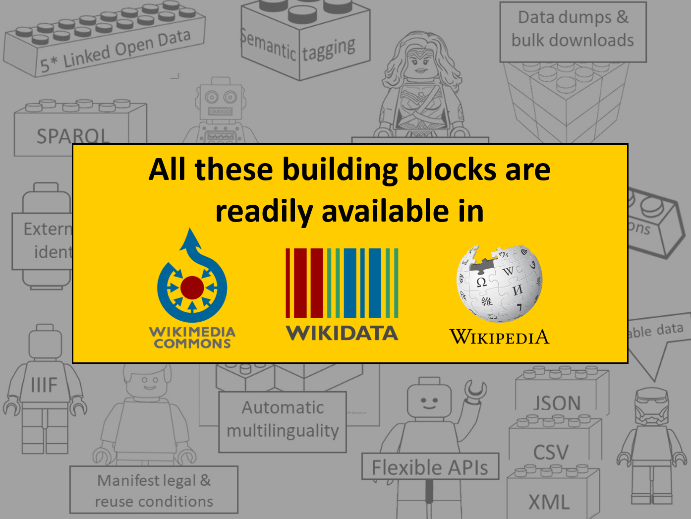
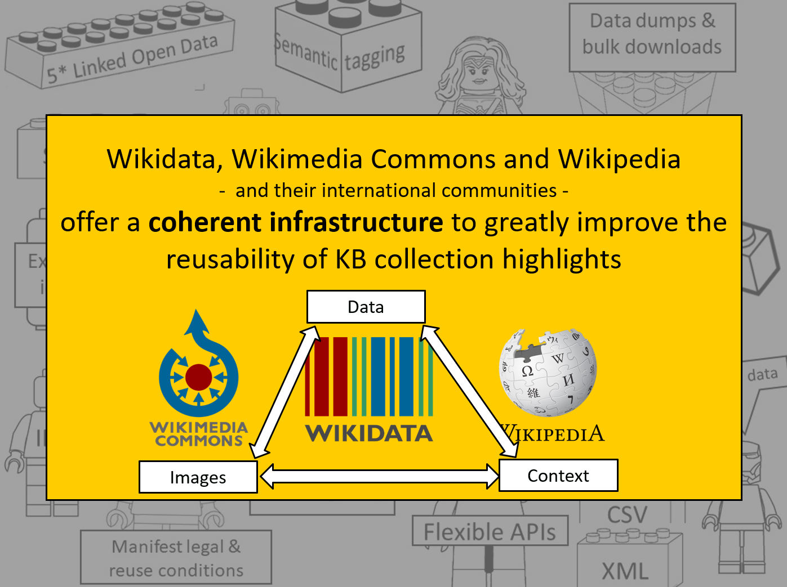

# 50 cool new things you can now do with KB's collection highlights - Part 6, Summary
*Latest update 16-06-2021*

*In this [series of 5 articles](index.md) I show the added value of putting images and metadata of [digitised collection highlights](https://www.kb.nl/galerij/digitale-topstukken) of the KB, national library of the Netherlands, into the Wikimedia infrastructure. By putting our collection highlights into Wikidata, Wikimedia Commons and Wikipedia, dozens of new functionalities have been added. As a result of Wikifying this collection, you can now do things with these highlights that were not possible before.*

As a bonus - and for overview - I've created a summary of the individual summaries from parts 2, 3, 4 and 5. This 6th part summarizes all 50 new cool things in one super handy single list.

## [Part 1, Introduction](Part%201%2C%20Introduction.html)
In the introduction of the series I discussed the things (functionalities) you could already do with [KB's collection highlights](https://www.kb.nl/galerij/digitale-topstukke)) on KB's own websites, before we started the [WikiProject Collection highlights](https://www.wikidata.org/wiki/Wikidata:WikiProject_Collection_highlights_National_Library_of_the_Netherlands) in 2020. I also looked at some of the limitations that arise from offering our highlights in read/view-only mode, catering for classical heritage consumers. I explained why 

3) the paradigm shift the KB made,  consuming to read-write creating, where our hioghlighta are LEGO bricks to build stuff with. 

wikifying our highlights 

catering fro new tyes of audiuences fotr out hihjlighds

A visual summary: 

<kbd></kbd><kbd></kbd><kbd></kbd><kbd></kbd><kbd></kbd><kbd></kbd><kbd></kbd>

## [Part 2, Overviews of all highlights](Part%202%2C%20Overviews%20of%20all%20highlights.html)
In the second article I looked at which handy & useful *overviews of all highlights combined* have become available as a result of the project. These include

1) A [thumbnail gallery](https://nl.wikipedia.org/wiki/Wikipedia:GLAM/Koninklijke_Bibliotheek_en_Nationaal_Archief/Topstukken/Galerij) for all highlights. 
2) A [visual gallery page](https://commons.wikimedia.org/wiki/Collection_highlights_of_Koninklijke_Bibliotheek) with 6 previews for each highlight. 
3) An overview of highlights [grouped by type/sort](https://nl.wikipedia.org/wiki/Wikipedia:GLAM/Koninklijke_Bibliotheek_en_Nationaal_Archief/Topstukken/Type). 
4) An [alphabetical overview](https://nl.wikipedia.org/wiki/Wikipedia:GLAM/Koninklijke_Bibliotheek_en_Nationaal_Archief/Topstukken/Alfabetisch/A-H) for all highlights, [powered by Wikidata](https://nl.wikipedia.org/w/index.php?title=Wikipedia:GLAM/Koninklijke_Bibliotheek_en_Nationaal_Archief/Topstukken/Alfabetisch/A-H&action=edit) and [templates](https://nl.wikipedia.org/wiki/Sjabloon:Wikidata). 
5) A [sortable overview table](https://nl.wikipedia.org/wiki/Wikipedia:GLAM/Koninklijke_Bibliotheek_en_Nationaal_Archief/Topstukken/Listeria) for all highlights. 
6) Manifest copyright status for all highlights. 
7) Highlights [available as PDFs](https://nl.wikipedia.org/wiki/Wikipedia:GLAM/Koninklijke_Bibliotheek_en_Nationaal_Archief/Topstukken/PDFs). 
8) An [interactive timeline](https://nl.wikipedia.org/wiki/Wikipedia:GLAM/Koninklijke_Bibliotheek_en_Nationaal_Archief/Topstukken/Chronologie) for all highlights. 
9) Overviews of [persons & institutions](https://nl.wikipedia.org/wiki/Wikipedia:GLAM/Koninklijke_Bibliotheek_en_Nationaal_Archief/Topstukken/Alfabetisch) related to the highlights, including  
10) a table of related persons [sortable by role](https://www.wikidata.org/wiki/Wikidata:WikiProject_Collection_highlights_National_Library_of_the_Netherlands/Admin/Overview/People). 
11) Overviews of [locations and dates](https://www.wikidata.org/wiki/Wikidata:WikiProject_Collection_highlights_National_Library_of_the_Netherlands/Admin/Overview/Locations_and_dates), [physical characteristics](https://www.wikidata.org/wiki/Wikidata:WikiProject_Collection_highlights_National_Library_of_the_Netherlands/Admin/Overview/Physical_characteristics) and [sources](https://www.wikidata.org/wiki/Wikidata:WikiProject_Collection_highlights_National_Library_of_the_Netherlands/Admin/Overview/Sources) for the highlights, as was well as descriptions in [3rd party databases](https://www.wikidata.org/wiki/Wikidata:WikiProject_Collection_highlights_National_Library_of_the_Netherlands/Admin/Overview/External_IDs). 
12) A [separate overview of existing and wanted Dutch Wikipeda articles](https://nl.wikipedia.org/wiki/Wikipedia:GLAM/Koninklijke_Bibliotheek_en_Nationaal_Archief/Topstukken/Artikelen) related to KB's collection highlights. 

## [Part 3, Overviews per highlight](Part%203%2C%20Overviews%20per%20highlight.html)
In the third article I discussed which new functionalities *for individual highlights* are available from now on, including

13) Merging KB's institutional and Wikimedia's participative worlds for each highlight. 
14) A [gallery page with individual images](https://commons.wikimedia.org/wiki/Buiten!_Waar_de_vogels_fluiten) for each public domain highlight. 
15) [Double page openings](https://commons.wikimedia.org/wiki/Category:Visboeck_Coenen_(openings)) for most public domain highlights. 
16) [Miniatures](https://commons.wikimedia.org/wiki/Category:Miniatures_from_Der_naturen_bloeme_-_KB_KA_16) and/or cut-outs of [interesting page sections](https://commons.wikimedia.org/wiki/Category:Kunst_en_samenleving_(KB_-_KW_1310_F_3_-_details)) for selected public domain highlights. 
17) Openly licensed [audio tracks](https://commons.wikimedia.org/wiki/Category:Beatrijs_(audio)) and  
18) [explainer videos](https://www.youtube.com/watch?v=Vnvr6WoyPKk) for selected highlights. 
19) Reusable [introduction texts under CC0-licensing](https://web.archive.org/web/20210126072215/https://www.kb.nl/auteursrecht) for each highligt. 
20) Openly licensed and freely reusable building blocks (images, audio, videos, texts) for each highligt. 
21) A [KB citation template](https://nl.wikipedia.org/wiki/Sjabloon:Bronvermelding_kb.nl) for use on Dutch Wikipedia. 
22) A [facebook](https://w.wiki/phx) of contributors to the [Album amicorum Jacob Heyblocq](https://nl.wikipedia.org/wiki/Wikipedia:GLAM/Koninklijke_Bibliotheek_en_Nationaal_Archief/Topstukken/Alfabetisch#Album_amicorum_van_Jacobus_Heyblocq_(1623-1690),_rector_van_de_Latijnse_school_te_Amsterdam). 
23) Overviews of the [gender distribution](https://w.wiki/F5J),  
24) the [occupations](https://w.wiki/F5N) and  
25) the [life spans](https://w.wiki/qzx) of those contributors. 
26) [Map visualisations](https://tinyurl.com/y2y7pfbj) for selected highlights in which locations and places play key roles. 

## [Part 4, Images](Part%204%2C%20Images.html)
In this article I showed which new functionalities *for individual highlight images* are available as a result of the project, including

27) Image downloads in various resolutions. 
28) [File level descriptive metadata](https://commons.wikimedia.org/wiki/File:Atlas_Van_der_Hagen-KW1049B12_002-HISPANIAE_ET_PORTUGALIAE_REGNA.jpeg#Summary) including 
29) textual and visual source attribution of the KB, 
30) manifest copyrights status (public domain) and  
31) multiple thematic categorisations. 
32) Geo coordinates for selected images, linking them to [various map services](https://geohack.toolforge.org/geohack.php?pagename=File:Den_Haag,_gezicht_bij_de_Doelen_over_de_Korte_Vijverberg,_tot_aan_het_Plein_(7985085070).jpg&params=052.081352_N_0004.313528_E_globe:Earth_type:camera_source:Flickr_&language=nl). 
33) Structured, machine-readable data, [linking images to Wikidata](https://commons.wikimedia.org/wiki/Commons:Structured_data), enabling  
34) 'automatic multilinguality' and multilingual search, and  
35) making them searchable by content. (*What is depicted in the images?*) 
36) Stimulate (inter)national participation for enriching KB's collections by [public tagging campaigns](https://isa.toolforge.org/campaigns/74), enabling  
37) [new search options](https://hay.toolforge.org/sdsearch/) for these collections. 

## [Part 5, Reuse](Part%205%2C%20Reuse.html)
In the last article I illustrated how you can programmatically reuse KB's collection highlights, for instance for/in your own websites, services, apps, hackathons and projects. Nice LEGO Technic® blocks for KB's target group of developers, app builders, digital humanists, data scientists, LOD afficionados and other nice nerds. Cool stuff includes

38) A [SPARQL driven thumbnail gallery](https://w.wiki/3E8z) of KB highlights. 
39) Structured lists of all KB highlights, both [simple](https://w.wiki/3FWz) and [more elaborate](https://w.wiki/3FXe) in [JSON](https://query.wikidata.org/sparql?query=%23%20Elaborated%20list%20of%20KB%20collection%20highlights%2C%20recreating%0A%23%20https%3A%2F%2Fnl.wikipedia.org%2Fwiki%2FWikipedia%3AGLAM%2FKoninklijke_Bibliotheek_en_Nationaal_Archief%2FTopstukken%2FListeria%0A%23%20using%20SPARQL%0A%0ASELECT%20DISTINCT%20%3Fhighlight%20%3FhighlightLabel%20%3Ftitle%20%3FhighlightDescription%20%3Fimage%20%3FhighlightIsALabel%20%3FinventoryNr%20%0A%3Fkbcat%20%3Fkburl%20%3Fbrowsebook%20%3Fgallery%20%3FcopyrightLabel%20%0A%0AWHERE%20%7B%0A%20%20%3Fhighlight%20p%3AP195%20%3Fst%20.%0A%20%20%3Fst%20ps%3AP195%20wd%3AQ1526131%20.%0A%20%20%3Fst%20pq%3AP2868%20wd%3AQ29188408.%0A%0A%20%20OPTIONAL%7B%3Fhighlight%20wdt%3AP18%20%3Fimage.%7D%0A%20%20OPTIONAL%7B%3Fhighlight%20wdt%3AP1476%20%3Ftitle.%7D%0A%20%20OPTIONAL%7B%3Fhighlight%20wdt%3AP31%20%3FhighlightIsA.%7D%0A%20%20OPTIONAL%7B%3Fhighlight%20wdt%3AP217%20%3FinventoryNr.%7D%0A%20%20OPTIONAL%7B%3Fhighlight%20wdt%3AP528%20%3Fppn.%0A%20%20%20%20%20BIND(CONCAT(%22https%3A%2F%2Fresolver.kb.nl%2Fresolve%3Furn%3DPPN%3A%22%2C%3Fppn)%20AS%20%3Fkbcat).%7D%20%0A%20%20OPTIONAL%7B%3Fhighlight%20wdt%3AP973%20%3Fkburl.%0A%20%20%20%20%20FILTER(STRSTARTS(STR(%3Fkburl)%2C%20%22https%3A%2F%2Fwww.kb.nl%2Fthemas%2F%22)).%7D%0A%20%20OPTIONAL%7B%3Fhighlight%20wdt%3AP953%20%3Fbrowsebook.%0A%20%20%20%20%20FILTER(STRSTARTS(STR(%3Fbrowsebook)%2C%20%22https%3A%2F%2Fgalerij.kb.nl%22)).%7D%0A%20%20OPTIONAL%7B%3Fhighlight%20wdt%3AP935%20%3Fgal.%0A%20%20%20%20%20BIND(CONCAT(%22https%3A%2F%2Fcommons.wikimedia.org%2Fwiki%2F%22%2CREPLACE(%3Fgal%2C%22%20%22%2C%22_%22))%20AS%20%3Fgallery).%7D%0A%20%20OPTIONAL%7B%3Fhighlight%20wdt%3AP6216%20%3Fcopyright.%7D%0A%20%20%20%20%0A%20%20SERVICE%20wikibase%3Alabel%20%7B%20bd%3AserviceParam%20wikibase%3Alanguage%20%22en%22.%20%7D%0A%7D%20ORDER%20BY%20%3FhighlightLabel%0A%0A%0A%0A%0A%0A%0A%0A&format=json) and [XML](https://query.wikidata.org/bigdata/namespace/wdq/sparql?query=%23%20Simple%20list%20of%20KB%20collection%20highlights%20%0ASELECT%20DISTINCT%20%3Fhighlight%20%3FhighlightLabel%20%3FhighlightDescription%0AWHERE%20%7B%0A%20%20%23%20the%20thing%20is%20part%20of%20the%20KB%20collection%2C%20and%20has%20role%20'collection%20highlight'%20within%20that%20collection%0A%20%20%3Fhighlight%20(p%3AP195%2Fps%3AP195)%20wd%3AQ1526131%3B%20p%3AP195%20%5Bpq%3AP2868%20wd%3AQ29188408%5D.%20%0A%20%20SERVICE%20wikibase%3Alabel%20%7B%20bd%3AserviceParam%20wikibase%3Alanguage%20%22en%22.%20%7D%0A%7D%0AORDER%20BY%20%3FhighlightLabel). 
40) Programatically check for [Wikipedia articles about KB highlights in Dutch](https://w.wiki/3FbF). 
41) Request multiple image URLs from the [Wikimedia Commons query API](https://commons.wikimedia.org/w/api.php?action=help&modules=query) for a specific highlight, both via [URL query strings](https://commons.wikimedia.org/w/api.php?action=query&generator=categorymembers&gcmtitle=Category:Visboeck_Coenen_(openings)&gcmlimit=500&gcmtype=file&prop=imageinfo&iiprop=url&format=xml) and Python scripts. 
42) Readily available bulk image download tools for obtaining [hires image URLs](https://wikilovesdownloads.toolforge.org/) and/or the [hires images themselves](https://commons.wikimedia.org/wiki/Commons:Imker_(batch_download)) from a specific KB highlight category on Wikimedia Commons.
43) Request highlight information from the [Wikidata API](https://www.wikidata.org/w/api.php?action=help&modules=wbgetentities) in multiple formats, directly from the highlight's Qnumber. 
44) Request full Wikidata items in seven different formats via a [Special:EntityData](https://www.mediawiki.org/wiki/Wikibase/EntityData) URL, directly from the Qnumber: [HTML](https://www.wikidata.org/wiki/Special:EntityData/Q16641064), [JSON](https://www.wikidata.org/wiki/Special:EntityData/Q16641064.json), [JSON-LD](https://www.wikidata.org/wiki/Special:EntityData/Q16641064.jsonld), [RDF](https://www.wikidata.org/wiki/Special:EntityData/Q16641064.rdf), [NT](https://www.wikidata.org/wiki/Special:EntityData/Q16641064.nt), [TTL or N3](https://www.wikidata.org/wiki/Special:EntityData/Q16641064.ttl) and [PHP](https://www.wikidata.org/wiki/Special:EntityData/Q16641064.php). 
45) Get a structured, machine readable [overview of persons and institutions related to KB highlights](https://query.wikidata.org/sparql?query=%23%20Overview%20of%20persons%20%26%20institutions%20related%20to%20%0A%23%201%20Admirandorum%20quadruplex%20spectaculum%20%28Q42302438%29%2C%20%0A%23%203%20Kunst%20en%20samenleving%20%28Q72752446%29%20and%20%0A%23%204%20Haags%20liederenhandschrift%20%28Q16641064%29%20%0A%23%20such%20as%20authors%2C%20makers%2C%20contributors%2C%20publishers%2C%20printers%2C%20illustrators%2C%20translators%2C%20owners%20etc.%20%0ASELECT%20DISTINCT%20%3Fhl%20%3FhlLabel%0A%28GROUP_CONCAT%28DISTINCT%20%3FcreatorLabel%20%3B%20separator%20%3D%20%22%20----%20%22%29%20as%20%3Fcreators%29%0A%28GROUP_CONCAT%28DISTINCT%20%3FauthorLabel%20%3B%20separator%20%3D%20%22%20----%20%22%29%20as%20%3Fauthors%29%0A%28GROUP_CONCAT%28DISTINCT%20%3FcontributorLabel%20%3B%20separator%20%3D%20%22%20----%20%22%29%20as%20%3Fcontributors%29%0A%28GROUP_CONCAT%28DISTINCT%20%3FeditorLabel%20%3B%20separator%20%3D%20%22%20----%20%22%29%20as%20%3Feditors%29%0A%28GROUP_CONCAT%28DISTINCT%20%3FtranslatorLabel%20%3B%20separator%20%3D%20%22%20----%20%22%29%20as%20%3Ftranslators%29%0A%28GROUP_CONCAT%28DISTINCT%20%3FillustratorLabel%20%3B%20separator%20%3D%20%22%20----%20%22%29%20as%20%3Fillustrators%29%0A%28GROUP_CONCAT%28DISTINCT%20%3FpublisherLabel%20%3B%20separator%20%3D%20%22%20----%20%22%29%20as%20%3Fpublishers%29%0A%28GROUP_CONCAT%28DISTINCT%20%3Fowned_byLabel%20%3B%20separator%20%3D%20%22%20----%20%22%29%20as%20%3Fowned_bys%29%0A%0AWHERE%20%7B%0A%20%20%23%20the%20thing%20is%20part%20of%20the%20KB%20collection%2C%20and%20has%20role%20%27collection%20highlight%27%20within%20that%20collection%0A%20%20%3Fhl%20%28p%3AP195%2Fps%3AP195%29%20wd%3AQ1526131%3B%20p%3AP195%20%5Bpq%3AP2868%20wd%3AQ29188408%5D.%0A%20%20%23%20limit%20to%20Q42302438%2C%20Q72752446%20and%20Q16641064%0A%20%20VALUES%20%3Fhl%20%7Bwd%3AQ42302438%20wd%3AQ72752446%20wd%3AQ16641064%7D%0A%20%20%0A%20%20OPTIONAL%7B%3Fhl%20wdt%3AP170%20%3Fcreator.%7D%0A%20%20OPTIONAL%7B%3Fhl%20wdt%3AP50%20%3Fauthor.%7D%0A%20%20OPTIONAL%7B%3Fhl%20wdt%3AP767%20%3Fcontributor.%7D%0A%20%20OPTIONAL%7B%3Fhl%20wdt%3AP98%20%3Feditor.%7D%0A%20%20OPTIONAL%7B%3Fhl%20wdt%3AP655%20%3Ftranslator.%7D%0A%20%20OPTIONAL%7B%3Fhl%20wdt%3AP110%20%3Fillustrator.%7D%0A%20%20OPTIONAL%7B%3Fhl%20wdt%3AP123%20%3Fpublisher.%7D%0A%20%20OPTIONAL%7B%3Fhl%20wdt%3AP127%20%3Fowned_by.%7D%0A%0A%20%20SERVICE%20wikibase%3Alabel%20%7B%20bd%3AserviceParam%20wikibase%3Alanguage%20%22en%22.%20%3Fhl%20rdfs%3Alabel%20%3FhlLabel.%0A%20%20%20%20%20%20%20%20%20%20%20%20%20%20%20%20%20%20%20%20%20%20%20%20%20%20%20%3Fcreator%20rdfs%3Alabel%20%3FcreatorLabel.%20%3Fauthor%20rdfs%3Alabel%20%3FauthorLabel.%20%0A%20%20%20%20%20%20%20%20%20%20%20%20%20%20%20%20%20%20%20%20%20%20%20%20%20%20%20%3Fcontributor%20rdfs%3Alabel%20%3FcontributorLabel.%20%3Feditor%20rdfs%3Alabel%20%3FeditorLabel.%20%0A%20%20%20%20%20%20%20%20%20%20%20%20%20%20%20%20%20%20%20%20%20%20%20%20%20%20%20%3Ftranslator%20rdfs%3Alabel%20%3FtranslatorLabel.%20%3Fillustrator%20rdfs%3Alabel%20%3FillustratorLabel.%20%0A%20%20%20%20%20%20%20%20%20%20%20%20%20%20%20%20%20%20%20%20%20%20%20%20%20%20%20%3Fpublisher%20rdfs%3Alabel%20%3FpublisherLabel.%20%3Fowned_by%20rdfs%3Alabel%20%3Fowned_byLabel.%7D%0A%20%20%7D%0A%20%20GROUP%20BY%20%3Fhl%20%3FhlLabel%0A%20%20ORDER%20BY%20%3FhlLabel&format=json), such as authors, makers, contributors, publishers, printers, illustrators, translators, owners, collectors etc. 
46) Multiple approaches for generating off-Wiki image galleries from the Wikimedia infrastructure, as detailed in the article *[Reusing the album amicorum Jacob Heyblocq - Image gallery of album contributors](https://kbnlwikimedia.github.io/Alba-Amicorum/alba/AA-Jacob-Heyblocq/reuse/)*. 
47) [Programmatically retrieve things depicted in images](https://commons.wikimedia.org/wiki/Commons:Depicts#Access), either via the [Wikimedia Commons SPARQL query service](https://commons.wikimedia.org/wiki/Commons:SPARQL_query_service), the Wikimedia Commons API or via the [Petscan tool](https://petscan.wmflabs.org/). 
48) Starting from selected [Wikidata biographical identifiers](https://www.wikidata.org/wiki/Wikidata:WikiProject_Biographical_Identifiers#Biographical_identifiers) such as the [Europeana entity (P7704)](https://www.wikidata.org/wiki/Property:P7704), extract information from external (non-Wikimedia) databases using their REST APIs. 
49) Extract information simultaneously from both Wikidata and external databases using [federated SPARQL queries](https://www.wikidata.org/wiki/Wikidata:SPARQL_query_service/Federated_queries), such as [this example](https://w.wiki/3MLQ). 
50) Programmatically request (meta)data associated with an individual image via both the [Wikimedia Commons API tool](https://magnus-toolserver.toolforge.org/commonsapi.php) and [directly from the Commons API](https://commons.wikimedia.org/w/api.php?action=help&modules=query), using [these examples](https://commons.wikimedia.org/wiki/Commons:API/MediaWiki) and [this imageinfo API documentation](https://commons.wikimedia.org/w/api.php?action=help&modules=query%2Bimageinfo) for inspiration. 

### About the author

Olaf Janssen is the Wikimedia coordinator of the KB, the national library of the Netherlands. He contributes to
[Wikipedia](https://nl.wikipedia.org/wiki/Wikipedia:GLAM/Koninklijke_Bibliotheek_en_Nationaal_Archief), [Wikimedia Commons](https://commons.wikimedia.org/wiki/Category:Koninklijke_Bibliotheek) and [Wikidata](https://www.wikidata.org/wiki/Wikidata:GLAM/Koninklijke_Bibliotheek_Nederland) as [User:OlafJanssen](https://nl.wikipedia.org/wiki/Gebruiker:OlafJanssen) 

### Reusing this article
This text of this article is available under the [CC-BY 4.0](https://creativecommons.org/licenses/by/4.0/) license. 
<kbd></kbd>

### Image sources & credits
* [Swiss_army_knife_open,_2012-(01)](https://commons.wikimedia.org/wiki/File:Swiss_army_knife_open,_2012-(01).jpg) -- Joe Loong, [CC BY-SA 2.0](https://creativecommons.org/licenses/by-sa/2.0), via Wikimedia Commons
* [Victorinox_Swiss_Army_SwissChamp_XAVT](https://commons.wikimedia.org/wiki/File:Victorinox_Swiss_Army_SwissChamp_XAVT.jpg) -- Dave Taylor from Boulder, CO, [CC BY 2.0](https://creativecommons.org/licenses/by/2.0), via Wikimedia Commons
* Old paradigm, [Taxidermied Monarch Butterfly in a bell jar](https://commons.wikimedia.org/wiki/File:Monarch_Butterfly_Taxidermy_03.jpg) -- Jeremy Johnson, [CC BY-SA 4.0](https://creativecommons.org/licenses/by-sa/4.0), via Wikimedia Commons
* New paradigm, [Bricks by the Bay 2011](https://www.flickr.com/photos/roninsfx/5568986878) -- Roninsfx, [CC-BY 2.0](https://creativecommons.org/licenses/by/2.0/), via Flickr
* Building blocks for the tech communities, [Wikimedia hackathon San Francisco 2012](https://commons.wikimedia.org/wiki/File:Wikimedia_Hackathon_San_Francisco_107.jpg) -- Matthew (WMF), [CC BY-SA 3.0](https://creativecommons.org/licenses/by-sa/3.0), via Wikimedia Commons
* KB collection highlights LEGO® box - based upon the [Villa Savoye box from the LEGO® Architecture series](https://i.ebayimg.com/images/g/n4AAAOSwjIpgTPWQ/s-l1600.jpg)
