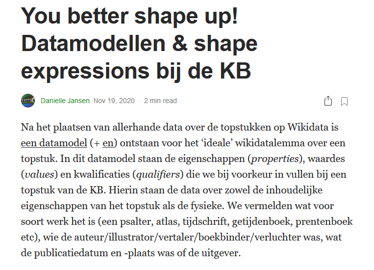
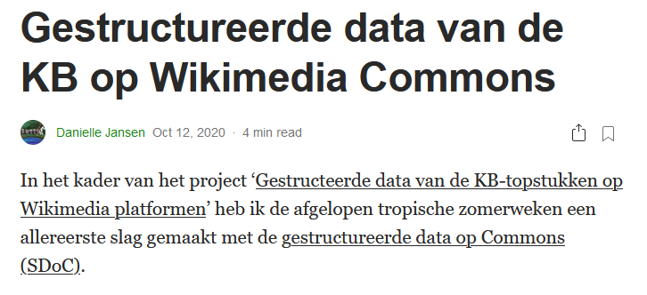
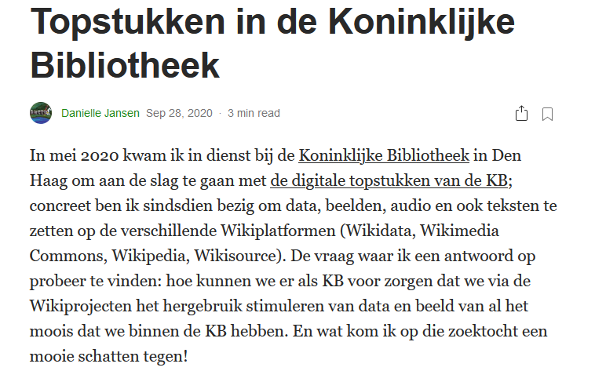

# Wikifying KB's collection highlights - Stories & publications

## [Cool new things you can now do with the KB's collection highlights](Cool%20new%20things%20you%20can%20now%20do%20with%20the%20KB's%20collection%20highlights/index.html) - March 2021
*A five part series about welke handige & nuttige overzichten van alle 70 topstukken samen er als resultaat van het project XXXXX beschikbaar zijn gekomen.*

## [You better shape up! Datamodellen & shape expressions bij de KB](https://ecritures.medium.com/you-better-shape-up-datamodellen-shape-expressions-bij-de-kb-c49669257e64) - 19 November 2020
*Short description* (article in Dutch)

## [Gestructureerde data van de KB op Wikimedia Commons](https://medium.com/@ecritures/gestructureerde-data-van-de-kb-op-wikimedia-commons-35dc948c2eee) - 12 October 2020
*Short description*  (article in Dutch)

## [Topstukken in de Koninklijke Bibliotheek](https://medium.com/@ecritures/topstukken-in-de-koninklijke-bibliotheek-b32780f314f8) - 28 September 2020
*Short description*  (article in Dutch)

